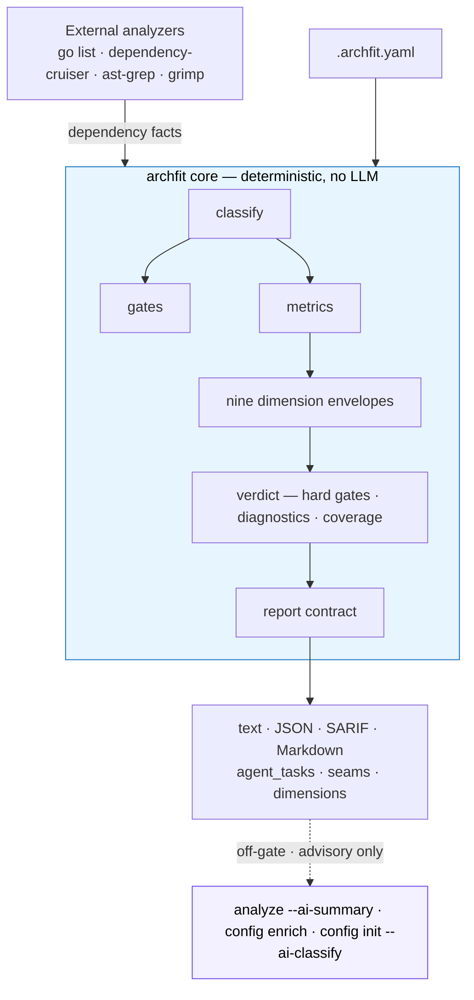

# archfit

[](https://github.com/alexei-led/archfit/actions/workflows/ci.yaml)
[](https://github.com/alexei-led/archfit/actions/workflows/release.yaml)
[](https://github.com/alexei-led/archfit/tags)
[](https://github.com/alexei-led/archfit/pkgs/container/archfit)
[](https://pkg.go.dev/github.com/alexei-led/archfit)
[](https://goreportcard.com/report/github.com/alexei-led/archfit)
[](LICENSE)

**Does this change keep the architecture healthy? archfit answers — with a decision, not a number.**

`archfit` is a one-command architecture-fitness CLI. It reads how your code is
actually wired (from language analyzers like `go list`, dependency-cruiser,
ast-grep, grimp), checks it against the architecture you declared in
`.archfit.yaml`, and reports an architecture **state**: a verdict, nine measured
dimensions with their evidence coverage, a coupling seam ledger, a CI gate, and
— when an AI agent breaks a boundary — a structured repair task.

There is no repository score. A single averaged number cannot say which of nine
differently-measured dimensions moved, or whether it moved because the code
changed or because nothing looked. The verdict comes from explicit hard gates,
active diagnostics, and evidence coverage instead.

Built for **AI agent and CI** workflows: deterministic output, pipe-friendly,
leads with what to do.

```text
$ archfit

ARCHITECTURE STATE

VERDICT    NEEDS ATTENTION
BLOCKING   0 active  ·  hard gates: pass
ATTENTION  2 dimension(s) flagged  ·  55 diagnostic(s)
COVERAGE   5 measured · 3 partial · 1 unmeasured  (of 9)

No blockers. Use this run for architecture-improvement planning,
not to stop development.

DIMENSIONS

  intent          measured    gate: pass            confidence: high     declared rules evaluated 60/60
  structure       measured    gate: pass            confidence: high     discovered edges resolved to a declared module 544/1255
  modularity      measured    gate: warn            confidence: high     declared modules with a declared public surface 17/18
  coupling        measured    gate: warn            confidence: high     cross-boundary edges scored 384/384
  change_locality measured    gate: pass            confidence: high     declared modules touched in the scanned history window 18/18
  complexity      partial     gate: pass            confidence: medium   production files in the source walk 233/233
  testability     partial     gate: pass            confidence: medium   classified source files 440/446
  operations      partial     gate: pass            confidence: medium   applicable analyzers reporting coverage 8/8
  drift           unmeasured  gate: not_applicable  confidence: unrated  no denominator

NOT MEASURED (5)

  complexity — cognitive complexity
    v1 ships no cognitive-complexity analyzer; only the size tail is measured
  drift — architecture drift
    no comparable architecture-state reference is stored

COUPLING SEAMS (67)

  assessment-repair -> relationship-analysis
    functional × cross_module_same_owner × high volatility · 12 critical of 34 scored · median balance 7
    try: reduce_strength
```

Run `archfit analyze` for a human-readable review; use `archfit check` in CI for gate exit codes
(`0` healthy, `2` needs attention, `1` blocked); add `--json` for
`archfit.architecture-state.v1`. Progress streams to stderr, so
`archfit check --json | jq` stays clean.

Expect `2`, not `0`, on a healthy repository in v1: complexity, testability, and
operations report `partial` by contract, and a partial dimension is never
reported as healthy. Gate on `1`.

## Why

AI agents are great at local edits and bad at holding the whole system design in
context. An agent can make a change that passes every test while it quietly
imports across a forbidden boundary, bypasses a module's public API, shortcuts
between layers, or grows a dependency cycle. Each one looks harmless; together
they _become_ the architecture, and every later fix costs more human context,
more tokens, and more retries.

`archfit` puts an architecture-fitness check in that loop:


A failed gate isn't a vague log line — it's a repair order the agent can act on:

```json
{
  "rule_id": "no_internal_access",
  "goal": "Replace the internal-API access from pkg/a/a.go to pkg/b/internal/impl.go with b's public API.",
  "constraints": [
    "Use only the public API of module b",
    "public surface of \"b\": [pkg/b/api/**]"
  ],
  "files": ["pkg/a/a.go", "pkg/b/internal/impl.go"],
  "validation": ["archfit check -c .archfit.yaml"]
}
```

Goal, constraints, the files to touch, and the command that proves the fix.

## Quick start

```sh
# install (or use the Docker image with all analyzers bundled: ghcr.io/alexei-led/archfit)
go install github.com/alexei-led/archfit/cmd/archfit@latest

archfit doctor                      # check which analyzers are available
archfit config init --root .        # generate a starter .archfit.yaml
archfit config update --json        # review the config: drift, pending edits, open decisions
archfit analyze                     # human review: the decision report
archfit baseline -c .archfit.yaml   # accept current findings as baseline
archfit check -c .archfit.yaml      # CI gate: exit 0 healthy / 2 needs attention / 1 blocked / 3 error
```

Once a candidate config file exists, `archfit config compare cand.yaml` measures
this same tree under both configurations and reports the difference (report-only).

Starter configs for common project shapes live in [`examples/`](examples/README.md).
Full setup — Docker, CI, optional analyzers, platform packages — is in the
[guide](docs/guide/README.md).

## What you get

- **Two intent-based commands.** `archfit analyze` → report-only, always exits 0;
  `archfit check` → CI gate, exits non-zero on violations.
  Both support `--json`, `--sarif`, `--markdown`, `--format scorecard`, or `--format legacy-json`.
- **A decision, not a score** — `HEALTHY` / `NEEDS ATTENTION` / `BLOCKED`, with a
  blocking-vs-diagnostic split, nine dimension envelopes that each say what they
  measured and what they could not, and a seam ledger naming the boundaries to
  look at. There is no repository scalar.
- **Deterministic gates** for forbidden dependencies, public-API boundaries,
  layer direction, cycles, and configured thresholds. Same input → byte-identical
  JSON, safe for CI.
- **`agent_tasks` repair blocks** so an AI agent gets the fix, not just the error.
- **A coupling seam ledger** built on
  [Balanced Coupling](docs/guide/concepts.md) (integration strength × distance ×
  volatility). One record per ordered module pair — however many imports express
  it — with its raw owner/deploy/structural distance facts, score distribution,
  quadrant, labels, and a balancing hypothesis. A seam is a diagnostic. The only
  coupling gate is `coupling.gate.distributed_monolith`, which counts newly
  introduced qualifying seams against a comparable reference and defaults to
  `mode: warn`.
- **Visible evidence quality** — SCIP strength overlays, Rust deep-analysis
  coverage, distance-basis context, and dynamic connascence signals are reported
  separately so missing or report-only evidence is not mistaken for score input.
- **Honest coverage** — a missing analyzer degrades the affected metric to `n/a`
  with the install step, never a false green.
- **Config comparison** — `archfit config compare <candidate>` measures one source
  tree under two configs and reports the finding, coverage, and measurement-loss
  differences. Report-only: a higher candidate score never means "better".
- **Content-addressed fact cache** — warm runs skip unchanged extractor
  subprocesses (typically 3–5× faster gates), byte-identical to a cold run;
  `--refresh` re-runs extractors and updates the cache ([details](docs/guide/caching.md)).
- **Off-gate AI enrichment** (`analyze --ai-summary`, `config enrich labels/abstained`,
  `config init --ai-classify`, `config update --ai-classify`) that may only draft labels,
  propose review material, explain, and prioritize collected evidence — it never
  decides the gate.
- **Multi-language** — Go, TypeScript/JavaScript, Python, Rust
  ([details](docs/guide/languages.md)).

## How it works

archfit separates **facts**, **gates**, and **narration**. Language adapters
collect dependency facts; a deterministic, LLM-free core classifies them, runs
the gates, and computes metrics. The application sequences
`Prepare → Acquire → Relate → Assess → Score` and builds the architecture
state once, then hands a data-only report contract to each renderer; the CLI
only picks concrete adapters and translates the verdict into an exit code. Optional LLM features sit
strictly off to the side.



The codebase dogfoods these boundaries with import-ring, projection, self-model,
and fan-out ratchets. The capability migration is complete — there is no `engine`,
pipeline hub, or shared stage-view package — and the results are deliberately not
greenwashed: the configured gate has zero blockers, the coupling dimension still
warns because the core capabilities are genuinely model-coupled at close distance,
and three dimensions report `partial` because v1 has no collector for them.
See the [architecture baseline](docs/design/architecture-baseline.md).

archfit doesn't replace architecture review — it makes repeatable evidence cheap
to collect and safe to run in CI. It sits one level above single-language
boundary linters (dependency-cruiser, import-linter, ArchUnit): they supply
facts for one ecosystem; archfit turns facts across languages into one verdict,
a Balanced-Coupling seam ledger, an explicit coverage statement, and agent repair
tasks.

## Upgrading from before v1.6.0

The CLI was redesigned in v1.6.0. These commands and flags changed:

| Old                             | New              | Notes                                                              |
| ------------------------------- | ---------------- | ------------------------------------------------------------------ |
| `archfit analyze --gate`        | `archfit check`  | new CI gate command                                                |
| `archfit --gate`                | `archfit check`  |                                                                    |
| `--full`                        | _(removed)_      | full scan is now the default                                       |
| `--advisory`                    | _(removed)_      | advisories are shown by default; use `--no-advisories` to suppress |
| `--severity`                    | `--min-severity` |                                                                    |
| `--llm` on `analyze`            | `--ai-summary`   |                                                                    |
| `--llm` on `config init/update` | `--ai-classify`  |                                                                    |
| `--llm-provider`                | `--ai-provider`  |                                                                    |
| `--llm-model`                   | `--ai-model`     |                                                                    |
| `--no-cache`                    | `--refresh`      | now writes updated results to cache                                |
| `--no-config`                   | _(removed)_      | run `archfit config init --root .` first                           |

See [commands.md](docs/guide/commands.md) for the full reference.

## Documentation

- **[Guide](docs/guide/README.md)** — full documentation map and setup.
- [Commands](docs/guide/commands.md) — every command, every flag, use cases, exit codes.
- [Concepts](docs/guide/concepts.md) — Balanced Coupling, made executable.
- [Metrics](docs/guide/metrics.md) — every dimension and how it's scored.
- [CI](docs/guide/ci.md) · [Agent feedback](docs/guide/agent-feedback.md) ·
  [Languages](docs/guide/languages.md) · [Configuration](docs/guide/configuration.md) ·
  [Caching](docs/guide/caching.md)
- [Contributing](CONTRIBUTING.md)

## License

Apache-2.0. See [LICENSE](LICENSE).
