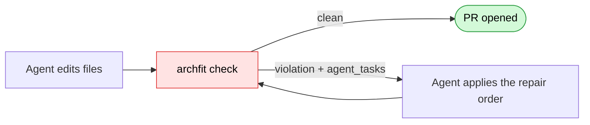
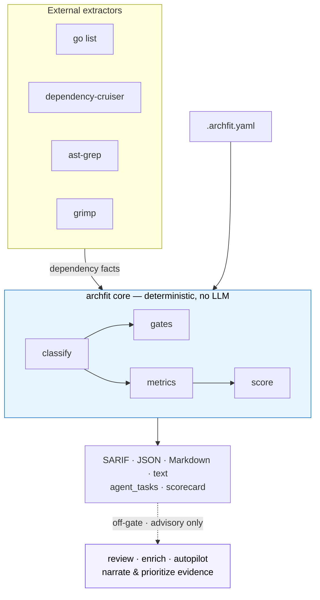
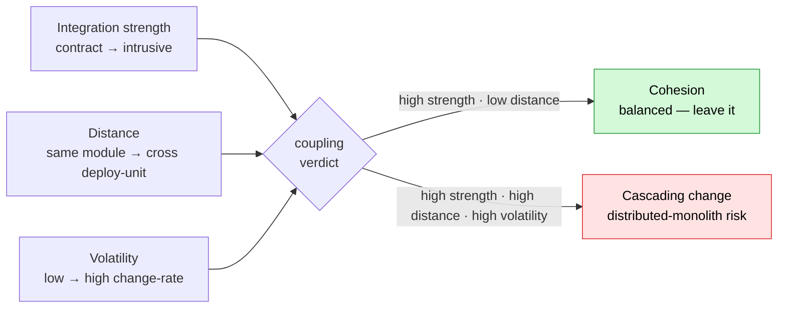

# archfit

[](https://github.com/alexei-led/archfit/actions/workflows/ci.yaml)
[](https://github.com/alexei-led/archfit/actions/workflows/release.yaml)
[](https://github.com/alexei-led/archfit/tags)
[](https://github.com/alexei-led/archfit/pkgs/container/archfit)
[](https://github.com/alexei-led/archfit/pkgs/container/archfit)
[](https://pkg.go.dev/github.com/alexei-led/archfit)
[](https://goreportcard.com/report/github.com/alexei-led/archfit)
[](LICENSE)

**Deterministic architecture-fitness for AI agents and CI.**

archfit reads dependency facts from a Go, TypeScript, or Python repo, checks them
against `.archfit.yaml`, and emits machine-readable gate violations, structured
repair tasks, and a banded scorecard. Architecture drift becomes a fact your
agent and pipeline can act on — not something a reviewer catches days later.

## Why

An AI agent editing your repo cannot see your architecture. It sees files — so it
imports the domain layer into the HTTP adapter, breaks a module boundary, or
grows a cycle, and the diff still looks fine. With no architecture signal in the
loop, the leak ships and someone catches it later (or never does).

archfit puts that signal in the loop and closes it with repairable feedback:



Every gate violation ships an `agent_tasks` entry — a structured repair order,
not a log line the agent has to parse intent out of:

```json
{
  "rule_id": "no_internal_access",
  "goal": "Replace the internal-API access from pkg/a/a.go to pkg/b/internal/impl.go with b's public API.",
  "constraints": [
    "Use only the public API of module b",
    "public surface of \"b\": [pkg/b/api/**]"
  ],
  "files": ["pkg/a/a.go", "pkg/b/internal/impl.go"],
  "validation": ["archfit check -c .archfit.yaml --full"]
}
```

The goal, the constraints it must stay inside, the exact files, and the command
that proves the fix — everything an agent needs to close the loop unattended.

## How it works

Language facts come from external tools run out of process. A deterministic core
decides over those facts. The LLM layer sits off to the side and is never on the
gate path.



Gates are byte-identical for unchanged input — safe to run in CI and to diff
across commits. When an optional analyzer is missing, the dependent metric reports
`n/a` with the enable step; the run never fails because a tool is absent.

## What you get

- **Deterministic gates** for forbidden dependencies, public-API boundaries,
  layer direction, import cycles, and configured thresholds.
- **`agent_tasks` repair blocks** so an AI agent gets the fix, not just the error.
- **A banded 7-dimension scorecard** (`archfit score`): boundary integrity,
  coupling balance, dependency-graph health, cohesion, change locality,
  architecture fitness, and analysis confidence.
- **Balanced-Coupling advisories** — strength × distance × volatility, grouped
  into rollups instead of one line per edge.
- **Honest coverage** — missing tools degrade to `n/a`, not a false green; gaps
  are reported in every output format.
- **Baselines** so accepted current debt does not hide new findings.
- **Off-gate LLM narration** (`review`, `enrich`, `autopilot`) that may only
  narrate and prioritize collected evidence — never invent gate violations.

## Methodology — Balanced Coupling

archfit operationalizes the checkable parts of Vlad Khononov's Balanced Coupling
model. It scores every cross-boundary relationship on three axes and explains why
it is cohesion (the good kind of coupling) or a cascading-change risk:



It does not replace architecture review — it makes repeatable evidence cheap to
collect and safe to run in CI. For the mapping from theory to signals, see
[Concepts](docs/guide/concepts.md) and [Metrics](docs/guide/metrics.md).

## How it compares

archfit is not a replacement for language-specific boundary linters — it is the
multi-language, agent-facing layer above them.

| Tool               | Languages          | Output for agents/CI                 | Coupling model            | LLM narration |
| ------------------ | ------------------ | ------------------------------------ | ------------------------- | ------------- |
| **archfit**        | Go, TS/JS, Python  | SARIF + JSON + `agent_tasks` + score | Balanced Coupling (S/D/V) | off-gate      |
| dependency-cruiser | TS/JS              | JSON/HTML, rule violations           | rule-based                | no            |
| import-linter      | Python             | text, contract pass/fail             | layered contracts         | no            |
| ArchUnit           | Java/JVM (.NET/TS) | test assertions in the build         | rule-based                | no            |

Use a single-language linter when you live in one language and want fine-grained,
in-build assertions. Use archfit when you want one config and one machine-readable
verdict across a polyglot repo, scored and shaped for an agent loop.

## Quick start

Install the CLI (use a release tag, not `@latest`, in repeatable docs):

```sh
go install github.com/alexei-led/archfit/cmd/archfit@v0.5.0
```

Or run the Docker image with the bundled toolchain:

```sh
docker run --rm -v "$(pwd):/repo" ghcr.io/alexei-led/archfit:v0.5.0 \
  check --config /repo/.archfit.yaml --full
```

Run the first check in a repository:

```sh
archfit doctor                                   # check available analyzers
archfit init --root . --output .archfit.yaml     # generate a starter config
$EDITOR .archfit.yaml
archfit check --config .archfit.yaml --full      # run the gates
archfit score --config .archfit.yaml --full      # banded scorecard
```

Accept current findings as a baseline when they represent known debt:

```sh
archfit baseline --full --config .archfit.yaml
```

Starter configs for common project shapes live in
[`examples/`](examples/README.md). Need Docker, CI, optional analyzers, or
language-specific setup? Start with the [guide](docs/guide/README.md).

## Core commands

| Command                | Use                                                 |
| ---------------------- | --------------------------------------------------- |
| `archfit doctor`       | Check local analyzer/tool availability.             |
| `archfit init`         | Generate a starter `.archfit.yaml`.                 |
| `archfit update`       | Sync `.archfit.yaml` with current structure.        |
| `archfit check`        | Run architecture gates and metrics.                 |
| `archfit score`        | Emit the banded 7-dimension scorecard.              |
| `archfit scan`         | Produce a full Markdown audit report.               |
| `archfit baseline`     | Save accepted current findings.                     |
| `archfit review`       | Off-gate LLM narrative review of the evidence.      |
| `archfit enrich`       | Draft off-gate LLM coupling-label refinements.      |
| `archfit autopilot`    | Draft a full `.archfit.yaml` via LLM (review-only). |
| `archfit explain <id>` | Explain one finding by fingerprint prefix.          |
| `archfit install`      | Check or install optional language tools.           |

See the [commands guide](docs/guide/commands.md) for flags, formats, and exit
codes. Point `--root` at the repo and `--config` elsewhere to run archfit from
outside the analyzed tree (external CI).

## Documentation

- [Guide](docs/guide/README.md) — documentation map.
- [Overview](docs/guide/overview.md) — what archfit is and when to use it.
- [Concepts](docs/guide/concepts.md) — Balanced Coupling, made executable.
- [Metrics](docs/guide/metrics.md) — every metric and how it is scored.
- [Install](docs/guide/install.md) — Go install, Docker, and optional tools.
- [Quick start](docs/guide/quick-start.md) — first useful run.
- [Language support](docs/guide/languages.md) — Go, TS, and Python setup.
- [Configuration](docs/guide/configuration.md) — `.archfit.yaml` basics.
- [CI](docs/guide/ci.md) — pull-request and pipeline setup.
- [Agent feedback](docs/guide/agent-feedback.md) — `agent_tasks`, SARIF, and
  `change_locality`.
- [LLM enrichment](docs/guide/llm-enrich.md) — human-reviewed off-gate drafts.
- [Examples](examples/README.md) — starter `.archfit.yaml` templates.
- [Contributing](CONTRIBUTING.md) — local development and release notes.

## License

Apache-2.0. See [LICENSE](LICENSE).
