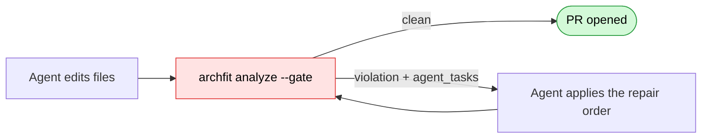
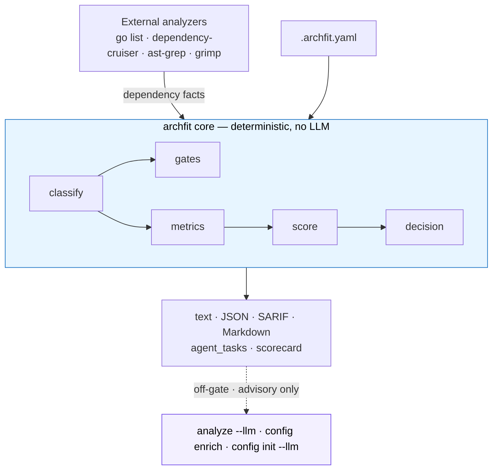

# archfit

[](https://github.com/alexei-led/archfit/actions/workflows/ci.yaml)
[](https://github.com/alexei-led/archfit/actions/workflows/release.yaml)
[](https://github.com/alexei-led/archfit/tags)
[](https://github.com/alexei-led/archfit/pkgs/container/archfit)
[](https://pkg.go.dev/github.com/alexei-led/archfit)
[](https://goreportcard.com/report/github.com/alexei-led/archfit)
[](LICENSE)

**Does this change keep the architecture healthy? archfit answers — with a decision, not a number.**

`archfit` is a one-command architecture-fitness CLI. It reads how your code is
actually wired (from language analyzers like `go list`, dependency-cruiser,
ast-grep, grimp), checks it against the architecture you declared in
`.archfit.yaml`, and gives you a clear verdict: a decision, a CI gate, a banded
scorecard, and — when an AI agent breaks a boundary — a structured repair task.

Built for **AI agent and CI** workflows: deterministic output, pipe-friendly,
leads with what to do.

```text
$ archfit

ARCHFIT RESULT

Decision   ACCEPTABLE WITH WATCH ITEMS
Gate       PASS  ·  0 blocking
Warnings   12 advisory
Score      58 / 100  mixed

No blockers. Use this run for architecture-improvement planning,
not to stop development.

RECOMMENDATIONS
  MUST FIX     none
  SHOULD FIX   · coupling_balance — reduce high-fan-in functional edges across boundaries
  WATCH        · dependency_graph_health — lazy-import cycles; advisory, not blocking

WHY THE SCORE IS LOW
  cohesion_modularity  5/100  [critical]   clone/structural scoring is severe; verify duplication first
  coupling_balance     36/100 [poor]       unbalanced edges across volatile module boundaries

TARGETS
  Current     58  mixed
  Near-term   61-80  serviceable
  Main goal   keep blocking findings at 0
```

Run it bare for a human-readable review; add `--gate` in CI for exit codes;
add `--json` to pipe it anywhere. Progress streams to stderr, so `archfit --json | jq`
stays clean.

## Why

AI agents are great at local edits and bad at holding the whole system design in
context. An agent can make a change that passes every test while it quietly
imports across a forbidden boundary, bypasses a module's public API, shortcuts
between layers, or grows a dependency cycle. Each one looks harmless; together
they _become_ the architecture, and every later fix costs more human context,
more tokens, and more retries.

`archfit` puts an architecture-fitness check in that loop:



A failed gate isn't a vague log line — it's a repair order the agent can act on:

```json
{
  "rule_id": "no_internal_access",
  "goal": "Replace the internal-API access from pkg/a/a.go to pkg/b/internal/impl.go with b's public API.",
  "constraints": [
    "Use only the public API of module b",
    "public surface of \"b\": [pkg/b/api/**]"
  ],
  "files": ["pkg/a/a.go", "pkg/b/internal/impl.go"],
  "validation": ["archfit analyze --gate -c .archfit.yaml --full"]
}
```

Goal, constraints, the files to touch, and the command that proves the fix.

## Quick start

```sh
# install (or use the Docker image with all analyzers bundled: ghcr.io/alexei-led/archfit)
go install github.com/alexei-led/archfit/cmd/archfit@latest

archfit doctor                      # which analyzers are available
archfit config init --root .        # generate a starter .archfit.yaml
archfit                             # human review: the decision report above
archfit --gate --full               # CI gate: exit 0 clean / 1 violation / 2 warn / 3 error
```

Accept current known debt as a baseline so it doesn't mask new findings:

```sh
archfit baseline --full
```

Starter configs for common project shapes live in [`examples/`](examples/README.md).
Full setup — Docker, CI, optional analyzers, platform packages — is in the
[guide](docs/guide/README.md).

## What you get

- **One command, many outputs.** `archfit analyze` → terminal report (default),
  `--json`, `--sarif`, `--markdown`, or `--format scorecard`. `--gate` turns on
  CI exit codes; without it the run is report-only.
- **A decision, not just a score** — `HEALTHY` / `ACCEPTABLE WITH WATCH ITEMS` /
  `NEEDS ATTENTION` / `FAIL`, with blocking-vs-advisory split, categorized
  recommendations, and evidence for why the score is low / what would improve it.
- **Deterministic gates** for forbidden dependencies, public-API boundaries,
  layer direction, cycles, and configured thresholds. Same input → byte-identical
  JSON, safe for CI.
- **`agent_tasks` repair blocks** so an AI agent gets the fix, not just the error.
- **A banded `coupling_balance` scorecard** built on
  [Balanced Coupling](docs/guide/concepts.md) (integration strength × distance ×
  volatility), reported as a 0–100 score — optionally gates the build via
  `coupling.gate` (band floor / max score drop).
- **Honest coverage** — a missing analyzer degrades the affected metric to `n/a`
  with the install step, never a false green.
- **Content-addressed fact cache** — warm runs skip unchanged extractor
  subprocesses (typically 3–5× faster gates), byte-identical to a cold run;
  `--no-cache` forces a clean control run ([details](docs/guide/caching.md)).
- **Off-gate LLM enrichment** (`analyze --llm`, `config enrich labels/abstained`,
  `config init --llm`, `config update --llm`) that may only draft labels,
  propose review material, explain, and prioritize collected evidence — it never
  decides the gate.
- **Multi-language** — Go, TypeScript/JavaScript, Python, Rust
  ([details](docs/guide/languages.md)).

## How it works

archfit separates **facts**, **gates**, and **narration**. Language adapters
collect dependency facts; a deterministic, LLM-free core classifies them, runs
the gates, computes metrics, and synthesizes the decision; optional LLM features
sit strictly off to the side.



archfit doesn't replace architecture review — it makes repeatable evidence cheap
to collect and safe to run in CI. It sits one level above single-language
boundary linters (dependency-cruiser, import-linter, ArchUnit): they supply
facts for one ecosystem; archfit turns facts across languages into one verdict,
a Balanced-Coupling risk read, score movement, and agent repair tasks.

## Documentation

- **[Guide](docs/guide/README.md)** — full documentation map and setup.
- [Commands](docs/guide/commands.md) — `analyze` flags, formats, exit codes.
- [Concepts](docs/guide/concepts.md) — Balanced Coupling, made executable.
- [Metrics](docs/guide/metrics.md) — every dimension and how it's scored.
- [CI](docs/guide/ci.md) · [Agent feedback](docs/guide/agent-feedback.md) ·
  [Languages](docs/guide/languages.md) · [Configuration](docs/guide/configuration.md) ·
  [Caching](docs/guide/caching.md)
- [Contributing](CONTRIBUTING.md)

## License

Apache-2.0. See [LICENSE](LICENSE).
