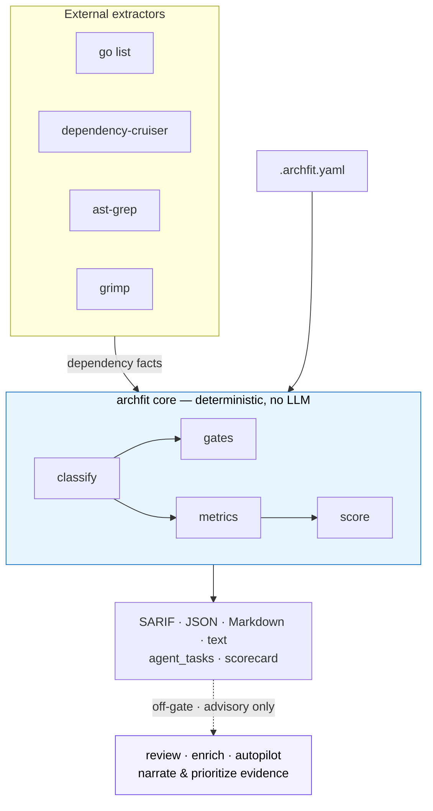
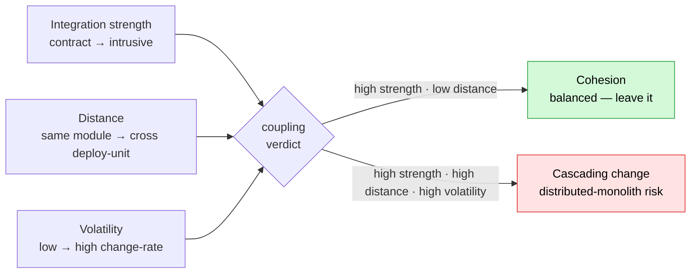

# archfit

[](https://github.com/alexei-led/archfit/actions/workflows/ci.yaml)
[](https://github.com/alexei-led/archfit/actions/workflows/release.yaml)
[](https://github.com/alexei-led/archfit/tags)
[](https://github.com/alexei-led/archfit/pkgs/container/archfit)
[](https://github.com/alexei-led/archfit/pkgs/container/archfit)
[](https://pkg.go.dev/github.com/alexei-led/archfit)
[](https://goreportcard.com/report/github.com/alexei-led/archfit)
[](LICENSE)

**Architecture-fitness checks for AI agents and CI.**

`archfit` checks whether the code still follows the architecture you intended.
It reads code-structure facts from language analyzers, then evaluates them
against `.archfit.yaml`: boundaries, layers, public APIs, cycles, and
[Balanced Coupling](docs/guide/concepts.md).

Balanced Coupling is a way to judge whether a dependency is healthy or risky. It
looks at three things: how strong the dependency is, how far apart the coupled
parts are, and how often they change.

The output is built for automation: deterministic gate violations, structured
repair tasks for agents, and a banded architecture scorecard. Architecture drift
becomes something your agent and CI can act on before it turns into review pain.

## Why

AI agents are good at local edits. They are not good at carrying the whole system
design in context.

That gap matters. An agent can make a change that passes tests while it quietly:

- imports across a forbidden boundary;
- bypasses a module's public API;
- adds a shortcut between layers;
- grows a dependency cycle.

Each single change can look harmless. Over time, those shortcuts become the real
architecture. Coupling grows, bugs cascade across distant modules, and every
future fix needs more human context, more agent tokens, and more retries.

`archfit` puts an architecture-fitness signal in that loop:


When a gate fails, `archfit` emits an `agent_tasks` entry. It is a repair order,
not a vague log line:

```json
{
  "rule_id": "no_internal_access",
  "goal": "Replace the internal-API access from pkg/a/a.go to pkg/b/internal/impl.go with b's public API.",
  "constraints": [
    "Use only the public API of module b",
    "public surface of \"b\": [pkg/b/api/**]"
  ],
  "files": ["pkg/a/a.go", "pkg/b/internal/impl.go"],
  "validation": ["archfit check -c .archfit.yaml --full"]
}
```

The task includes the goal, the constraints, the files to inspect, and the
command that proves the fix.

## How it works

`archfit` separates facts, gates, and narration.

Language adapters collect code-structure facts. A deterministic core evaluates
those facts against your config. Optional LLM features can explain and prioritize
the evidence, but they never decide whether the gate passes.



For unchanged input, gate output is byte-identical. That makes it safe for CI and
for comparing commits. If an optional analyzer is missing, the dependent metric
reports `n/a` with the enable step instead of pretending everything is fine.

## What you get

- **Deterministic gates** for forbidden dependencies, public-API boundaries,
  layer direction, import cycles, and configured thresholds.
- **`agent_tasks` repair blocks** so an AI agent gets the fix, not just the error.
- **A banded 7-dimension scorecard** (`archfit score`): boundary integrity,
  coupling balance, dependency-graph health, cohesion, change locality,
  architecture fitness, and analysis confidence.
- **Balanced-Coupling advisories** — strength × distance × volatility, grouped
  into rollups instead of one line per edge.
- **Honest coverage** — missing tools degrade to `n/a`, not a false green; gaps
  are reported in every output format.
- **Baselines** so accepted current debt does not hide new findings.
- **Syntax facts** (`tools.syntax.enabled: on`) — declaration counts, public API
  totals, and architectural roles (handler/service/repository/domain) for Go,
  TypeScript, Python, and Rust. Powers three new rule types:
  `forbidden_role_dependency`, `public_api_max`, and `public_api_change`.
- **Off-gate LLM narration** (`review`, `enrich`, `autopilot`) that may only
  narrate and prioritize collected evidence — never invent gate violations.

## Methodology — Balanced Coupling

Coupling is not automatically bad. Some parts should move together. The problem
is coupling that is too strong, too distant, or too volatile for the design.

`archfit` operationalizes the checkable parts of Vlad Khononov's Balanced
Coupling model. It scores cross-boundary relationships on three axes and explains
whether the relationship looks cohesive or risky:



It does not replace architecture review — it makes repeatable evidence cheap to
collect and safe to run in CI. For the mapping from theory to signals, see
[Concepts](docs/guide/concepts.md) and [Metrics](docs/guide/metrics.md).

## How it compares

Language-specific boundary linters are still useful. `archfit` sits one level
above them.

Those tools supply facts. `archfit` turns the facts into a measured verdict about
intended architecture, Balanced-Coupling risk, score movement, and repair tasks.

| Tool               | Languages                                | Output for agents/CI                 | Coupling model            | LLM narration |
| ------------------ | ---------------------------------------- | ------------------------------------ | ------------------------- | ------------- |
| **archfit**        | See [languages](docs/guide/languages.md) | SARIF + JSON + `agent_tasks` + score | Balanced Coupling (S/D/V) | off-gate      |
| dependency-cruiser | TS/JS                                    | JSON/HTML, rule violations           | rule-based                | no            |
| import-linter      | Python                                   | text, contract pass/fail             | layered contracts         | no            |
| ArchUnit           | Java/JVM (.NET/TS)                       | test assertions in the build         | rule-based                | no            |

Use a single-language linter when you want fine-grained in-build assertions for
one ecosystem. Use `archfit` when you want one architecture config, one
machine-readable verdict, and feedback shaped for an AI-agent repair loop.

## Quick start

Install the CLI (use a release tag, not `@latest`, in repeatable docs):

```sh
go install github.com/alexei-led/archfit/cmd/archfit@v0.6.1
```

Or run the Docker image with the bundled toolchain:

```sh
docker run --rm -v "$(pwd):/repo" ghcr.io/alexei-led/archfit:v0.6.1 \
  check --config /repo/.archfit.yaml --full
```

Run the first check in a repository:

```sh
archfit doctor                                   # check available analyzers
archfit init --root . --output .archfit.yaml     # generate a starter config
$EDITOR .archfit.yaml
archfit check --config .archfit.yaml --full      # run the gates
archfit score --config .archfit.yaml --full      # banded scorecard
```

Accept current findings as a baseline when they represent known debt:

```sh
archfit baseline --full --config .archfit.yaml
```

Starter configs for common project shapes live in
[`examples/`](examples/README.md). Need Docker, CI, optional analyzers, platform
package managers, or PATH fixes? Start with the [guide](docs/guide/README.md) and
[tooling reference](docs/guide/tooling.md).

## Core commands

| Command                | Use                                                 |
| ---------------------- | --------------------------------------------------- |
| `archfit doctor`       | Check local analyzer/tool availability.             |
| `archfit init`         | Generate a starter `.archfit.yaml`.                 |
| `archfit update`       | Sync `.archfit.yaml` with current structure.        |
| `archfit check`        | Run architecture gates and metrics.                 |
| `archfit score`        | Emit the banded 7-dimension scorecard.              |
| `archfit scan`         | Produce a full Markdown audit report.               |
| `archfit baseline`     | Save accepted current findings.                     |
| `archfit review`       | Off-gate LLM narrative review of the evidence.      |
| `archfit enrich`       | Draft off-gate LLM coupling-label refinements.      |
| `archfit autopilot`    | Draft a full `.archfit.yaml` via LLM (review-only). |
| `archfit diff <ref>`   | Compare scorecard between a git ref and HEAD.       |
| `archfit explain <id>` | Explain one finding by fingerprint prefix.          |
| `archfit install`      | Check or install common analyzer tools.             |

See the [commands guide](docs/guide/commands.md) for flags, formats, and exit
codes. Point `--root` at the repo and `--config` elsewhere to run archfit from
outside the analyzed tree (external CI).

## Documentation

- [Guide](docs/guide/README.md) — documentation map.
- [Overview](docs/guide/overview.md) — what archfit is and when to use it.
- [Why architecture fitness matters](docs/guide/why-architecture-fitness.md) —
  architecture erosion, AI-agent risk, and why this is more than dependency lint.
- [Concepts](docs/guide/concepts.md) — Balanced Coupling, made executable.
- [Metrics](docs/guide/metrics.md) — every metric and how it is scored.
- [Install](docs/guide/install.md) — binary install, Docker, and first analyzer checks.
- [Tooling](docs/guide/tooling.md) — platform setup, package managers, tool versions,
  home pages, and PATH checks.
- [Quick start](docs/guide/quick-start.md) — first useful run.
- [Language support](docs/guide/languages.md) — supported languages and setup.
- [Configuration](docs/guide/configuration.md) — `.archfit.yaml` basics.
- [CI](docs/guide/ci.md) — pull-request and pipeline setup.
- [Agent feedback](docs/guide/agent-feedback.md) — `agent_tasks`, SARIF, and
  `change_locality`.
- [LLM enrichment](docs/guide/llm-enrich.md) — human-reviewed off-gate drafts.
- [Examples](examples/README.md) — starter `.archfit.yaml` templates.
- [Contributing](CONTRIBUTING.md) — local development and release notes.

## License

Apache-2.0. See [LICENSE](LICENSE).
