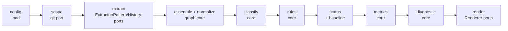
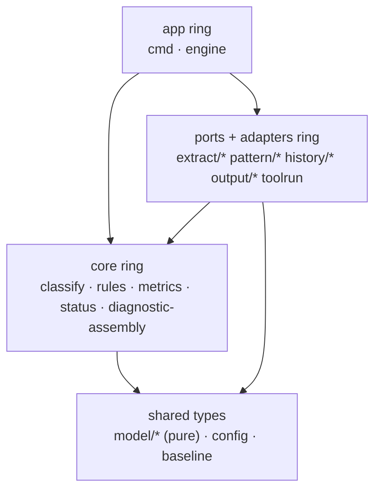

<!-- markdownlint-configure-file { "MD013": { "line_length": 200, "code_blocks": false, "tables": false } } -->

# Archfit — Internal Architecture Design

**Version:** 0.1 draft
**Date:** 2026-06-07
**Status:** design (not an implementation plan)
**Source spec:** [`docs/spec/arch-fitness-spec-v0.4.md`](../spec/arch-fitness-spec-v0.4.md)
**Methodology:** Vlad Khononov, Balanced Coupling (integration strength × distance × volatility)

---

## 0. Purpose and scope

This document designs archfit's **internal module/tool architecture** — the seams between components, the
contracts across them, the direction of dependencies, and the coupling analysis that justifies each boundary.

It sits between the build spec (the _what_) and a future implementation plan (the _how/when_). It does **not**
schedule work, pick exact struct fields, or freeze a public API. The Go signatures below are illustrative — they
fix _shape and direction_, not final names.

The design is organised around one idea: **archfit's own architecture should pass archfit's own check.** Every
boundary is justified with the Balanced Coupling model the tool implements, and every cross-cutting guarantee is
made _structural_ — enforced by the compiler, by construction, or by a CI gate — rather than by discipline.

The level of abstraction analysed throughout is **packages inside one Go binary**. At that level the highest
in-process distance is _cross-package_. archfit also reaches **across the process boundary** to external tools
(dependency-cruiser, import-linter, ast-grep, git), which is genuinely higher distance: separate lifecycle,
ownership, and versions. This two-tier distance is the spine of the analysis.

### Volatility map (drives every boundary)

| Part of archfit   | DDD subdomain     | Volatility                                                     | Architectural implication                                                                  |
| ----------------- | ----------------- | -------------------------------------------------------------- | ------------------------------------------------------------------------------------------ |
| Graph model       | core              | high (symbol-level, new edge kinds later)                      | central contract — small, versioned, additive; immutable value (compiler catches breakage) |
| BC classifier     | core              | high (formulas calibrate)                                      | isolate behind one immutable `Classification` value                                        |
| Metrics           | core / supporting | high (versioned formulas)                                      | independent, each behind its own contract                                                  |
| Rules             | core              | medium–high (new types)                                        | independent, each behind its own contract                                                  |
| Native extractors | generic           | high _implementation_ volatility (native → tree-sitter → SCIP) | strong contract = the graph                                                                |
| External adapters | generic           | provider-switching volatility                                  | anti-corruption layer, highest distance                                                    |
| Config model      | supporting        | medium                                                         | segregate into per-consumer views                                                          |
| Diagnostic model  | core              | medium                                                         | versioned output contract                                                                  |
| Renderers         | generic           | low                                                            | pure functions of the diagnostic                                                           |

---

## 1. Architecture style and invariants

archfit is a **hexagonal (ports-and-adapters) pipeline**. Two concrete, immutable, versioned data models anchor
the centre:

- **Graph model** — normalised architecture facts. The seam between _getting facts_ and _judging them_.
- **Diagnostic model** — findings + metrics + coverage + repair tasks + verdict. The seam between _the engine_ and
  _everything that displays or stores results_.

Four invariants hold everywhere; §7 and §9 show how each is upheld by structure, not discipline:

1. **Pure core, I/O at the edges.** Core packages (`graph`, `classify`, `rules`, `metrics`, `status`, `diagnostic`)
   do no I/O and don't import `os`, `os/exec`, or YAML **directly** (`arch_test` enforces this). They receive a
   `config.Config` (as views) and a `baseline.Baseline` as values built by `cmd`; the `config` and `baseline`
   packages own their own file parsing. Git, subprocess, and renderers sit behind ports at the perimeter.
   Dependencies point **inward**.
2. **Determinism is a contract.** _Same repo + config + base/head + tool versions → identical gate findings and
   deterministic metrics._ Collections are canonically ordered at construction; tool versions are captured; no map
   iteration order escapes into output.
3. **Never silent.** A missing or failed _optional_ tool produces a coverage record and lowers confidence — never an
   empty result that masquerades as "clean."
4. **Quarantine non-determinism.** The verdict and deterministic metrics are computed from gate findings + metric
   results **only**. The semantic/LLM advisory channel is deferred past v1; when it lands it rides a separate type
   the verdict cannot read — the boundary is stated now so it is cheap to honour later.

The composition root (`cmd/archfit` + the `engine` orchestrator) is the **only** place allowed to depend on
everything; it constructs concrete adapters and runs the stages explicitly.

### Why this shape (Balanced Coupling justification)

The two anchor models sit at the centre; everything couples _to them_ via contract/model coupling at **low
effective distance** (in-process, one team). The genuinely high-distance things — external tools — are pushed behind
anti-corruption ports, so their high distance is balanced by **low strength** (they only emit normalised facts).
This satisfies `MODULARITY = STRENGTH XOR DISTANCE` at every seam. The two rejected shapes (layered pipeline with a
threaded `Config`; graph-visitor engine) both create high-strength coupling at high distance — see
[Decision 1](#d1-ports-and-adapters-pipeline).

---

## 2. Pipeline and data flow

One engine runs an explicit sequence of pure stages. Data flows one way; each stage's sealed output is the next
stage's input.



1. **config** — load + validate `archfit.yaml`; project per-consumer views (Section 5).
2. **scope** — git port resolves base/head + changed files → a sealed `Scope` value.
3. **extract** — run `Extractor`s (graph facts), `PatternProvider`s (ast-grep evidence), `HistoryProvider` (churn).
   Emits facts **and coverage records**.
4. **assemble / normalize** — files → modules, resolve real targets (defeat re-export shims, spec §17),
   classify public/internal, impose canonical ordering. Outputs the immutable `Graph`.
5. **classify** — Balanced Coupling classification of every cross-boundary relationship, computed **once** into a
   `coupling.Index` (edge → stable dims). Consumed by **metrics** and by the **severity-join** in diagnostic
   assembly — **not** by gate rules (rules stay decoupled from the volatile classifier; see §3).
6. **rules** — evaluate the rule set over the graph (+ pattern evidence) → findings keyed by edge (no severity yet).
7. **status** — `cmd` loads `.archfit/baseline.json` via `baseline.Load` (accepted finding fingerprints **+ prior
   metric snapshot**) and hands the value in; the stage assigns `new | baseline | excepted | expired_exception |
fixed` and applies exceptions. Runs **before** metrics because status-partitioned counts and deltas depend on it.
8. **metrics** — compute over graph + `coupling.Index` + **status-tagged** findings; status-partitioned counts
   (`new_high`, `baseline_high`, …) and deltas vs the baseline metric snapshot are why metrics run after status.
9. **diagnostic** — **join severity** onto findings from the `coupling.Index` (by edge key); assemble verdict,
   summary, `agent_tasks`, `tool_coverage`.
10. **render** — selected renderers; exit code from verdict (Section 10).

### `check` is the command; `scan` is an alias

There is **one** analysis command — `check` — and one engine. This matches how the field actually works: every
mainstream linter has a single analysis command and expresses delta-vs-full as a _flag_, not a separate command
(`golangci-lint run --new-from-rev`, `ruff check --diff`, `semgrep --baseline-commit`). Splitting on scope alone
would be non-idiomatic; developers and agents expect to run the _same_ command locally and in CI.

So `Mode` is **derived from flags**, not from which subcommand was typed:

| Flag (on `check`)                | Effect                                                                             |
| -------------------------------- | ---------------------------------------------------------------------------------- |
| `--base <ref>`                   | delta scope: emphasise findings new since `<ref>` (the gate default for CI/agents) |
| `--full`                         | full-repo scope: full inventory (baseline debt, exceptions, staleness)             |
| `--advisory`                     | enable the semantic advisory channel (advisory only; never gates)                  |
| `--format json\|markdown\|sarif` | output renderer(s)                                                                 |
| `--report`                       | report-only: do not fail on metric regressions (gate rules still set exit 1)       |

`scan` is a **documented preset alias** for the human-audit use case (onboarding, consulting audit, map refresh) —
it exists for _discoverability_, so that audience need not memorise the flag combination:

```text
archfit scan  ≡  archfit check --full --advisory --report --format markdown
```

This mirrors the only real subcommand split in the field — Semgrep's `scan` vs `ci` — which encodes _intent and
defaults_, not a different engine. (archfit's naming is the more intuitive direction: `check` = gate, like running
tests; `scan` = full audit.)

> **Invariant — `scan` is sugar; the modes must not fork.** All capability lives on `check` via flags. `scan`
> resolves to a `check` flag set before the engine runs; the engine never learns which verb was typed. If `scan`
> ever needs something `check` cannot express as flags, that is a coupling smell — the modes have forked, and the
> fix is a new flag, not a new code path.

The other subcommands stay thin too: `baseline` runs stages 1–7 then writes via `baseline.Save`; `explain`
re-runs the engine in-memory and filters to one finding (no cache file in v1 — stateless and always fresh);
`doctor` uses tool detection; `init` is a separate config-inference component.

---

## 3. Core contracts and the coupling scorecard

The seams as small Go contracts. Each stage receives only the **`Config` view** it needs, never the whole `Config`;
the immutable `Graph` is shared whole but read-only (nothing to narrow — see below).

```go
// --- Producer ports (the anti-corruption perimeter) ---
type Extractor interface {            // graph-fact producers: native AND adapter-backed
    Name() string
    Extract(ctx context.Context, s Scope, c ExtractConfig) (Facts, Coverage, error)
}
type PatternProvider interface {      // ast-grep
    Name() string
    Find(ctx context.Context, s Scope, c PatternConfig) ([]PatternMatch, Coverage, error)
}
type HistoryProvider interface {      // git
    Changed(ctx context.Context, base, head string) (ChangeSet, error)
    Churn(ctx context.Context, s Scope) (ChurnStats, Coverage, error)
}
type ToolRunner interface {           // shared subprocess mechanics (the ONLY os/exec user)
    Detect(ctx context.Context, tool string) (ToolInfo, bool) // path + version + applicability
    Run(ctx context.Context, cmd ToolCmd) (Output, error)
}

// --- Analyzer core (pure). Polymorphic things are interfaces; one-impl things are plain functions. ---
// *graph.Graph is the concrete immutable graph (accessor methods, no exported mutability).
// classify is one impl, so it is a package-level function, not an interface (takes its view at the call):
//   classify.Run(g *Graph, c ClassifyConfig) coupling.Index  — consumed by metrics + the severity-join, NOT by gate rules

type Rule interface {                 // many impls (registry); RuleConfig bound at construction
    ID() string
    Check(g *Graph, ev Evidence) []Finding    // findings carry an edge key; severity is joined later
}
type Metric interface {               // uniform dispatch interface the engine iterates
    Name() string
    Version() string
    Calculate(in CollectedSignals) MetricResult
}
// Concrete metrics implement a typed Calculator[In] for ONE per-family input and
// are adapted to Metric in New() via adapt(metric, CollectedSignals.As<Family>);
// the compiler then forbids a metric from reading a signal outside its family.
type Calculator[In any] interface { Name() string; Version() string; Calculate(In) MetricResult }

// Per-family inputs (the narrow replacement for the former god MetricInput).
// CommonInput is what every metric can rely on; the rest embed it and add a group
// (HistoryInput, SymbolInput, SizeInput, ComplexityInput, FitnessInput, DuplicationInput).
type CommonInput struct {
    Graph           *Graph
    Classifications coupling.Index // edge-keyed lookup of Classification values
    Findings        []Finding      // already status-tagged by the status stage
    Baseline        MetricSnapshot // prior metric values, for deltas
    ToolCoverage    []Coverage
    ChangedFiles    []string       // delta-mode scope
}

// --- Output / state ---
// Renderer is the one interface here (many impls: json/console/markdown/sarif; the engine iterates them).
type Renderer interface { Format() string; Render(d Diagnostic, w io.Writer) error }
// Config and baseline are loaded by plain functions in their own packages; core gets VALUES, never does the I/O:
//   config.Load(ctx) (config.Config, error)          // owns archfit.yaml parsing (imports yaml)
//   baseline.Load(ctx, path) (baseline.Baseline, error) // baseline.Save(ctx, path, Baseline) error
// No Clock interface: cmd captures `now := time.Now()` once and passes it to the status stage.
```

`Graph` and `Diagnostic` are **concrete immutable values**, not interfaces — they are the published languages, so they
are versioned structs with accessor methods and no exported mutability. Consumers get the same `*graph.Graph`
read-only. (No per-consumer graph interfaces: in Go, _adding_ a field or method never breaks a caller, and we are not
swapping graph implementations, so the indirection would buy nothing.)

**Classification flow (deliberate decoupling).** The classifier produces a `coupling.Index` (edge →
`Classification`). It is read by **metrics** (e.g. the unbalanced-edge count) and by the **severity-join** in
diagnostic assembly, which attaches each finding's `Severity` by edge key using the §10.3 strength/distance/volatility
mapping. **Gate rules do not receive classification:** a `forbidden_dependency` is forbidden regardless of strength, so
coupling every rule to the volatile classifier would buy nothing — rules emit edge-keyed findings and severity is
joined afterward. (`Evidence` carries only `PatternProvider` matches, e.g. ast-grep hits a rule needs.)

### The dogfood scorecard

Analysed at the in-binary package level. "Distance (real)" is the true cost hidden behind the contract. The
**Enforced by** column names the _structural_ mechanism that upholds the balance — not discipline.

| Seam             | Consumers                    | Strength          | Distance (real)         | Volatility       | Balanced? | Enforced by                                                                                               |
| ---------------- | ---------------------------- | ----------------- | ----------------------- | ---------------- | --------- | --------------------------------------------------------------------------------------------------------- |
| Graph model      | nearly all                   | model             | low (in-proc)           | high             | ✅        | immutable value, read-only; additive changes don't break callers, compiler catches breaking ones          |
| Diagnostic model | renderers, baseline, explain | contract          | low                     | medium           | ✅        | versioned struct; single output schema version                                                            |
| Extractor        | engine                       | contract          | hides high (subprocess) | high (impl)      | ✅        | output-typed contract; distance isolated in `ToolRunner`                                                  |
| PatternProvider  | rules, engine                | contract          | hides high              | medium           | ✅        | output-typed contract                                                                                     |
| HistoryProvider  | scope, classify              | contract          | hides high              | low              | ✅        | output-typed contract                                                                                     |
| ToolRunner       | adapters only                | contract          | _is_ the boundary       | medium           | ✅        | single `os/exec` choke point + import gate                                                                |
| Classification   | metrics, severity-join       | model             | low                     | high (formulas)  | ✅        | single immutable `Classification` value via `coupling.Index`; not exposed to gate rules                   |
| Rule             | engine                       | contract          | low                     | medium           | ✅        | concrete read-only graph + `Evidence`; `RuleConfig` bound at construction; no classifier dep              |
| Metric           | engine                       | contract          | low                     | high (versioned) | ✅        | per-family inputs (`CommonInput` + opt-in groups) + per-metric config bound at construction + `Version()` |
| Renderer         | engine                       | contract          | low                     | low              | ✅        | pure fn of diagnostic                                                                                     |
| Config views     | each stage                   | contract (narrow) | low                     | medium           | ✅        | per-stage view type (no whole `Config` in signatures)                                                     |
| Baseline I/O     | cmd                          | contract          | hides file I/O          | low              | ✅        | `baseline.Load/Save` funcs; core gets a `Baseline` value, never does the I/O                              |

Every seam lands on `STRENGTH XOR DISTANCE` (or low volatility). The two highest-risk seams are graph and
classification (high fan-in, high volatility). They stay balanced because they are **immutable values at low
(in-process) distance**: a consumer can read them but not mutate them, additive changes don't break callers, and the
compiler flags any breaking change. That is the structural guarantee — not a "keep it small" convention (§9).

### The Baseline artifact and status matching

The `baseline` package loads/saves it with plain functions; `Baseline` is the persisted artifact. It must be defined,
because the `check` semantics (status assignment, metric deltas, the finding fingerprint from §7) depend on its shape:

```go
type Baseline struct {
    SchemaVersion string            // "archfit.baseline.v1"; mismatch = exit 3 + regenerate hint
    Accepted      []AcceptedFinding // the accepted floor: finding fingerprints
    Metrics       MetricSnapshot    // name → {value, version} for delta computation
    // optional run context (not used for matching): createdAt, per-tool versions
}
type AcceptedFinding struct {
    Fingerprint string // hash(rule_id+from+to+kind) — the §7 identity, NO line numbers
    RuleID      string
}
type MetricSnapshot map[string]struct{ Value float64; Version string }
```

**Status matching algorithm** (the `status` stage), purely by fingerprint set arithmetic — deterministic, no fuzzy
matching:

| Current run        | In `Baseline.Accepted`? | Matches a config exception? | Status                   |
| ------------------ | ----------------------- | --------------------------- | ------------------------ |
| finding present    | no                      | no                          | `new`                    |
| finding present    | yes                     | —                           | `baseline`               |
| finding present    | —                       | yes, unexpired              | `excepted`               |
| finding present    | —                       | yes, expired                | `expired_exception`      |
| finding **absent** | yes                     | —                           | `fixed` (debt paid down) |

Notes that close the spec gaps:

- **Exceptions live in `archfit.yaml`, not the baseline.** The baseline records the accepted _floor_; exceptions are
  a separate, expiring, human-approved overlay matched at status time (spec §11). Keeping them apart is why an
  exception can expire and flip a `baseline` edge to a gate failure without rewriting the baseline file.
- **Metric deltas** = current metric value − `Baseline.Metrics[name].Value`, only when the metric `Version` matches;
  a version bump invalidates the delta (reported as "new baseline needed", not a false regression).
- **Migration:** a `SchemaVersion` mismatch is a hard error (exit 3) with an `archfit baseline` re-generate hint —
  never a silent reinterpretation of old data.

---

## 4. Package decomposition and the dependency rule

Refines spec §15. The key change versus the spec: a **`model/`** group holds the published languages (pure data,
zero deps), and the import rule is **mechanically enforced**, not documented.

```text
cmd/archfit/            # main; flag parsing (kong); THE composition root — only place with full fan-out
internal/
  engine/               # stage orchestrator; runs the pipeline by Mode; depends on contracts, not adapters
  model/                # published languages — import nothing but stdlib (NO yaml, NO os, NO os/exec)
    graph/              #   Graph, Node, Edge (immutable, versioned)
    coupling/           #   Classification + coupling.Index
    finding/            #   Finding, Severity, Confidence, RepairTask, PatternMatch
    diagnostic/         #   Diagnostic, MetricResult, MetricSnapshot, Coverage, Verdict, Summary
  config/               # Config + per-consumer view types + projection + Load (archfit.yaml; imports yaml)
  baseline/             # Baseline/AcceptedFinding types + status-matching + Load/Save (.archfit/baseline.json)
  scope/                # Scope type + delta resolution (consumes history port)
  classify/             # classify.Run (pure core func)
  rules/                # Rule contract + built-in rules
  metrics/              # Metric contract + built-in metrics
  status/               # baseline diff, exception match, status assignment (pure; takes a captured `now`)
  extract/              # Extractor contract + graph assembly/normalization
    golang/ ts/ py/     #   native scanners (go/packages; static TS; static Python) — in-process
    depcruise/ importlinter/   # adapters (out-of-process)
  pattern/              # PatternProvider contract
    astgrep/
  history/              # HistoryProvider contract
    git/
  toolrun/              # ToolRunner (subprocess, detect, version capture)
  output/               # Renderer contract
    jsonout/ console/ markdown/ sarif/
  doctor/  initcfg/     # tool-detection report; config inference for `archfit init`
```

This is the **target** package shape, not a big-bang build. Phase 1 (spec §16) instantiates **all three language
extractors** — `extract/golang` (native `go/packages`), `extract/ts` (dependency-cruiser adapter), `extract/py` (grimp
adapter) — plus `history/git`, `output/{jsonout,console}`, and the core. Deferred to later phases: `pattern/astgrep`
(structural evidence), SCIP/LSP semantic real-target resolution and a `tree-sitter` native fallback (the
native → tree-sitter → SCIP fidelity ladder), and `markdown`/`sarif` renderers. See Decision D8.

### The one import rule — four rings, dependencies point inward



1. **shared types** — `model/*` (pure: graph, coupling, finding, diagnostic) plus `config` and `baseline`. `config`
   and `baseline` own their own file parsing, so they import yaml/json — they are the one pragmatic exception to
   "everything below core is pure."
2. **core** — imports shared types only (`config` **views**, never the loader path). **Forbidden (direct imports):**
   `os`, `os/exec`, YAML, `toolrun`, any adapter — the `arch_test.go` gate enforces this. Core receives `Config`/
   `Baseline` as values from `cmd` and never calls `config.Load`/`baseline.Load` (convention, review-caught — the
   one spot not compiler-proof; see D3).
3. **ports + adapters** — import shared types, their own contract, and `toolrun`.
4. **app** — `engine` imports contracts + core; `cmd` imports concretes and calls `config.Load`/`baseline.Load`.

### Explicit wiring, no global registries

The composition root _constructs_ the producer/rule/metric/renderer slices and passes them into `engine.Run`:

```go
cfg  := config.Load(ctx)                       // config package owns archfit.yaml parsing
base := baseline.Load(ctx, path)               // returns a Baseline value (empty if none)
ex   := []Extractor{ golang.New(cfg.ForExtract("go")), depcruise.New(runner, cfg.ForExtract("ts")) }
rs   := rules.New(cfg)                            // []Rule — each closed over its own RuleConfig
ms   := metrics.New(cfg)                          // []Metric — each closed over its own MetricConfig
rn   := []Renderer{ jsonout.New(), console.New() }
diag, err := engine.Run(ctx, mode, scope, cfg.ForClassify(), ex, patterns, history, rs, ms, base, rn, now)
// classify is a func the engine calls (classify.Run); `base` is a value; `now` is time.Time. No ports for them.
```

No `init()` registration, no hidden global state (explicit data flow beats magic). The engine never imports an
adapter, so it never transitively pulls `os/exec` — the import rule stays mechanically true. Adding a built-in is a
one-line construction; adding a plugin later (Section 8) is the same, reading manifests instead of literals.

---

## 5. Config segregation (per-consumer views)

The spec hands the whole `Config` to `Extractor`/`Rule`/`Metric`. That is a god-object: a rule can read anything, and
adding a metric-only field changes the type every rule depends on. It is model coupling where contract coupling will
do.

**One config file, one `Config` struct.** The fix is _what each stage receives_: a narrow, read-only **view** — a
projection of the one `Config`, not a copy.

| View                               | Consumer        | Contains                                                                                   |
| ---------------------------------- | --------------- | ------------------------------------------------------------------------------------------ |
| `ScopeConfig`                      | scope           | default base, exclusions                                                                   |
| `ExtractConfig`                    | each extractor  | paths, exclusions, lang settings (tsconfig path, py roots), tool mode                      |
| `PatternConfig`                    | pattern         | ast-grep specs, enable                                                                     |
| `ClassifyConfig`                   | classify        | `ModuleMap` + layers + strength hints (contract/shared-model paths) + volatility overrides |
| `RuleConfig`                       | rules           | rule specs + `ModuleMap` + exclusions                                                      |
| `MetricConfig`                     | **each** metric | _only that metric's_ block + bands                                                         |
| `ExceptionSet` + `MapReviewConfig` | status          | exceptions, `stale_after`                                                                  |
| `OutputConfig`                     | render          | formats, file paths                                                                        |

`ModuleMap` (module defs + `ModuleFor(path)`) is the one sub-view shared by classify/rules/status — stable
vocabulary, read-only, low distance. Sharing it is fine; it is not the volatile part.

This is **structural**: views are **bound at construction**. The composition root projects each view —
`rules.New(cfg)`, `metrics.New(cfg)` close over their slice; `classify.Run` takes `cfg.ForClassify()` at the call —
so `Rule.Check` and `Metric.Calculate` never take a `Config` parameter. A rule physically cannot reach a metric
field; adding that field leaves `RuleConfig` untouched. (Same reason `CommonInput` carries shared artifacts only —
never the config.)

Loading lives in the same `config` package (it owns `archfit.yaml` parsing). Core depends on `config` for the
**view types** and receives a built `Config` from `cmd` — it never calls `config.Load`. That last point is
convention rather than compiler-proof; splitting the loader into its own package would make it proof, but that is
deferred as unneeded for v1 (see D3).

---

## 6. The adapter / anti-corruption layer (the hot path)

Most producers run **out-of-process** — the design reuses existing tools rather than re-implementing them in Go. So
this layer carries the most weight, and native in-process extraction (Go via `go/packages`) is the _exception_: an
`Extractor` that happens not to call `ToolRunner`.

Every adapter-backed `Extractor` is the same five steps:

```text
detect ─▶ run ─▶ parse ─▶ normalize ─▶ coverage
```

1. **detect** — `ToolRunner.Detect`: binary present? version? applicability markers (depcruise needs `package.json`;
   import-linter needs a Python project). If `mode: auto` and absent/not-applicable → emit a coverage record and
   return **no facts, no error**. The gate never fails because a tool is missing.
2. **run** — `ToolRunner.Run` with a context timeout, a **controlled minimal env** (locale/TZ pinned for
   determinism), captured stdout/stderr/exit, and the **tool version recorded**.
3. **parse** — a per-tool `Parser`: foreign output (depcruise JSON, import-linter report, ast-grep JSON) → typed
   intermediate structs. The brittle, version-sensitive part, isolated per adapter and unit-tested against captured
   fixtures.
4. **normalize** — the anti-corruption translation: foreign paths/nodes → `model/graph` nodes, repo-relative paths,
   **resolve real targets** (defeat re-export shims, spec §17), attach `confidence`/`language`/`locations`.
   Per-adapter output is `Facts`; the `extract` assembly stage merges all `Facts`, dedups, and seals the `Graph`.
5. **coverage** — every adapter emits a coverage record (tool, version, files seen/expected, unresolved count,
   status). Feeds the coverage metric and per-finding confidence.

**`ToolRunner` is the single choke point** — the only package that touches `os/exec`. Adapters never shell out
directly. One place to enforce timeouts, env control, version capture, and determinism; and adapters become testable
by mocking `ToolRunner`.

**One authoritative extractor per language per run.** If both a native scanner and an adapter exist and both are
enabled+present, **prefer the adapter** (higher fidelity), fall back to native, and **record the choice in
coverage**. We do not merge two sources for one language — assembly dedups edges by canonical key, keeping the
highest-priority source. This is a _mechanical_ dedup, not a "remember not to merge" rule.

**Confidence flows, never fails.** Unresolved/dynamic imports lower an edge's `confidence`; they don't drop the edge
or fail the gate. Native scanners may carry lower confidence than adapters — stated honestly in coverage.

### v1 roster

| Contract          | v1 implementations                                                                                                             |
| ----------------- | ------------------------------------------------------------------------------------------------------------------------------ |
| `Extractor`       | `golang` (native `go/packages`, in-proc) · `ts` (dependency-cruiser via `bunx`/`npx`) · `py` (grimp via `uv run`/`python3.12`) |
| `HistoryProvider` | `git` (adapter, Tier 0 required)                                                                                               |
| `PatternProvider` | `astgrep` — **deferred to Phase 3** (`Evidence` empty in v1)                                                                   |

All three `Extractor`s share one contract: native Go and the out-of-process TS/Python adapters emit identical `Facts`.
`doctor` reuses `Detect` across the roster (go; node + dependency-cruiser; python3.12 + uv/grimp; git) to print
availability, versions, and install hints. Higher-fidelity tiers (tree-sitter native fallback, SCIP/LSP real-target
resolution) are deferred — see Decision D8.

---

## 7. Determinism and coverage (cross-cutting)

Neither is a module — both are constraints realised at specific seams, made structural in Section 9, with CI gates as
backstop.

### The guarantee and its enemies

| Threat                     | Mitigation                                               | Where                      |
| -------------------------- | -------------------------------------------------------- | -------------------------- |
| Go map-range randomization | never expose maps at a boundary; seal as sorted slices   | every artifact constructor |
| Subprocess output ordering | normalize sorts facts by canonical key                   | `extract` assembly         |
| Parallel adapter execution | run concurrently, collect, then sort → order-independent | engine                     |
| Tool version drift         | capture version; record in coverage + tool fingerprint   | `toolrun`                  |
| Filesystem walk order      | sort paths                                               | extractors / assembly      |
| Wall clock                 | `now` captured once in `cmd`, passed to the status stage | `status`                   |
| Machine-specific paths     | normalize to repo-relative                               | normalize step             |
| Random/unstable IDs        | identity = content fingerprint, computed in constructor  | `finding` model            |

**Canonical ordering keys:** nodes by `type:path`; edges by `(from, to, kind, firstLocation)`; findings by
`(rule_id, edgeKey)`; metrics by name; coverage by tool.

**Finding identity.** `id = hash(rule_id + from + to + kind)` — **no line number**. So _one finding per (rule,
source→target edge); multiple sites collapse into `locations[]`._ Line numbers in identity would churn the baseline
on every edit. Identity is computed inside `finding.New`, so an ID-less or mis-ordered finding is unrepresentable.

**Comparable body vs run metadata.** Wall-clock, durations, and host go in a separate `run` envelope (or stderr),
**excluded** from the deterministic body. Golden tests compare only the body.

### Coverage is a second data channel

It runs parallel to facts: producers → coverage metric → diagnostic.

- `coverage = extracted / applicable`; `confidence = evidence quality after missing/failed/partial tools`.
- **Per-finding confidence** is derived in diagnostic assembly from the confidence of the edges/evidence behind it +
  coverage of that language/area.
- **Confidence caps the band** (spec §10.1): low confidence caps the highest reportable band, so the tool never
  implies precision it lacks.
- **Never silent:** a missing optional tool always yields a coverage record; `doctor` and `scan` surface them with
  install hints.

---

## 8. Extensibility seam (not built in v1)

The four plugin kinds in spec §14 (`extractor`, `rule`, `metric`, `output`) map one-to-one onto contracts we already
have. So a future process-plugin is just one more adapter: a generic implementation of one contract that uses
`ToolRunner` to exec an external binary and exchanges JSON (the spec's `stdin`/`stdout` protocol). Because contract
inputs/outputs are already plain data structs, that JSON is a direct serialization of the in-process contract.

**v1 does not build any of this.** The point here is only that the contracts don't _preclude_ it — no plugin runtime,
no wire-schema, no extra CI gates until there is a real plugin to support.

---

## 9. Resilience — from discipline to structure

The principle that ties the design together:

> **Sealed artifacts and narrow inputs.** Every stage boundary is an immutable value built by a constructor (sorted,
> deduped, IDs assigned) and passed read-only; each stage receives only the view it needs. Determinism, blast-radius,
> and the non-determinism quarantine are enforced by _construction and the compiler_ — with two CI gates as backstop,
> not per-site discipline.

### Discipline rules made structural

Each invariant that would otherwise rely on "be careful" is turned into a compile error or a red build:

| Invariant                                 | Structural mechanism                                                                                     |
| ----------------------------------------- | -------------------------------------------------------------------------------------------------------- |
| Core imports no I/O / adapters _directly_ | `arch_test.go` (via `go/packages`) import gate; later archfit-on-archfit                                 |
| One source per language                   | `extract` assembly dedups by canonical edge key, highest-priority source wins                            |
| Each stage sees only its config           | view types bound at construction (§5) — no signature takes `Config`                                      |
| Verdict ignores non-deterministic input   | `computeVerdict(gates []Finding, …)` — when advisory lands it is a different type the compiler keeps out |

Determinism and stable finding identity are enforced the same way — **sealed constructors** (sort/dedup/freeze, ID
computed in `finding.New`) plus canonical ordering — detailed in §7.

The two mechanisms that carry most of this, both cheap:

```go
// Sealed constructors: determinism is a property of construction, not a rule at every output site.
graph.Build(facts []Facts) Graph             // sorts canonically, dedups by edge key, picks one source/language, freezes
finding.New(rule RuleID, e Edge, locs []Loc) // computes the fingerprint ID inside the constructor

// Category-typed signature: the gate physically cannot read a future advisory.
func computeVerdict(gates []Finding, metrics []MetricResult) Verdict
```

### CI gates (two for v1, one later)

| Gate                                    | Catches                                                              | Cost                       |
| --------------------------------------- | -------------------------------------------------------------------- | -------------------------- |
| `arch_test.go` (uses `go/packages`)     | ring violations (core _directly_ importing os/os-exec/YAML/adapters) | zero deps, plain `go test` |
| double-run golden                       | nondeterminism (same inputs → byte-identical body)                   | one test                   |
| **archfit checks archfit** (graduation) | the import rule as `archfit.yaml`, once the engine runs              | the dogfood payoff         |

### Deliberately not done in v1

To keep this simple, the design **omits** several guards until a real need appears: per-consumer graph _interfaces_
(the graph is one immutable value; Go doesn't break callers on additive change), a `Classification`/evidence type
split (one struct until evidence grows), a schema-compatibility gate (a version constant suffices with no external
consumers), and a JSON round-trip gate (it guards the deferred plugin protocol). Each is a one-change addition later
if it earns its place.

---

## 10. Error model and exit codes

Verdict and "the run itself failed" are **orthogonal** axes.

```text
exit 0  pass
exit 1  gate failed                  } from verdict (run succeeded)
exit 2  metric regression / warning  }
exit 3  tool/config error            } the run could not produce a trustworthy verdict
```

- **Coverage gap → continue, lower confidence.** A missing _optional_ tool, unresolved imports, partial extraction.
  Recorded in coverage; never aborts.
- **Hard error → abort, exit 3.** Invalid/unparseable config; missing Tier-0 `git`; bad base ref; a tool set
  `enabled: on` (not `auto`) that won't exec.

`engine.Run` returns `(Diagnostic, error)`: a non-nil error → exit 3 and **no verdict** (the diagnostic is partial,
clearly marked); a nil error → the verdict drives 0/1/2. This keeps "we couldn't tell" from ever masquerading as
"clean."

---

## 11. Decision records

### D1. Ports-and-adapters pipeline

- **Context:** archfit normalises heterogeneous (mostly out-of-process) tool output, then judges it deterministically.
- **Options:** (A) hexagonal pipeline with a pure core; (B) layered pipeline threading `Config`; (C) graph-visitor
  engine.
- **Choice:** A.
- **Why:** B makes `Config` a god-object (model coupling, system-wide blast radius) and leaks I/O into rule/metric
  packages (core gains high-distance coupling to external tools). C couples visitors to graph internals (intrusive,
  high strength) and makes ordering implicit (determinism harder). A keeps the two anchor models central and pushes
  high-distance tools behind ACL ports — `STRENGTH XOR DISTANCE` at every seam.

### D2. Producers grouped by output type; unified `Extractor` + `ToolRunner`

- **Context:** producers run in-process and out-of-process; three output kinds (graph facts, pattern evidence,
  history).
- **Options:** (1) group by output type — `Extractor`/`PatternProvider`/`HistoryProvider`, with subprocess mechanics
  in a shared `ToolRunner`; (2) group by where it runs — `Extractor` (in-proc) vs `Adapter` (subprocess); (3) one
  mega `Source` returning everything.
- **Choice:** 1.
- **Why:** a native scanner and dependency-cruiser share the same output knowledge (graph facts) → identical strength
  toward core. Their only difference is _distance_, an implementation detail belonging in `ToolRunner`. (2) splits one
  concept across two interfaces by an implementation detail and lumps ast-grep (evidence) with depcruise (edges) just
  because both are subprocesses (low cohesion). (3) forces a fat interface most producers can't satisfy (stamp/
  intrusive coupling). Rule: group by _who consumes the output_, not _how it executes_.

### D3. Config: views, single `config` package

- **Options:** (a) one `config` package (types + views + loader) and one `baseline` package (types + store), each
  importing yaml/json; (b) split each into pure types + a separate `*io` loader so core's import graph is provably
  YAML-free; (c) pass whole `Config` to every stage.
- **Choice:** a.
- **Why:** (c) is the god-object — rejected; the real fix is per-consumer **views bound at construction** (no stage
  signature takes `Config`), which (a) and (b) both deliver. (b) additionally keeps core from _transitively_
  importing YAML, compiler-enforced — but costs two extra packages with unexpected names (`configio`/`baselineio`).
  For v1 we favour **fewer, expected packages** (a): core still imports no `os`/`os/exec`/YAML **directly**
  (`arch_test`), and the only residual is convention — core must not call `config.Load`. Splitting to (b) later is
  mechanical if that convention ever bites.

### D4. Finding identity = content fingerprint, one per edge

- **Options:** (a) `hash(rule_id+from+to+kind)`, sites in `locations[]`; (b) sorted ordinal `archfit-001`;
  (c) fingerprint including line number.
- **Choice:** a.
- **Why:** (b) renumbers when any finding is inserted → breaks baseline matching and `explain`. (c) churns the
  baseline on every line edit. (a) is stable across runs and unrelated edits — exactly what baseline status matching
  needs. A short sorted ordinal may appear as a human alias, but the fingerprint is canonical.

### D5. Explicit wiring, no global registries

- **Options:** (a) composition root constructs and passes slices into `engine.Run`; (b) `init()` self-registration
  into global registries.
- **Choice:** a.
- **Why:** explicit data flow over hidden global state; keeps the engine free of adapter imports so it never
  transitively pulls `os/exec` — the import rule stays mechanically true.

### D6. Structure over discipline (cheap structure only)

- **Choice:** enforce each cross-cutting invariant by construction or the compiler, with two CI gates as backstop
  (Section 9) — sealed constructors, view types bound at construction, a category-typed verdict, and the
  `arch_test.go` import gate. Stop there: no abstractions added for futures that don't exist yet (§9, "deliberately
  not done").
- **Why:** enforced guarantees beat remembered ones, but only when the structure is cheaper than the bug it prevents.
  Sealed values and one import test are cheap; speculative interfaces and schema gates are not, so they wait.

### D7. `explain` is stateless

- **Choice:** `explain <id>` re-runs the engine in-memory and filters to the fingerprint; no cache file in v1.
- **Why:** always fresh, no stale-cache class of bugs, no extra persistence surface. Revisit only if re-run cost
  becomes a problem.

### D8. Three languages from v1; adapters for TS/Python; fidelity tiers deferred

- **Context:** the tool is "useless Go-only" — TypeScript and Python are the primary audience; Go is the simplest path.
- **Choice:** ship all three import extractors in v1 behind one `Extractor` contract — Go native (`go/packages`),
  TypeScript via the **dependency-cruiser** adapter (`bunx`/`npx`), Python via **grimp** through a bundled PEP 723 helper
  run with **`uv`** (ephemeral) or `python3.12`. Use grimp directly, not import-linter (import-linter is a contract
  checker built on grimp; archfit has its own rule engine and needs only the graph).
- **Deferred (designed-for, not built):** ast-grep `PatternProvider`; SCIP indexers / LSP for symbol-level real-target
  resolution (the §17 re-export-shim problem); a `tree-sitter` in-process native fallback. These form the
  native → tree-sitter → SCIP fidelity ladder; v1 does best-effort resolution via the adapters themselves.
- **Why:** the architecture is already adapter/`ToolRunner`-centric, so two more `Extractor` impls are the cheap part;
  the expensive semantic tiers buy fidelity the v1 audience does not yet need. Missing toolchains degrade via the
  coverage channel (never silent), so the bare Go binary stays useful. Distribution: a `scratch` image runs Go only;
  full TS/Python analysis needs Node and Python present (host, CI, or a fatter image).

---

## 12. Open questions (carried from spec §18)

These are intentionally _not_ decided here; they are calibration/threshold questions, not structural ones, and the
architecture above absorbs any answer without changing shape:

- Severity defaults for unbalanced edges (post-calibration with Vlad).
- Whether _same owner, different module_ is medium or low distance by default.
- Whether _different deploy_unit, same owner_ is high distance by default.
- When to add the tree-sitter native fallback and SCIP/LSP semantic resolution (the fidelity ladder; D8 defers both —
  v1 uses dependency-cruiser for TS and grimp for Python, decided).
- Whether semantic advisory is LLM-based, pattern-based, or omitted from the first public release (the _channel_ is
  designed; the _implementation_ is deferred).

---

## 13. Summary

archfit is a hexagonal pipeline with two stable, versioned, immutable anchor models (graph, diagnostic) and a pure
core surrounded by anti-corruption ports. Producers are grouped by output type; the high-distance subprocess world is
quarantined behind a single `ToolRunner`. Configuration reaches each stage as a narrow view, not a god-object.

Every cross-cutting guarantee — determinism, the non-determinism quarantine, the import rule — is **structural**:
enforced by sealed constructors, immutable values, view types bound at construction, a category-typed verdict, and two
CI gates, not by discipline. Speculative guards (graph interfaces, schema gates, the plugin protocol) are deferred
until something needs them. The architecture is its own test fixture: archfit can check archfit, and its own design
passes its own Balanced Coupling scorecard.
