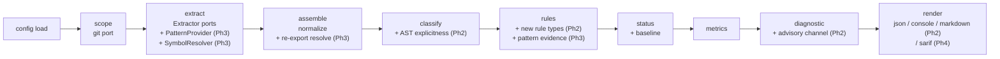

<!-- markdownlint-configure-file { "MD013": false, "MD036": false, "MD024": { "siblings_only": true } } -->

# Archfit — Internal Architecture Design

**Version:** 0.2 draft
**Date:** 2026-06-08
**Status:** design (not an implementation plan)
**Supersedes:** [`arch-fitness-architecture-v0.1.md`](arch-fitness-architecture-v0.1.md)
**Source spec:** [`docs/spec/arch-fitness-spec-v0.4.md`](../spec/arch-fitness-spec-v0.4.md)
**Methodology:** Vlad Khononov, Balanced Coupling (integration strength × distance × volatility)

---

## Changelog from v0.1

v0.2 adds three topic areas to the v0.1 foundation:

1. **Phase 2** — BC classification extension (AST-level explicitness signals, full severity table), three new rule types, Markdown renderer, `archfit init`, map-staleness checks, exception inventory in `scan` output.
2. **Phase 3** — `PatternProvider` port with ast-grep adapter, `SymbolResolver` port with SCIP-backed barrel-file resolution, fidelity ladder.
3. **CI/CD + Distribution** — GitHub Actions workflow design, cross-platform binary release, multi-arch Docker fat image.

All Phase 1 decisions (D1–D8) and structural invariants carry forward unchanged. New decisions are D9–D18.

---

## 0. Scope, invariants, and methodology

_(Carried from v0.1 unchanged — see §0–§4 of v0.1 for the full baseline.)_

Phase 2 introduces two new architectural constraints not present in Phase 1:

- **BC findings are evidence, not gates.** The Balanced Coupling model was designed as a design-reasoning tool, not an automated CI gate. Vlad Khononov's explicit position: "it's not something that is going to be easy to incorporate in a continuous integration pipeline." Phase 2 BC findings carry `kind: "advisory"` and appear in `archfit scan` output; they never contribute to exit 1. Structural rule findings (`forbidden_dependency`, `public_api_only`, `forbidden_layer_direction`, `cycle`) remain the only gate channel.

- **Static binary, no CGO.** `CGO_ENABLED=0` everywhere. No tree-sitter in-process fallback (see D9). The fat Docker image (§CI-3) bundles the full external toolchain, making an in-process native fallback redundant.

---

## 1. Pipeline — Phase 2/3 additions

The v0.1 pipeline stages are numbered 1–10. Phase 2 extends stages 3, 5, and 9; Phase 3 extends stage 3 further. No stage is replaced; the extensions are additive.



### Stage 3 extension (extract) — Phase 2

The Go extractor gains an optional **AST explicitness pass** controlled by `cfg.GoExtractAST bool` (default `true` if `go/types` load succeeds). This pass runs after the import-path scan and enriches each `graph.Edge` with an `Explicitness` hint that the classifier reads.

### Stage 3 extension (extract) — Phase 3

Two new ports join the extractor stage:

- `PatternProvider` — runs ast-grep patterns, returns `[]PatternMatch` that the rule stage attaches as `Evidence`.
- `SymbolResolver` — runs SCIP indexers, writes a symbol-resolution map used during graph normalization to resolve re-export shims and barrel files.

### Stage 5 extension (classify) — Phase 2

`classify.Run` uses the new `Explicitness` hints from the extractor pass, plus the full Khononov severity table, to populate `coupling.Classification.Explicitness` and derive a `Severity` directly from the balance formula.

### Stage 9 extension (diagnostic) — Phase 2

A second finding list is assembled: `advisoryFindings []finding.Finding` with `kind: "advisory"`. These are BC findings that failed the balance check. They appear in the diagnostic only when `mode.Advisory = true` (i.e. `archfit scan`). The `verdict` and exit code ignore them entirely.

---

## 2. Phase 2 additions

### 2.1 BC classification extension (`internal/classify`)

Phase 1 already populates `Strength` (contract/intrusive from config globs), `Distance` (from owner/deploy_unit fields), and `Volatility` (from subdomain). Phase 2 completes the four-dimension model.

#### Khononov severity table

The balance formula yields severity for every cross-boundary relationship:

```
BALANCE = (STRENGTH XOR DISTANCE) OR NOT VOLATILITY

severity:
  balanced + any volatility           → ok        (not a finding)
  imbalanced + low/unknown volatility → advisory   (tolerable in practice)
  imbalanced + high volatility        → advisory   (BC violation — surfaced in scan)
  intrusive + any distance            → advisory   (always surfaced, strength override)
  intrusive + cross_deploy_unit       → advisory:high  (highest risk)
```

The severity field on advisory findings uses `low | medium | high | critical`:

| Condition                                           | Severity       |
| --------------------------------------------------- | -------------- |
| Balanced                                            | — (no finding) |
| Imbalanced, low/unknown volatility                  | low            |
| Imbalanced, high volatility                         | medium         |
| Intrusive, cross_module_diff_owner, low volatility  | medium         |
| Intrusive, cross_module_diff_owner, high volatility | high           |
| Intrusive, cross_deploy_unit, any volatility        | critical       |

> **Design constraint:** These severity defaults are starting points for calibration. The `archfit.yaml` config allows per-module `volatility` override and per-rule `severity_override`. Do not hardcode defaults that can't be tuned.

#### Explicitness (`coupling.Explicitness`)

Phase 1 set explicitness to `explicit` if strength=contract and `implicit` if strength=intrusive, else `unknown`. Phase 2 adds AST signals to resolve `unknown` → `explicit` or `implicit` for Go (TS and Python remain at glob-tier; see D10).

New explicitness map for Go (higher confidence than globs):

| AST signal                                            | Explicitness | Strength override |
| ----------------------------------------------------- | ------------ | ----------------- |
| `//go:linkname` directive                             | implicit     | intrusive         |
| `unsafe.Pointer` cast to external type                | implicit     | intrusive         |
| `reflect` + unexported field by string name           | implicit     | intrusive         |
| Embeds external **concrete** struct (not interface)   | implicit     | functional        |
| Type assertion to external **concrete** type          | implicit     | functional        |
| Implements external **interface** (structural typing) | explicit     | contract          |
| Type assertion to external **interface**              | explicit     | contract          |
| Standard import of exported symbol                    | explicit     | contract/model    |

These signals are detected during the Go extractor's AST pass (see §2.2). The classifier reads them from a new `graph.Edge.ExplicitnessHint` field (optional; empty string = "use config-glob classification").

#### `coupling.Classification` change

No struct change needed — `Explicitness` was already stubbed in Phase 1. Phase 2 populates it from both the existing config-glob path and the new AST hint path.

---

### 2.2 AST explicitness pass (`internal/extract/golang`)

A new unexported function `detectExplicitness(pkgs []*packages.Package, modulePath string) map[edgeKey]explicitnessHint` runs after the import-position scan within `GoExtractor.Extract`. It uses `packages.Package.TypesInfo` (populated when `NeedTypes` is set — already required by the Phase 1 load mode) to walk type assertions, struct literals, and comments.

Patterns to detect:

```go
// go:linkname — scan File.Comments for "//go:linkname"
// unsafe.Pointer — scan for call to unsafe.Pointer() with a type conversion target in another package
// reflect — scan for selector expressions calling reflect.ValueOf/TypeOf followed by FieldByName/Method calls
// struct embedding — scan StructType.Fields for anonymous fields whose type resolves to an external package
// interface implementation — use types.Implements(T, iface) for local types vs external interfaces
// type assertion — scan TypeAssertExpr.Type; check if asserted type is concrete or interface
```

This pass is **optional and defensive**: if `pkg.TypesInfo == nil` (ill-typed package) the pass silently skips that package, leaving `ExplicitnessHint` empty. The classifier falls back to config-glob classification for those edges. The arch_test gate already ensures core packages don't import `go/types` directly; this lives in the adapter layer (`extract/golang`) where it belongs.

---

### 2.3 New rule types (Phase 2)

Three rule types deferred from Phase 1 (spec §9):

#### `internal_api_access`

Fires on any edge with `kind: uses_internal` (already produced by the extractor). This is functionally equivalent to `public_api_only` but the config shape separates concerns:

```yaml
rules:
  - id: no-internal-access
    type: internal_api_access
    # from/to glob filters are optional (empty = all edges)
    gate: fail
```

Difference from `public_api_only`: `internal_api_access` can be scoped to specific from/to globs and carries `MatchedBy` showing the internal path explicitly.

#### `new_cross_module_dependency`

Fires when a cross-module edge is `status: new` and did not exist in the baseline. Useful for teams that want to review every new module dependency before it lands:

```yaml
rules:
  - id: no-new-cross-module-deps
    type: new_cross_module_dependency
    from: services/checkout/**
    to: services/pricing/**
    gate: warn # prompts review; human promotes to fail after triage
```

The rule reads `finding.Status` from the status-assigned findings. An edge that was in the baseline is `status: baseline` and does not fire.

#### `cycle` rule type

The Phase 1 cycle metric gates on `gate: fail` config. Phase 2 adds a dedicated `cycle` rule type for explicit per-cycle-pair control:

```yaml
rules:
  - id: no-module-cycles
    type: cycle
    gate: fail
```

The rule type is sugar that delegates to the same Tarjan SCC detection as `CycleMetric`. The difference: as a rule, each cycle emits a **finding with specific from/to edge evidence** (the shortest cycle path), making it actionable with `archfit explain`. The metric still emits the aggregate count; the rule emits granular findings.

---

### 2.4 `scan` command and Markdown renderer

`scan` is already defined as `check --full --advisory --report --format markdown` (spec §4.5, v0.1 §2). Phase 2 makes `--advisory` meaningful (Phase 1 stubbed it) and adds the `markdown` format renderer.

#### Markdown renderer (`internal/output/markdown`)

The renderer uses two stdlib/well-scoped dependencies:

- **`text/template`** (stdlib) — report skeleton: headings, conditional sections, summaries.
- **`github.com/jedib0t/go-pretty/v6/table`** — tables: `RenderMarkdown()` for file output, `Render()` for terminal. Same data struct, two output modes.

No `goldmark` (goldmark is a parser, not a generator). No `glamour` (cosmetic enhancement deferred).

Report structure (designed for engineering teams — lead with what they read, bury what they skip):

```markdown
# Architecture Report — <repo> <head> (<date>)

## Health Summary

<one-line verdict> | gate_findings: N | advisories: N | coverage: X%

## Critical Gate Violations

<table: rule_id | from | to | why | constraint>
(up to 10; "run archfit check --format json for full list" if more)

## BC Advisories (archfit scan only)

<table: severity | from_module | to_module | strength | distance | volatility>
(only when --advisory; top N by severity)

## Metrics

<table: name | value | band | delta | trend>

## Map Staleness

<list: uncovered paths | dead rules | last-scanned age>

## Exception Inventory

<table: rule | from | to | reason | approved_by | expires>

---

<details><summary>Full violation list</summary>
...
</details>
```

The `<details>` collapse keeps the report skimmable in GitHub PR review.

#### Terminal output for `scan`

`scan` runs to terminal as well as file. The same `go-pretty` `Table.Render()` call produces colored ASCII output; `Table.RenderMarkdown()` writes the `.md` file. Both from the same populated `table.Writer` — no duplication.

When stdout is a terminal: render color table via `Render()`.
When stdout is a file or pipe: render Markdown via `RenderMarkdown()`.
`cmd` detects via `term.IsTerminal(os.Stdout.Fd())` (stdlib since Go 1.21: `golang.org/x/term`).

---

### 2.5 `archfit init`

A new sub-command that auto-generates a starter `archfit.yaml` by inspecting the repo. This reduces the barrier to adoption.

#### Discovery approach (Go)

1. Run `go list -json ./...` (via `toolrun.Runner`) to enumerate packages with `Dir`, `ImportPath`, and `Imports`.
2. Group packages into candidate modules using directory depth heuristics: packages under the same first two path segments after the module root are a candidate module.
3. For each candidate module: collect import edges to other candidate modules → infer public paths (top-level `.go` files) vs internal paths (`internal/` subdirs).
4. Emit a `archfit.yaml` skeleton with `modules:`, `rules: [{type: forbidden_dependency, gate: warn}]`, and `layers:` derived from the directory structure.

#### Discovery approach (TypeScript)

1. Detect `package.json` in the repo root.
2. Read `src/` or `lib/` directory for top-level subdirs → candidate modules.
3. Emit modules with `paths: ["src/<module>/**"]`.

#### Discovery approach (Python)

1. Detect `pyproject.toml` or `setup.py`.
2. Read the top-level package directory for subpackages.
3. Emit modules with `paths: ["<pkg>/<subpkg>/**"]`.

All discovered rules default to `gate: warn`. The `init` command annotates the generated file with `# TODO: review and promote rules to gate: fail after calibration`.

---

### 2.6 Map staleness (`internal/staleness`)

A new optional check run during `--full` scope to flag when the architecture map may have drifted from reality. Implemented as a pure function (no I/O, same ring as core stages).

Three structural checks:

1. **Uncovered paths:** Any import path in the graph that matches no module's `paths:` glob → warning finding, `kind: "advisory"`, `rule_id: "map/uncovered_path"`.
2. **Dead rules:** Any module `paths:` glob that matches zero files in the repo → warning finding, `rule_id: "map/dead_rule"`.
3. **Stale timestamp:** If `reviewed_at` is set on a module and `now - reviewed_at > staleness_threshold` (default 90 days) AND the module had any new findings since the review date → warning finding, `rule_id: "map/stale_review"`.

These are `kind: "advisory"` findings and appear in `archfit scan` output. They do not affect the gate verdict.

The `staleness` package sits at the **core ring** (pure function, same constraints as `classify`, `rules`, `metrics`, `status` — no I/O).

---

### 2.7 Exception inventory

`archfit scan` includes an exception inventory section listing all active exceptions from the config, their expiry dates, and approved-by fields. This is read from `cfg.ForStatus().Exceptions` — no new stage, just a new section in the Markdown renderer.

Stale/expired exceptions (exceptions that already expired AND their associated findings are gone) are highlighted so teams can clean up the config.

---

## 3. Phase 3 design

### 3.1 `PatternProvider` port and ast-grep adapter

Phase 1 defined an empty `Evidence` struct in the rules stage. Phase 3 fills it via a new production port.

#### Port contract

```go
// internal/engine/ports.go (Phase 3 addition)
type PatternProvider interface {
    Name() string
    // Find runs structural pattern queries against the repo at scope root.
    // Returns per-file, per-line pattern matches that rules attach as Evidence.
    Find(ctx context.Context, s scope.Scope, c config.PatternConfig) ([]PatternMatch, diagnostic.Coverage, error)
}

type PatternMatch struct {
    File    string
    Line    int
    Column  int
    Pattern string // the rule ID that matched
    Text    string // matched source text
    Node    string // tree-sitter node kind
}
```

The `PatternConfig` view exposes a list of `PatternDef` values:

```yaml
rules:
  - id: no-direct-db-access
    type: forbidden_dependency
    from: services/checkout/**
    to: internal/db/**
    gate: fail
    # Phase 3: attach structural evidence to the finding
    patterns:
      - id: no-direct-db-access
        lang: go
        rule: |
          pattern: sql.Open($_, $_)
          message: Direct sql.Open call outside db adapter
```

#### ast-grep adapter (`internal/extract/astgrep`)

ast-grep has no Go API — subprocess only. The adapter shells out to `sg` (the ast-grep CLI binary):

```
sg --lang go --json run --pattern '...' <files>
```

Detection: `toolrun.Runner.Detect(ctx, "sg")`. If absent and `PatternConfig.Mode == ModeAuto` → return empty matches + coverage record `status: "absent"`. Never fail.

Tool tier: **Tier 2** (optional; presence in PATH enables pattern evidence). Add to `doctor` output.

#### Rule stage integration (Phase 3)

Rules receive `Evidence` populated by the engine stage:

```go
// engine.Run: after PatternProvider.Find, build evidence index
evidenceIndex := indexByFile(patternMatches)

// rule.Check receives the evidence for edges touching each file
type Evidence struct {
    PatternMatches []PatternMatch // populated in Phase 3; empty in Phase 1/2
}
```

Rules that have `patterns:` config attach matching `PatternMatch` values to their findings as a `evidence` field. Rules without `patterns:` config are unaffected.

---

### 3.2 `SymbolResolver` port and SCIP-backed barrel-file resolution

TypeScript barrel files (`index.ts` re-exporting from `internal/`) and Python `__init__.py` shims can hide real coupling from import-path analysis. SCIP provides compiler-grade symbol resolution to defeat this.

#### Port contract

```go
// internal/engine/ports.go (Phase 3 addition)
type SymbolResolver interface {
    Name() string
    // Resolve returns the real import target for a given resolved import path.
    // If the path is a re-export shim, Resolve returns the real source file.
    // Returns the same path if resolution is not possible or not needed.
    Resolve(ctx context.Context, fromFile, toPath string) (realPath string, confidence string)
}
```

#### SCIP adapter (`internal/extract/scip`)

Three SCIP indexers, all subprocess only:

| Language   | Indexer                  | Status (2026-06)   |
| ---------- | ------------------------ | ------------------ |
| TypeScript | `scip-typescript` v0.4.0 | Active, TS 5.x     |
| Python     | `scip-python`            | Active (tag-based) |
| Go         | `scip-go` v0.2.7         | Active             |

**Workflow for TypeScript barrel resolution:**

```
scip-typescript --output index.scip <repo>   # subprocess
↓
read index.scip via github.com/sourcegraph/scip (Go library)
↓
build re-export map: "src/index.ts: X" → "src/internal/x.ts"
↓
SymbolResolver.Resolve("src/a.ts", "src/index.ts") → "src/internal/x.ts"
```

The engine calls `SymbolResolver.Resolve` during the **assemble/normalize** stage (stage 3 in the pipeline, after raw extraction). The resolved target replaces the barrel path in graph edges, making previously-hidden coupling visible.

**Confidence downgrade on unresolved shims:**
When a SCIP index cannot resolve a path, the edge keeps its original target and confidence is downgraded to `"medium"` (vs `"high"` for fully resolved edges). This is consistent with the Phase 1 principle: never drop an edge, always lower confidence.

**Fallback chain (fidelity ladder):**

```
Phase 1: import-path analysis (dependency-cruiser for TS, grimp for Python, go/packages for Go)
Phase 2: + AST explicitness signals (Go extractor)
Phase 3: + SymbolResolver (SCIP indexers) for re-export resolution
         + PatternProvider (ast-grep) for structural evidence
```

Each tier is behind the same port contracts. Higher tiers are optional (detect → run → fallback to lower tier on absence). The graph and diagnostic schema are unchanged — only edge confidence and `Evidence.PatternMatches` get richer.

**Detection and tool tier:**

| Tool              | Tier   | `doctor` output |
| ----------------- | ------ | --------------- |
| `scip-typescript` | Tier 2 | Yes             |
| `scip-python`     | Tier 2 | Yes             |
| `scip-go`         | Tier 2 | Yes             |
| `sg` (ast-grep)   | Tier 2 | Yes             |

All absent → `SymbolResolver` returns the input path unchanged (identity resolver); `PatternProvider` returns empty matches. Phase 1/2 behavior is preserved exactly.

---

### 3.3 Fidelity ladder and confidence model

The fidelity ladder is explicit in the architecture. Each tier adds resolution depth; each step has a detectable tool and a confidence budget.

| Tier | Tools                               | Edge confidence                      | Barrel resolution                      |
| ---- | ----------------------------------- | ------------------------------------ | -------------------------------------- |
| 0    | none                                | high (Go only)                       | N/A                                    |
| 1    | dependency-cruiser (TS), grimp (Py) | high                                 | No (via Node resolver in dep-cruiser)  |
| 2    | + AST pass (Go)                     | high + explicit hints                | No improvement needed for Go internals |
| 3    | + SCIP indexers                     | high (resolved), medium (unresolved) | Yes (TypeScript fully, Python partial) |
| 3    | + ast-grep                          | high                                 | No (pattern evidence, not resolution)  |

**No CGO, no tree-sitter in-process.** (Decision D9.) TS/Python analysis requires either external toolchains or the fat Docker image. The bare static binary produces meaningful Go analysis everywhere and gracefully degrades for TS/Python with a coverage record.

---

## 4. CI/CD pipeline and distribution

### 4.1 GitHub Actions — CI workflow (`.github/workflows/ci.yaml`)

Trigger: push + pull_request to main/master.

```yaml
# Job dependency: lint → test → build
# lint is fastest; test needs Node+Python for extractor tests; build is matrix cross-compile
```

**Job: lint**

- `actions/setup-go@v6` (go-version-file: go.mod, cache: false)
- `golangci/golangci-lint-action@v9` (version: v2.12, manages its own cache)
- `golang/govulncheck-action@v1.0.4` (go-package: ./...)

**Job: test** (depends on lint)

- `actions/setup-go@v6`
- `actions/setup-node@v6` (node-version: '22') — for TypeScript extractor integration tests
- `astral-sh/setup-uv@v8` (python-version: '3.13') — for Python extractor integration tests
- `go test -race -coverprofile=coverage.out ./...`
- CI gates 1 & 2: `go test ./internal/ -run TestArchImports` + `go test ./internal/engine/ -run TestGolden`
- Upload coverage artifact

**Job: build** (depends on test)

- Matrix: `{linux/amd64, linux/arm64, darwin/amd64, darwin/arm64}`
- All targets on `ubuntu-latest` (pure Go cross-compile, no native macOS runner needed)
- `CGO_ENABLED=0 GOOS=${} GOARCH=${} go build -trimpath -ldflags="-s -w -X main.version=..."`
- Upload binaries as artifacts

---

### 4.2 Release workflow (`.github/workflows/release.yaml`)

Trigger: push of semver tag (`v[0-9]+.[0-9]+.[0-9]+` and `v*-rc.*`).

Jobs: **build-binaries** + **build-docker** (parallel after tag) → **release** (after both).

**Job: build-binaries**

- Same matrix as CI build job
- Outputs: `dist/archfit-v{VERSION}-{OS}-{ARCH}[.exe]` + `SHA256SUMS`
- Uses `actions/upload-artifact@v4`

**Job: build-docker** (see §4.3)

**Job: release** (depends on build-binaries + build-docker)

- `actions/download-artifact@v4` (merge-multiple: true)
- Auto-generate release notes from `git log` between tags
- `gh release create ${GITHUB_REF_NAME} --notes-file RELEASE_NOTES.md dist/*`

**Makefile target (`make release`)** for local release testing:

```makefile
VERSION ?= $(shell git describe --tags --always --dirty)
release:
    @mkdir -p dist
    @for GOOS in linux darwin; do \
        for GOARCH in amd64 arm64; do \
            CGO_ENABLED=0 GOOS=$$GOOS GOARCH=$$GOARCH \
            go build -trimpath -ldflags "-s -w -X main.version=$(VERSION)" \
            -o dist/archfit-$(VERSION)-$$GOOS-$$GOARCH ./cmd/archfit; \
        done; \
    done
    @cd dist && sha256sum * > SHA256SUMS
```

---

### 4.3 Docker images — fat multi-arch image

**Single image target** (`ghcr.io/alexei-led/archfit:vX.Y.Z`). Linux only, two architectures: `linux/amd64` + `linux/arm64`. No `darwin`, no Windows (Docker for desktop is Linux containers).

The image is **self-contained**: it bundles Go binary + Node.js + dependency-cruiser + Python 3.12 + uv + grimp. Users don't need any toolchain on the host.

#### Base image choice

`debian:12-slim` (bookworm-slim). Rationale:

- glibc — full PyPI wheel compatibility (Alpine/musl breaks grimp's C-extension wheels)
- Native arm64 package support (aarch64)
- Smaller than ubuntu:24.04 (~30 MB compressed vs ~35 MB)
- Same foundation as `node:22-slim` (same Debian version, same libc)

#### Multi-stage Dockerfile

```dockerfile
# syntax=docker/dockerfile:1
ARG DEBIAN_VERSION=bookworm-slim
ARG NODE_VERSION=22
ARG UV_VERSION=0.5.0
ARG DEPCRUISER_VERSION=17

# ── Stage 1: Go cross-compile (runs on builder native arch, no QEMU) ─────
FROM --platform=$BUILDPLATFORM golang:1.26-bookworm AS go-builder
ARG TARGETOS TARGETARCH VERSION COMMIT DATE
WORKDIR /src
COPY go.mod go.sum go.work go.work.sum* ./
RUN go mod download
COPY . .
RUN CGO_ENABLED=0 GOOS=${TARGETOS} GOARCH=${TARGETARCH} \
    go build -trimpath \
    -ldflags "-s -w -X main.version=${VERSION} -X main.commit=${COMMIT} -X main.date=${DATE}" \
    -o /out/archfit ./cmd/archfit

# ── Stage 2: Python venv with grimp ──────────────────────────────────────
FROM --platform=$TARGETPLATFORM python:3.12-slim-bookworm AS py-builder
COPY --from=ghcr.io/astral-sh/uv:${UV_VERSION} /uv /uvx /bin/
ENV UV_COMPILE_BYTECODE=1 \
    UV_LINK_MODE=copy \
    UV_PYTHON_DOWNLOADS=never \
    UV_SYSTEM_PYTHON=1
RUN --mount=type=cache,target=/root/.cache/uv \
    uv pip install grimp

# ── Stage 3: Final runtime image ─────────────────────────────────────────
FROM debian:${DEBIAN_VERSION}

# Install Node.js 22 via NodeSource (official, supports arm64)
# Install Python 3.12 runtime + ca-certs
RUN apt-get update && apt-get install -y --no-install-recommends \
        ca-certificates curl git gnupg \
        python3.12 python3.12-distutils libpython3.12 \
    && mkdir -p /etc/apt/keyrings \
    && curl -fsSL https://deb.nodesource.com/gpgkey/nodesource-repo.gpg.key \
        | gpg --dearmor -o /etc/apt/keyrings/nodesource.gpg \
    && echo "deb [signed-by=/etc/apt/keyrings/nodesource.gpg] https://deb.nodesource.com/node_22.x nodistro main" \
        > /etc/apt/sources.list.d/nodesource.list \
    && apt-get update && apt-get install -y nodejs \
    # Install dependency-cruiser globally
    && npm install -g dependency-cruiser@${DEPCRUISER_VERSION} \
    && npm cache clean --force \
    && rm -rf /var/lib/apt/lists/*

# Copy uv binary (multi-arch manifest — Docker resolves correct arch)
COPY --from=ghcr.io/astral-sh/uv:${UV_VERSION} /uv /uvx /usr/local/bin/

# Copy grimp + deps from Python builder (installed into system Python)
COPY --from=py-builder /usr/local/lib/python3.12/dist-packages /usr/local/lib/python3.12/dist-packages

# Copy archfit binary
COPY --from=go-builder /out/archfit /usr/local/bin/archfit

# Non-root user
RUN groupadd -r archfit && useradd -r -g archfit archfit
USER archfit

# uv should not try to download Python inside the container
ENV UV_PYTHON_DOWNLOADS=never \
    UV_SYSTEM_PYTHON=1

ENTRYPOINT ["/usr/local/bin/archfit"]
```

**Key design notes:**

- `FROM --platform=$BUILDPLATFORM` in the Go builder stage means the Go compiler runs natively on the CI runner (no QEMU overhead for compilation).
- `--platform=$TARGETPLATFORM` for the Python stage ensures Python wheels are the correct arch.
- uv is copied from the official `ghcr.io/astral-sh/uv` multi-arch manifest — Docker resolves amd64/arm64 automatically.
- The Python stage installs grimp into `system-python` (no venv needed inside Docker).
- Estimated image size: ~280-350 MB (Node.js + npm modules dominate; grimp + deps ~80 MB; Go binary <10 MB).

#### Multi-arch build in GitHub Actions

Use **native matrix runners** (not QEMU) for complex images with compiled Python wheels and npm install. GitHub provides `ubuntu-24.04-arm` native ARM64 runners.

```yaml
jobs:
  build-docker:
    strategy:
      matrix:
        include:
          - { platform: linux/amd64, runner: ubuntu-latest }
          - { platform: linux/arm64, runner: ubuntu-24.04-arm }
    runs-on: ${{ matrix.runner }}
    outputs:
      digest-${{ matrix.platform == 'linux/amd64' && 'amd64' || 'arm64' }}: ${{ steps.build.outputs.digest }}
    steps:
      - uses: actions/checkout@v4
      - uses: docker/login-action@v3
        with:
          {
            registry: ghcr.io,
            username: "${{ github.actor }}",
            password: "${{ secrets.GITHUB_TOKEN }}",
          }
      - uses: docker/setup-buildx-action@v3
      - uses: docker/build-push-action@v6
        id: build
        with:
          platforms: ${{ matrix.platform }}
          push: true
          outputs: type=image,name=ghcr.io/${{ github.repository }},push-by-digest=true,name-canonical=true
          build-args: |
            VERSION=${{ github.ref_name }}
            COMMIT=${{ github.sha }}
            DATE=${{ github.event.head_commit.timestamp }}
          cache-from: type=gha,scope=docker-${{ matrix.platform }}
          cache-to: type=gha,mode=max,scope=docker-${{ matrix.platform }}

  merge-docker:
    needs: build-docker
    runs-on: ubuntu-latest
    steps:
      # ... download digests, create multi-arch manifest with docker buildx imagetools
      - name: Create multi-arch manifest
        run: |
          docker buildx imagetools create \
            -t ghcr.io/${{ github.repository }}:${{ github.ref_name }} \
            -t ghcr.io/${{ github.repository }}:latest \
            ghcr.io/${{ github.repository }}@${{ needs.build-docker.outputs.digest-amd64 }} \
            ghcr.io/${{ github.repository }}@${{ needs.build-docker.outputs.digest-arm64 }}
```

Rationale for native runners: QEMU + `uv pip install` and `npm install` have a known hang issue on arm64. Native runners eliminate this and cut build time 3-5× for complex images.

#### Image labels and OCI annotations

```dockerfile
LABEL org.opencontainers.image.title="archfit"
LABEL org.opencontainers.image.description="Architecture fitness checker for Go, TypeScript, and Python"
LABEL org.opencontainers.image.source="https://github.com/alexei-led/archfit"
LABEL org.opencontainers.image.licenses="Apache-2.0"
```

---

## 5. Decisions

### D9: No tree-sitter / no CGO (Phase 3 native fallback dropped)

**Decision:** `CGO_ENABLED=0` throughout. No tree-sitter in-process fallback.

**Rejected alternatives:**

- CGO + `go-tree-sitter`: breaks static cross-compilation and scratch images; fat Docker already bundles toolchains, making the fallback redundant
- WASM via wazero: `github.com/malivvan/tree-sitter` is pre-release with 3 commits
- Pure-Go reimplementation (`odvcencio/gotreesitter`): surfaced during research but too new (days old at research time) to rely on; revisit in Phase 3 when it has a stable track record

**Consequences:**

- Bare static binary: meaningful Go analysis anywhere; TS/Python degrade to coverage-gap + install hint
- Fat Docker image: full analysis for all three languages (no host toolchain required)
- SCIP adapters (Phase 3): subprocess-only, consistent with all other external tools

---

### D10: Explicitness — config-glob for TS/Python, AST pass for Go (Phase 2)

**Decision:** Phase 2 AST explicitness signals are Go-only. TypeScript and Python remain at config-glob tier.

**Rationale:** The AST signals that detect intrusive access (`go:linkname`, `unsafe.Pointer`, `reflect`, struct embedding) are Go-specific patterns with no direct equivalents in TS/Python at Phase 2 fidelity. TypeScript intrusive signals (double casts, `as any`, module augmentation) require the TypeScript type checker to resolve accurately — that is Phase 3 SCIP work. Python private-prefix signals (`_module`) are already captured by path globs.

---

### D11: BC findings are advisory — never gate CI

**Decision:** All BC findings carry `kind: "advisory"`. They never produce exit 1. Gate channel is structural rules only.

**Authority:** Vlad Khononov, the methodology's author: "it's not something that is going to be easy to incorporate in a continuous integration pipeline." (Tech Lead Journal, ep. 188.)

**Operationally:** `archfit check` (CI gate) ignores advisory findings for the verdict. `archfit scan` (human audit) surfaces them with full detail. Teams that want to hard-gate specific patterns should define a `forbidden_dependency` or `public_api_only` rule instead — these are structural, unambiguous, and appropriate for CI.

---

### D12: `scan` is a flag alias, not a separate command

_(Carried from v0.1, now made binding for Phase 2 implementation.)_

`archfit scan ≡ archfit check --full --advisory --report --format markdown`. The engine never learns which verb was typed. Markdown renderer is a new output adapter (`internal/output/markdown`); the rest of the pipeline is unchanged.

---

### D13: Markdown renderer — `text/template` + `go-pretty`

**Decision:** `text/template` (stdlib) for report skeleton; `github.com/jedib0t/go-pretty/v6/table` for tables.

**Rejected:** `goldmark` (parser, not generator); `glamour` (cosmetic enhancement only, deferred); raw `fmt.Fprintf` (unmaintainable for a structured multi-section report).

**Architecture:** The Markdown renderer lives in `internal/output/markdown`, same layer as `internal/output/jsonout` and `internal/output/console`. It satisfies `engine.Renderer`. `go-pretty` is a new module dependency; it stays in the adapter layer and never crosses into core.

---

### D14: Docker base image — `debian:12-slim`

**Decision:** `debian:12-slim` (bookworm-slim) as the runtime base for the fat image.

**Rejected:** Alpine (musl libc breaks grimp's glibc-linked wheels on PyPI); ubuntu:24.04 (slightly larger, no functional difference for this use case).

---

### D15: Multi-arch Docker — native matrix runners, not QEMU

**Decision:** Separate jobs on `ubuntu-latest` (amd64) and `ubuntu-24.04-arm` (arm64); merge manifest after both complete.

**Rejected:** Single job with `docker/setup-qemu-action` — QEMU + `uv pip install` has a known hang bug (astral-sh/uv#11699); QEMU builds for complex multi-runtime images exceed 30 minutes.

---

### D16: `new_cross_module_dependency` rule defaults to `gate: warn`

**Decision:** The `new_cross_module_dependency` rule type defaults to `gate: warn` in generated configs.

**Rationale:** Automatically failing on any new cross-module dependency in CI would create friction before teams have established and calibrated their module boundaries. `warn` surfaces the information for review; teams promote to `fail` after deliberate architecture decisions.

---

### D17: `archfit init` uses `go list` for discovery (not AST)

**Decision:** `archfit init` uses `toolrun.Runner` to invoke `go list -json ./...` for Go discovery. No in-process AST analysis.

**Rationale:** `go list` provides the accurate package graph including build tag resolution. Direct AST parsing would miss build constraints. Consistent with the existing extractor approach.

---

### D18: SCIP version pins (Phase 3 implementation note)

The SCIP indexers are subprocess tools with no stable Go APIs. Pin specific versions and treat them like external tools:

- `scip-typescript`: `@0.4.0` or later
- `scip-python`: pin to a commit tag (no formal releases as of 2026-06)
- `scip-go`: `@v0.2.7` or later
- `github.com/sourcegraph/scip`: for reading `.scip` protobuf output in-process

These are Tier 2 tools: detected via `doctor`, graceful degradation on absence, confidence downgrade on partial results.

---

## 6. Deferred (not in Phase 2 or Phase 3)

| Feature                            | Deferred to                                         | Reason                                                      |
| ---------------------------------- | --------------------------------------------------- | ----------------------------------------------------------- |
| `change_locality` metric           | Phase 2+                                            | "needs calibration against real tasks" (spec §10.4)         |
| `repair_task` JSON content         | Phase 4                                             | Needs stable JSON contract + agent loop                     |
| SARIF output                       | Phase 4                                             | Needs stable JSON contract                                  |
| GitHub Action wrapper              | Phase 4                                             | Depends on SARIF                                            |
| MCP server                         | Phase 4                                             | Needs stable JSON contract                                  |
| TS/Python AST explicitness signals | Phase 3                                             | Requires SCIP type information                              |
| TypeScript double-cast detection   | Phase 3                                             | `as unknown as T` requires tsc type checker                 |
| Full connascence classification    | Phase 2+                                            | After calibration on real findings                          |
| Plugin protocol                    | Phase 4+                                            | Deferred per spec §14                                       |
| `goreleaser`                       | Never (fleet uses make-release + gh release create) | Fleet convention                                            |
| cosign image signing               | Optional in Phase 2/3                               | Not blocked; add when team needs it                         |
| `archfit:scratch` image            | Phase 2+                                            | Pure-Go static binary on scratch; TS/Py need host toolchain |

---

## Appendix A — Updated package layout (Phase 2/3 additions)

```
internal/
  model/                  ← Phase 1 (unchanged)
  config/                 ← Phase 1 (+ PatternConfig, SymbolResolverConfig views in Phase 3)
  baseline/               ← Phase 1
  scope/                  ← Phase 1
  classify/               ← Phase 1 (+ Phase 2 AST hint integration, full severity table)
  rules/                  ← Phase 1 (+ internal_api_access, new_cross_module_dependency, cycle in Phase 2)
  metrics/                ← Phase 1
  status/                 ← Phase 1
  staleness/              ← NEW Phase 2 (map staleness checks)
  engine/                 ← Phase 1 (+ PatternProvider, SymbolResolver ports in Phase 3)
  extract/
    golang/               ← Phase 1 (+ AST explicitness pass in Phase 2)
    ts/                   ← Phase 1
    py/                   ← Phase 1
    astgrep/              ← NEW Phase 3 (ast-grep PatternProvider adapter)
    scip/                 ← NEW Phase 3 (SCIP SymbolResolver adapter)
  history/git/            ← Phase 1
  toolrun/                ← Phase 1
  output/
    jsonout/              ← Phase 1
    console/              ← Phase 1
    markdown/             ← NEW Phase 2 (text/template + go-pretty Markdown renderer)
cmd/archfit/              ← Phase 1 (+ scan alias, init command in Phase 2)
.github/
  workflows/
    ci.yaml               ← NEW Phase 2 (lint + test + build jobs)
    release.yaml          ← NEW Phase 2 (binary release + Docker)
Dockerfile                ← NEW Phase 2 (fat multi-arch image)
Makefile                  ← Phase 1 (+ release target, docker targets in Phase 2)
```

---

## Appendix B — Action version reference (verified 2026-06-08; re-verify at implementation)

| Action                          | Version  | Notes                                         |
| ------------------------------- | -------- | --------------------------------------------- |
| `actions/checkout`              | `v4`     |                                               |
| `actions/setup-go`              | `v6`     | Node 24 runtime; honors `toolchain` directive |
| `actions/setup-node`            | `v6`     | Node 22 LTS                                   |
| `actions/upload-artifact`       | `v4`     | Requires unique artifact names                |
| `actions/download-artifact`     | `v4`     | `merge-multiple: true`                        |
| `actions/cache`                 | `v4`     | Use restore/save split for multi-job          |
| `golangci/golangci-lint-action` | `v9`     | v2 config schema; golangci-lint v2.12         |
| `golang/govulncheck-action`     | `v1.0.4` | Pin to commit SHA for reproducibility         |
| `astral-sh/setup-uv`            | `v8`     |                                               |
| `docker/build-push-action`      | `v6`     |                                               |
| `docker/setup-buildx-action`    | `v3`     |                                               |
| `docker/login-action`           | `v3`     |                                               |
| `docker/setup-qemu-action`      | `v3`     | Only if QEMU fallback needed                  |

Native ARM64 runner: `ubuntu-24.04-arm` (GitHub-hosted, GA as of 2024).
