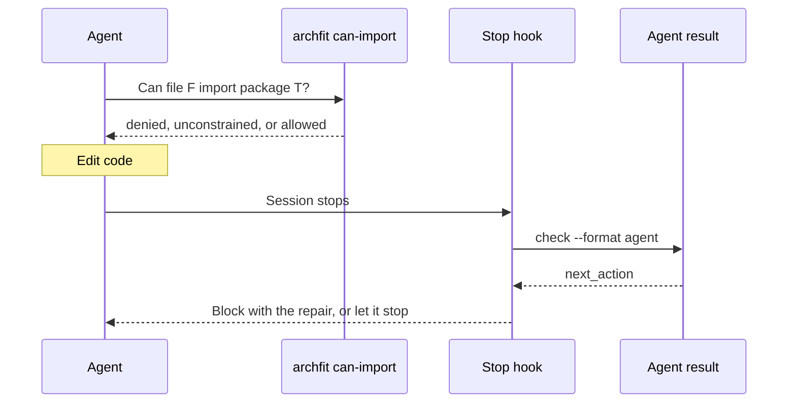

# Agent guardrails

## What this is

This plan covers what an AI coding agent gets from archfit before and after
an edit. Before an edit, it asks whether module A can import B. After an edit,
it gets a small result with one next action. It also covers the hooks, the
generated `AGENTS.md` block, and the embedded skill that connect these to agent
hosts. These are Wave 2 items 2.3 to 2.5 in the [roadmap](erosion-roadmap.md).
The MCP server is a Wave 4 item. All commands, flags, and JSON below are
**proposed**. None of them exists in the current engine.

**Already built:** `agent_tasks[]` repair contracts with rule-aware
constraints and no public-API route for a forbidden target. Seam-gate tasks
list files, task text is one bounded line, and `--base` runs set task `origin`. When a ratchet blocks, text and
Markdown list the metrics that worsened. See
[the agent feedback loop](../../guide/agent-feedback.md) and the
[v2.4.0 release notes](../../guide/release-notes.md#v240--guardrails-that-fire).

## Terms

| Term         | Meaning                                                                                        |
| ------------ | ---------------------------------------------------------------------------------------------- |
| Gate finding | A finding from a rule. With `gate: fail` and an active status, it blocks `check` (exit 1).     |
| Agent task   | One entry in `agent_tasks[]`: the repair contract for one active gate finding.                 |
| Origin       | `introduced` or `pre_existing`, set by comparing against a `--base` run.                       |
| Next action  | The one instruction the agent result gives: what the agent does next.                          |
| Allowlist    | A module's `depends_on` or `visible_to` list. See [guardrail language](guardrail-language.md). |

## Problems that remain

- **No pre-edit question.** An agent cannot ask which module owns a path, or
  whether A can import B. It must re-derive this from `.archfit.yaml`. There, the
  most specific glob owns a path, and Python globs are dotted. A Go `from:`
  matches files, but a Go `to:` matches packages.
- **The output is too large for an agent.** On the engine's own repository,
  `check --format json` writes about 285 KB (178 findings, 71 seams) and takes
  about 20 s. An agent needs a small part of it.
- **No stop signal.** Exit 2 (`needs_attention`) is the normal state of most
  repositories. A correct fix can still end at exit 2. The agent cannot tell
  "done" from "still broken".
- **Tasks are not grouped.** One import that breaks two rules gives two
  findings and two separate tasks.
- **No host integration.** There is no Stop hook, no pre-commit hook, and no
  generated instruction block. The skill in `skills/archfit` is copied by hand.

## The agent loop



## 2.3 Agent result: `--format agent`

`check` and `analyze` get a new format value, `agent`. It writes
`archfit.agent-result.v1`, a projection of the same run. The exit code stays
the verdict.

**Proposed:**

```json
{
  "schema_version": "archfit.agent-result.v1",
  "verdict": "blocked",
  "next_action": "repair",
  "summary": "1 repair introduced by this change; 0 blockers elsewhere",
  "repairs": [
    {
      "finding_ids": ["d9c3ea8b…", "8b71a1c7…"],
      "rule_ids": ["core_no_toolrun", "layer_inversion"],
      "repair_kind": "code_change",
      "origin": "introduced",
      "edge": {
        "from": "internal/relationship/scoring/scorer_book.go",
        "to": "internal/toolrun",
        "kind": "imports"
      },
      "at": [
        { "file": "internal/relationship/scoring/scorer_book.go", "line": 5 }
      ],
      "goal": "…",
      "constraints": ["…"],
      "edit": ["internal/relationship/scoring/scorer_book.go"]
    }
  ],
  "evidence_gaps": [],
  "unevaluated_rules": [],
  "omitted": { "repairs": 0, "advisories": 171 },
  "validate": "archfit check --format agent --since main"
}
```

**Repairs.**

1. Group the active gate tasks by edge (`from`, `to`, `kind`). One import that
   breaks two rules gives one repair.
2. Set `repair_kind` to `code_change` when any grouped task needs a code change.
3. Fill `edit` from the source side of the edge. Never list a forbidden target.
4. Sort: in scope first, then `code_change`, then severity, then lowest ID.

**Scope.** `--since <ref>` runs with `--base merge-base(ref, HEAD)`. Origin
alone decides scope: `introduced` is in scope, and `pre_existing` is outside
it. An `unknown` origin, or one downgraded by a profile difference, counts as in scope,
so `--since` never hides a blocker. Without `--since`, every blocker is in scope. No path-touch heuristic is
used, because it misses findings that a change causes at a distance.

**Next action.** The first matching row wins:

| `next_action`      | Condition                                                     |
| ------------------ | ------------------------------------------------------------- |
| `repair`           | An in-scope repair needs a code change.                       |
| `ask_owner`        | In-scope repairs all need an owner decision, or a required rule has a dead selector (a policy defect). |
| `restore_evidence` | A required tool failed, or a required rule lacks producer evidence. |
| `report_blocked`   | The verdict is `blocked`, but only by blockers outside scope. |
| `none`             | Done. Exit 2 with `none` is a correct finish.                 |

`next_action` is decided once, in `agenttask`. It is the only agent
instruction. A tripped metric ratchet produces no finding today. Until
[erosion tracking](erosion-tracking.md) turns a ratchet into a finding, the
result names the worsened metrics, the same way text output does.

**Budget.** The result stays at or under 8 KB.

1. Move tail repairs into `omitted`.
2. Cut long strings to 200 characters.
3. Always keep the header and one repair. Set `"truncated": true` when
   anything was cut.

## 2.4 Hooks, instructions, and skill

### Claude Code Stop hook

The hook reads the Claude Code JSON event on stdin for `Stop` and
`SubagentStop`. It resolves relative paths against the event `cwd`.

1. For any other event, exit 0.
2. If `git status --porcelain` is empty, exit 0 without a run.
3. Otherwise, run the 2.3 result in process and map it:

| Result                                 | Hook output                                                                 |
| -------------------------------------- | --------------------------------------------------------------------------- |
| `repair` or `ask_owner`, first stop    | Exit 2. Stderr carries IDs, `file:line`, goal, constraints, and `validate`. |
| The same, `stop_hook_active` is true   | Exit 0 with a `systemMessage`. The hook blocks at most once.                |
| `restore_evidence` or `report_blocked` | Exit 0 with a `systemMessage`.                                              |
| `none`                                 | Exit 0, silent.                                                             |
| archfit error                          | Exit 0 with a `systemMessage`. The hook fails open.                         |
| Malformed stdin                        | Exit 1.                                                                     |

### Git pre-commit hook

The pre-commit hook exits 1 on `repair` or `ask_owner`, 0 otherwise, and 3 on
an error. A `.pre-commit-hooks.yaml` in the repository root publishes it.

**Proposed:**

```yaml
- id: archfit
  name: archfit architecture guardrails
  entry: archfit hook git   # the roadmap names no hook command (open decision 1)
  language: system
  pass_filenames: false
  require_serial: true
```

### Generated `AGENTS.md` block

`archfit agents-md --write` renders one block between `<!-- archfit:start -->` and
`<!-- archfit:end -->`. The block holds:

- The module table: paths, layer, owner, and public surface.
- The fail-gated rules as sentences, grouped by source.
- The loop: ask `can-import` before a new cross-module import, run the agent
  result before finishing, and never edit policy, baseline, waivers, or labels
  to pass.

Text outside the markers stays byte-identical. Output is sorted and has no
timestamps. `--check` exits 0 when the block is current, 1 on drift, and 3 on
an error. CI runs `--check` on the engine's own `AGENTS.md`.

### Embedded skill

The binary embeds `skills/archfit` with `go:embed`. A command installs the copy
that matches the binary version. The skill is rewritten around three steps:
ask (`can-import`), check (the agent result), and hooks.

## 2.5 Pre-edit queries: `where` and `can-import`

Two commands answer before an edit. They read the config, waivers and the
baseline. They run no extractor and do not read the fact cache.

- `where <path>...` gives the owning module, its layer, and whether the path is
  excluded. It also lists rules whose selector prefix overlaps the path. That
  list is for reading only.
- `can-import <from> <target>...` builds a one-edge graph and runs it through
  the same relationship analysis and rule pass as `check`. Waivers and the
  baseline apply.

Each `can-import` answer is one of:

| Answer          | Meaning                                                                                     |
| --------------- | ------------------------------------------------------------------------------------------- |
| `denied`        | A fail-gated rule fires on the edge. The answer carries the finding ID and the repair text. |
| `allowed`       | An allowlist entry or a layer rule proves the edge is permitted.                            |
| `unconstrained` | No rule decides the edge. This is not permission.                                           |
| `not_decided`   | The edge needs the whole graph: the seam gate, a cycle rule, or Rust without crate roots.   |

`allowed` answers depend on the allowlists in 2.1. Without them, only
denylists exist, so no answer can be `allowed` except through layers. One edge predicate
(`Judge`) serves both `can-import` and the seam policy status in
[architect workflow](architect-workflow.md).

**Exit codes.**

| Command      | 0                | 1                                    | 2                             | 3                     |
| ------------ | ---------------- | ------------------------------------ | ----------------------------- | --------------------- |
| `can-import` | No target denied | A target denied by a fail-gated rule | None denied, some not decided | Usage or config error |
| `where`      | Answered         | —                                    | —                             | Usage or config error |

## Wave 4: MCP server

A stdio MCP server wraps `where`, `can-import`, and the agent result. It is
read-only and reloads the config on each call. It starts only when the CLI
commands ship and an agent host without a shell needs it. Use the official
`modelcontextprotocol/go-sdk`. A hand-written JSON-RPC server is rejected.

## Invariants kept

- The `check` exit code stays the verdict. `--format agent` does not change it.
- The architecture state (`archfit.architecture-state.v1`) gets no
  agent-only field.
- One evaluator: queries and `check` share relationship analysis and the rule
  pass. An agreement test pins this.
- Abstain, never fake: `unconstrained`, `not_decided`, and evidence gaps never
  read as clean.
- Scope filters the presentation only. The state, baseline, and comparison never
  see it.
- No LLM text in any of these surfaces.

## Contract impact

| Contract                                                     | Change                                                                                                                                |
| ------------------------------------------------------------ | ------------------------------------------------------------------------------------------------------------------------------------- |
| `archfit.agent-result.v1`, `archfit.policy-answer.v1`        | New. Structs and schemas live in `internal/output/agentout` until the App decodes them, so the model-surface golden does not grow.    |
| Format parity                                                | `agent` is a digest. Declare it exempt from layout parity, as SARIF is. Add a completeness test instead.                              |
| `cli_exit_contract_test.sh`                                  | Add every new command and its exit codes. The Stop hook uses exit 2 to block, which is the host protocol, not the engine verdict.     |
| Architecture state, baseline v2, fingerprints, config schema | Unchanged.                                                                                                                            |
| App                                                          | The App PR block reuses the state `agent_tasks[]` keys today. Adopting `next_action` is in [App and Action flow](app-action-flow.md). |

## Tests

- **Agreement.** On Go, TypeScript, and Python fixtures, every edge gate
  finding from `check --json` is `denied` by `can-import`, with the same rule
  ID and finding ID. No tool runner call happens.
- **Completeness.** Every active gate finding ID appears in a repair, or is
  counted in `omitted.repairs`.
- **Next action.** A table test of the precedence. `none` never appears with an
  in-scope blocker. Two rules on one edge give one repair.
- **Budget.** Ten repairs fit in 8 KB. Two runs are byte-identical.
- **Hooks.** One stdin fixture for each row of the hook table, checking the
  exit code and the output channel. A process `cwd` that differs from the event
  `cwd` resolves correctly.
- **Instructions.** Goldens over `examples/*.archfit.yaml` and `.archfit.yaml`.
  A second write changes nothing. `--check` detects drift.

## Open owner decisions

1. **Command names.** This plan uses the roadmap names: `archfit policy where`,
   `archfit policy can-import`, and `archfit agents-md`. The roadmap names no
   hook command, so `archfit hook git` is a placeholder. The alternative is one
   `agent` group: `agent hook`, `agent instructions`, `agent skill`,
   `agent can-import`, `agent where`. The
   [roadmap](erosion-roadmap.md#open-questions-for-the-owner) lists this question.
2. **Erosion gate.** Add the `can-import` agreement test as a seventh erosion
   gate.
3. **Stop-hook reference.** The default `--since` ref for the hook: `HEAD`, or
   the merge-base with the default branch.
4. **Steady-state partials.** Whether `restore_evidence` fires on the normal
   unresolved-specifier partial of TypeScript and Python runs.

## Rejected options

| Option                                                       | Reason                                                                                         |
| ------------------------------------------------------------ | ---------------------------------------------------------------------------------------------- |
| Path-touch attribution and an `unattributed` class           | Origin from `--base` is the one classifier. The App uses it too.                               |
| A hook trigger list built from extractor inputs              | It misses CODEOWNERS, labels, coverage, and deploy-unit inputs. A clean tree is the only skip. |
| `other_blockers.metric_regression`                           | Erosion tracking proposes ratchet findings (open decision). Until then the result names worsened metrics, as in 2.3. |
| A per-rule `AppliesFrom` method                              | `can-import` runs the synthetic edge through the normal rule pass.                             |
| Parsing proposed edits in a PreToolUse hook                  | The query commands answer the same question without parsing.                                   |
| A sliced state, or a flag that changes the `check` exit code | The state and the exit code stay one contract.                                                 |
| A second agent payload schema for PRs                        | The App reuses `agent-result.v1` field names.                                                  |
