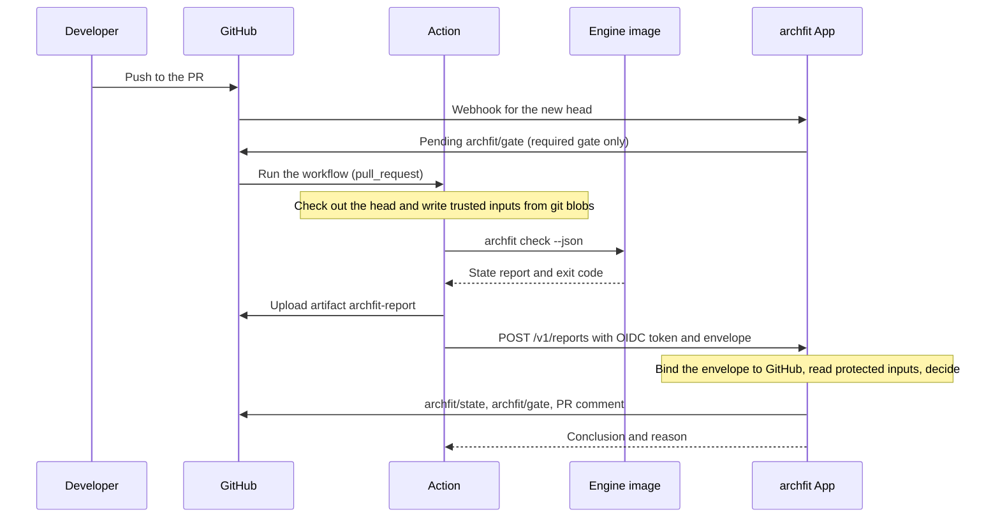
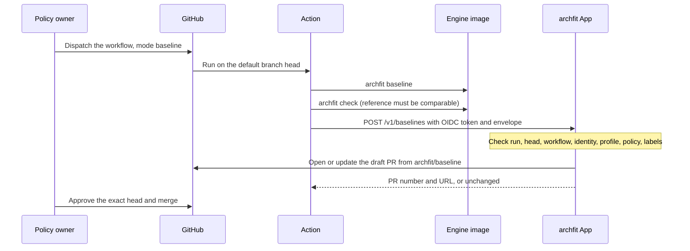

# App and Action flow

## What this is

This page describes how three parts work together to gate pull requests (PRs) on GitHub.
The **engine** is the archfit CLI in a pinned container image.
The **Action** (`archfit-action`) runs the engine in customer CI and uploads the result.
The **App** (`archfit-app`) is a GitHub App that checks the upload and publishes PR feedback.
This flow is built: the App `main` branch and `archfit-action` v1.0.0. The App is not deployed yet.
The last sections list the work that is still open.

## Terms

| Term              | Meaning                                                                                                                                                        |
| ----------------- | -------------------------------------------------------------------------------------------------------------------------------------------------------------- |
| State report      | The `archfit.architecture-state.v1` JSON that `archfit check --json` writes. See [architecture-state reporting](../../design/architecture-state-reporting.md). |
| Verdict           | `healthy`, `needs_attention` or `blocked`. The engine exit code is the verdict (0, 2, 1). Exit 3 means no report.                                              |
| Protected ref     | The PR base branch. For a push, it is the default branch.                                                                                                      |
| Trusted inputs    | `.archfit.yaml`, `.archfit-baseline.json` and `.archfit-labels.yaml`. The gate reads them from the protected ref.                                              |
| Baseline          | `.archfit-baseline.json`. It lists accepted findings and the reference state. See [erosion tracking](erosion-tracking.md).                                     |
| Envelope          | `archfit.report-envelope.v1`. One line of JSON with 16 keys that states what the job analysed. The App owns its schema.                                        |
| Engine identity   | The triple `engine_version`, `image_digest`, `platform`. The App approves identities in a locked manifest.                                                     |
| Manifest row      | One approved engine identity, with its measurement profile version and the pinned Action commit (`action_ref`).                                                |
| Receipt           | The run ID and the report, policy, baseline and labels digests that the App stores on each check it publishes.                                                 |
| Publication lease | A short lock for one head commit. It makes sure that only one App instance writes feedback for that commit at a time.                                          |

## Who owns what

| Part   | Owns                                                                                       | Does not do                                       |
| ------ | ------------------------------------------------------------------------------------------ | ------------------------------------------------- |
| Engine | Analysis, the state report, the baseline file, image releases                              | Network calls to the App                          |
| Action | Checkout, trusted-input files, the container run, the envelope, the upload                 | Decisions about the gate                          |
| App    | The envelope schema, the manifest, the gate decision, checks, the PR comment, baseline PRs | Analysis. It stores no report and no source code. |

The App treats each report as customer-attested evidence. It never calls a report "verified".

## Report flow on a pull request

### Action steps

1. Check the inputs and the event. The Action accepts `pull_request`, `push` and `workflow_dispatch` only. It refuses every other event before the checkout.
2. Check out the analysed commit with full history and `persist-credentials: false`. On a PR, this is the PR head, not the merge commit.
3. Refuse a checkout that keeps credentials in any `.git` config file.
4. Write each trusted input from its git blob into a temporary directory and hash it. The table below shows which commit each file comes from.
5. Pull the image by digest. Refuse it when its platform differs from the runner or `archfit --version` differs from `engine-version`.
6. Run the engine as the workspace user, with all capabilities dropped and only `HOME=/tmp` in the environment.
7. Upload the payload as a workflow artifact before the POST, so that the result survives a failed upload.
8. Mint a GitHub OIDC token whose audience is the App base URL, and POST the payload with the envelope header.

The container sees the checkout at `/src` with `.git` read-only. Each trusted input is mounted read-only at `/bundle/<name>`. The engine runs `check --json --progress=none -c /bundle/.archfit.yaml --root /src`. The report goes to a file outside every mount.

| Event                                | Analysed commit | Trusted inputs come from                                                                           |
| ------------------------------------ | --------------- | -------------------------------------------------------------------------------------------------- |
| `pull_request`, with an App endpoint | PR head         | The head when the PR changes that file (merge base to head). Otherwise the tip of the base branch. |
| `pull_request`, without an endpoint  | PR head         | The tip of the base branch, for every file                                                         |
| `push`, `workflow_dispatch`          | `GITHUB_SHA`    | The same commit                                                                                    |

The App accepts a head copy of a trusted input only when a policy owner approved that exact head commit. A PR with more than one merge base (criss-cross merges) is refused.

### Action modes

| Mode        | Engine command                           | Payload and cap                 | Route             |
| ----------- | ---------------------------------------- | ------------------------------- | ----------------- |
| `report`    | `check --json`                           | State report, 5 MiB             | `/v1/reports`     |
| `discovery` | `config init --root /src --output -`     | Draft policy, 1 MiB             | `/v1/discoveries` |
| `baseline`  | `baseline`, then `check` as a self-check | `.archfit-baseline.json`, 1 MiB | `/v1/baselines`   |

Discovery and baseline run on the default branch only. A dispatched run in `report` mode is refused. The `discover: true` input also selects discovery. The generated workflow sends both `mode` and `discover`.

Without an `endpoint`, the Action sends nothing. The job then fails on a `blocked` verdict, so the job itself is the gate.

### Upload rules

- The envelope is at most 8192 bytes on one line.
- The Action retries on 429, 5xx and "no answer": at most 5 attempts in 300 s, with a fresh token each time. It obeys `Retry-After` up to 120 s. Otherwise it waits 5 s, doubled for each attempt, with ±20% jitter.
- A 409 on a report or a draft means that a newer commit or attempt supersedes this upload. The Action logs a notice and passes.
- A 409 on a baseline fails the job. Somebody must dispatch the capture again.
- Every other answer is final. The error names the App code and gives a fix.
- A fork PR gets no OIDC token. The Action analyses, keeps the artifact, sends nothing and passes. The App marks the PR `fork_unsupported`.

### App steps

1. Verify the OIDC token, the envelope, the payload digest and the workflow run. Bind the head, base and merge base to GitHub API data.
2. Decode the report with the key set of the engine release that the envelope names.
3. Read the trusted inputs, settings and owner approval from the protected ref.
4. Decide. The decision is a pure function with no I/O and no LLM call.
5. Take the publication lease for the head commit. Read the trusted inputs again. If any input changed, refuse to publish.
6. Publish `archfit/state`, `archfit/gate` (only with `gate: required`) and one PR comment. Release the lease.

The upload handler has a 55 s deadline. The target is feedback within 60 s.

## Gate decision and feedback

`archfit/gate` has three conclusions. The first reason sets the conclusion.

| Conclusion        | When                                              | Example reasons                                                                                                    |
| ----------------- | ------------------------------------------------- | ------------------------------------------------------------------------------------------------------------------ |
| `success`         | Trusted evidence has no blocking finding          | `healthy`, `attention_only`                                                                                        |
| `failure`         | Trusted evidence has a blocking finding           | `blocking_findings`                                                                                                |
| `action_required` | Evidence, governance or subscription needs action | `policy_defect`, `missing_required_coverage`, `baseline_not_comparable`, `stale_inputs`, `unknown_engine_identity` |

- `attention_only` is a `needs_attention` verdict with nothing else to act on. It is a `success`, but it never reads "healthy".
- `policy_defect` names required rules whose selector matches nothing. The engine lists these in `decision.unevaluated_required_rules`.
- The gate never uses `neutral` or `skipped`. A missing report never becomes `success`.
- `archfit/state` is advisory. It is `success` only for a `healthy` verdict, `neutral` when the gate reason is `attention_only` or the gate conclusion is `failure`, and `action_required` otherwise.

The feedback shows this:

- The `archfit/gate` summary names each blocking finding: rule, module pair, first location, ID prefix and repair goal. It shows at most 20.
- `archfit/state` annotates active findings on files that the PR changed. It shows at most 150, blockers first.
- The comment groups findings as "Introduced", "Accepted debt" and "Fixed". Here "Introduced" means active, that is, not accepted by the baseline or a waiver. It does not mean "added by this PR". When Wave 3.3 origin reaches the App, rename this group to "Active" so it cannot be read as origin `introduced`.
- The comment also lists evidence gaps, validation commands and a JSON block of agent tasks between `<!-- archfit:agent-tasks -->` markers.
- The App graph page draws modules from the policy and links from the report. A link is `violation`, `accepted`, `advisory` or `observed`. After Wave 2.7 it can also be `allowed`, read from the engine's `seams[].policy`. The App never decides a status itself.

## Baseline flow

The baseline changes only through a PR that a policy owner approves. The App never commits to the default branch.

The App accepts a baseline upload only when all of these hold:

1. The run is on the current head of the default branch, from the workflow that `.archfit-app.yaml` names.
2. The engine identity is a manifest row, and the file uses that row's measurement profile.
3. The file is a valid `archfit.baseline.v2` baseline of at most 1 MiB.
4. Its `state.config_hash` equals the digest of the protected `.archfit.yaml`, and the labels digest matches.

A file equal to the protected baseline opens nothing. The PR body counts the accepted findings that the capture adds and removes, and lists them by rule ID. Approval accepts every added finding.

## Publication safety

- **Lease.** The lease lasts 60 s for each head commit, across all instances. The holder stops work 10 s before the lease expires.
- **Uncertain write.** After a failed or timed-out GitHub write, the lease stays until it expires. A waiting publisher then cannot overwrite a write that GitHub still applies.
- **Stale inputs.** Inside the lease, the App reads the trusted inputs again. If they changed, it publishes nothing and answers 503. The Action retry then decides from the new inputs.
- **Storage outage.** A store error fails the call before any GitHub write. The pending check stays pending. It never turns green.
- **Sweep.** An hourly operator call repairs lost webhooks, stale receipts, expired waivers and missing uploads. A missing upload becomes `action_required` after 60 minutes.

## Engine upgrades

- The manifest holds rows of two releases during an upgrade: the release that new workflows pin and the release before it.
- The report decoder knows each release's key set. A key from a later release is unknown, and the report is `report_invalid`.
- The gate decides only from fields that every listed release defines: verdict, hard gates, unevaluated required rules, config hash, profile version and gate reference.
- The decoder reads v2.3.1 and v2.4.0 reports. The manifest approves both, with v2.4.0 current.
- Each engine release from v2.4.0 attaches `image-identity.json` (`archfit.image-identity.v1`). It lists the index digest and one digest for each platform. The v2.4.0 manifest rows come from it.

## What is left

| Item                                  | Why it blocks                                                                                                                                                                                                                                                                                  | Status                                                                                                    |
| ------------------------------------- | ---------------------------------------------------------------------------------------------------------------------------------------------------------------------------------------------------------------------------------------------------------------------------------------------- | --------------------------------------------------------------------------------------------------------- |
| Persistent store driver               | `memory` is the only driver. It loses leases, consent and entitlements on restart. With more than one instance, `CompareAndSwap` must be atomic across all instances, or the lease does not hold.                                                                                              | Not built. Must ship before any pilot. The App tech stack chose Firestore, accessed through its REST API. |
| GitHub App registration and hosting   | No App is registered or deployed.                                                                                                                                                                                                                                                              | Open                                                                                                      |
| Origin in CI                          | The Action does not pass `--base`, because `--base` needs a git worktree and `.git` is read-only. PR-scoped origin needs the v3.0 engine keys and a change to the Action mounts.                                                                                                               | Planned. See [erosion tracking](erosion-tracking.md).                                                     |
| Reviewed baseline migration           | Baseline mode runs plain `archfit baseline`, which accepts all current debt. After an engine or profile change, a capture must not accept new debt. `--reanchor` reads the stored baseline. Baseline mode does not mount it. The App requires an empty `baseline_digest` for `kind: baseline`. | Waits for `archfit baseline --reanchor` in v3.0, plus an Action and App contract change                   |
| Coupling block on PRs                 | Strength, distance and volatility for each seam do not reach the PR. Today a call through a port reads as functional coupling, so the block would mislead.                                                                                                                                     | Waits for [coupling score v7](coupling-score-v7.md)                                                       |
| PR agent block uses `agent-result.v1` | The PR block reuses `agent_tasks[]` keys. `next_action` and grouped repairs need the Wave 2.3 format.                                                                                                                                                                                          | Waits for Wave 2.3                                                                                        |
| `seams[].policy` decoder              | The App graph reads the engine's seam policy status (`allowed`).                                                                                                                                                                                                                               | Waits for Wave 2.1 and 2.7                                                                                |
| Managed discovery                     | No sandbox driver exists.                                                                                                                                                                                                                                                                      | Open, not needed for pilots                                                                               |

App pilots run advisory (`gate: advisory`) on engine v2.x. The required gate goes live after v3.0.0 and one re-anchor. See the [roadmap](erosion-roadmap.md).

## Rejected options

| Option                                                                 | Reason                                                                                                |
| ---------------------------------------------------------------------- | ----------------------------------------------------------------------------------------------------- |
| A separate engine transport format or architecture-map document        | The App reads the state report directly. An additive `seams[].policy` key can follow allowlists.      |
| A tolerant report reader                                               | An unknown key or decision value must fail closed (`report_invalid`).                                 |
| `--base` as the source of accepted debt                                | The persisted baseline on the protected ref is the only gate reference. Origin is presentation only.  |
| App-side rule evaluation or "permitted" links                          | The engine owns rules. The App only displays the engine's `seams[].policy` status.                    |
| App-committed or automatic baselines                                   | Accepted debt changes only by an owner-approved PR.                                                   |
| Gating fork PRs, `workflow_run`, `pull_request_target` or merge queues | These events run with base privileges on author code, or have no PR whose owners approved the inputs. |
| SARIF upload from the Action                                           | The App publishes checks and annotations itself.                                                      |
