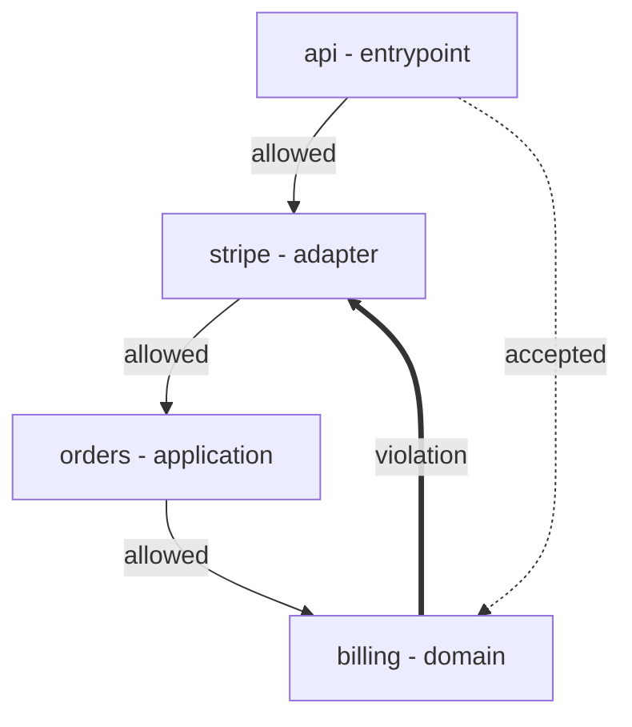

# Architect workflow

## What this is

This plan covers what a human architect reads and does with archfit. It
covers the text and Markdown brief, the glossary, consistent explanations,
and an architecture map rendered as Mermaid. These are Wave 2 items 2.6 and
2.7 in the [roadmap](erosion-roadmap.md). All output layouts, commands, and
keys below are **proposed**. None of them exists in the current engine.

**Already built:** `config init` writes failable starter rules
(`no-module-cycles`, `no-layer-back-edges`). Onboarding detects languages
through the extractors' own probes, `go.work` included. `config update` does
not destroy stanzas or propose catch-all modules. Text and Markdown list the
worsened metrics when a ratchet blocks. On the App branch, the graph takes each link status
from report findings. See the
[v2.4.0 release notes](../../guide/release-notes.md#v240--guardrails-that-fire)
and [config init](../../guide/commands.md#archfit-config-init).

## Terms

| Term             | Meaning                                                                                         |
| ---------------- | ----------------------------------------------------------------------------------------------- |
| Blocker          | An active gate finding. It makes `check` exit 1.                                                |
| Diagnostic       | An advisory finding. It never blocks.                                                           |
| Seam             | One ordered module pair with at least one import edge. See [concepts](../../guide/concepts.md). |
| Brief            | The proposed layout of the text and Markdown output.                                            |
| Architecture map | A diagram of modules and seams. It is not the `modules:` map in the config.                     |

## Problems that remain

**The text output hides what to fix.** In
`internal/output/console/report.go`:

- Each finding list stops after 8 entries (`findingCap`).
- `why` is cut at 100 characters.
- A listed finding shows no ID and no `file:line`. IDs appear only in the
  finding index at the end.

**The Markdown output is two documents.** It writes the state with
`# archfit — architecture state`, then a second audit with `# archfit report`.

**NOT MEASURED lines give no step.** Each line names the missing fact and the
reason. It does not say what closes the gap.

**Some explanations contradict the scorer.**

- The undeclared-volatility warning says the "scorer abstains on volatility"
  (`internal/evidence/acquisition/warnings.go`). The book scorer scores
  undeclared volatility as V=10, the worst case.
- A critical seam at low distance reads "cheap to change"
  (`internal/relationship/analysis/advisories.go`).

**There is no glossary.** Terms such as seam, diagnostic, analyzer coverage,
and accepted are not defined in one place.

**Small surfaces disagree.**

- `external_edges` mixes library imports with first-party code that no module
  owns.
- SARIF results carry no `baselineState`, so code scanning cannot tell new
  results from accepted ones.
- `config compare` text still prints a repository score line, which the state
  contract dropped.

**There is no picture of the architecture.** No output shows the layers, the
modules, and which observed seams the policy permits.

## 2.6 The brief

### Text and Markdown layout, phase 1

The text and Markdown outputs use one view model and one section order.
Markdown has one H1.

1. **Headline.** The keys stay as they are. With no finding, it says why:
   `NEEDS ATTENTION — evidence incomplete: testability, operations`.
2. **BLOCKERS.** Not capped. Each entry shows:
   - The first 8 characters of the ID, the rule, and `from -> to`.
   - The `file:line` location.
   - The full `why`.
   - The goal from the agent task.
   - The command that checks the fix.
3. **NEXT STEPS.** At most 5, in this order: blockers, missing tools
   (`archfit doctor --fix`), baseline, module decisions, and coverage or
   deploy-unit evidence.
4. The current sections follow, with the finding index last.

**Proposed** text output:

```text
BLOCKERS (1)
  b228b5d0 layers-point-inward  billing -> stripe (domain -> adapter)
    internal/domain/billing/charge.go:3
    why:   domain module billing imports adapter module stripe
    goal:  remove the import; depend on a port in billing
    check: archfit check -c .archfit.yaml

NEXT STEPS
  1. Fix blocker b228b5d0.
  2. Declare volatility for 3 modules (see NOT MEASURED).
```

**Baseline step.** NEXT STEPS offers `archfit baseline` only when no blocker is
active. When the gate reference is non-comparable because of a profile or model
change, NEXT STEPS points to a review instead. A blanket re-baseline accepts
debt that nobody reviewed.

**NOT MEASURED.** Each line ends with `→ <step>`, or with
`(out of claim — no action)`.

Phase 2 adds seam readings, rule roll-ups, and a compact index. It ships only
when the format parity tests need it.

### Explanations and glossary

Fix each contradiction where the text is built, not in the renderer:

1. Change the undeclared-volatility warning to say that the scorer uses V=10.
2. Remove "cheap to change" from the critical low-distance advisory.
3. Move seam guidance to the closed move set in
   [coupling score v7](coupling-score-v7.md). It removes `leave_alone` on a
   blocked seam.

Add `docs/guide/glossary.md`. It maps each archfit term to the book term and
chapter, and marks archfit-only terms. Human output uses these words:

| Human term        | Wire term                      |
| ----------------- | ------------------------------ |
| blocker           | gate finding                   |
| diagnostic        | advisory finding               |
| accepted          | baselined finding              |
| analyzer coverage | `coverage` (not test coverage) |
| seam              | one ordered module pair        |

### Small consistency fixes

These have no dependency on the rest of this plan. They can ship first.

- Split `external_edges` into two new metrics: `library_edges` and
  `unmapped_first_party_edges`.
- Set SARIF `baselineState`: `new` for a new finding, `unchanged` for an
  accepted or waived one.
- Drop the score line from the `config compare` text.

## 2.7 Architecture map

`archfit map` renders the same run's state and policy. It adds no new wire
document.

**Proposed:**

```text
archfit map [-c .archfit.yaml] [--root DIR] [--format mermaid|text] [--focus MODULE]...
```

- The exit code is 0, or 3 on an error or an unknown `--focus` module.
- Layers are drawn outermost first, so a permitted edge points down.
- Each edge shows its seam status and its strength.
- `--focus` keeps the named modules and their direct neighbours. The output
  counts what it omitted, so a blocked seam is never hidden without a count.

**Proposed** map for a small hexagonal repository:



The `billing` to `stripe` violation points up, against the layer order. A
thick edge is a violation, and a dotted edge is accepted debt.

**Seam status.** The first matching row wins:

| Status          | Condition                                                          |
| --------------- | ------------------------------------------------------------------ |
| `violation` | An active gate finding names the pair. |
| `accepted` | A gate finding on the pair is baselined or waived. |
| `advisory` | Another active finding names the pair. |
| `allowed` | An allowlist entry or the layer rule proves the edge is permitted. New. |
| `observed` | No finding names the pair and no rule decides it. |

The App graph already uses `violation`, `accepted`, `advisory`, and
`observed`. This plan adds only `allowed`. For an `observed` pair,
`can-import` answers `unconstrained`.

A baselined `new_cross_module_dependency` finding shows as `accepted`, not as
`allowed`. Accepted debt is not permission.

**`seams[].policy` key.** After the allowlists in
[guardrail language](guardrail-language.md) ship, the state gets an additive
`seams[].policy` key with this status. The rule pass computes it, through the
same edge predicate that `can-import` uses in
[agent guardrails](agent-guardrails.md). The App graph then reads it. The App
ships the decoder before the engine emits the key.

## Invariants kept

- The state is the primary output. The `check` exit code is the verdict.
- Display flags never change a status. They only filter, and the output
  counts what they omit.
- The finding index keeps every finding ID in canonical order, so the format
  parity tests hold.
- `Score.Band` stays the severity source. No LLM sits on the gate path.
- Only relationship analysis sees the graph.

## Contract impact

| Contract                                 | Change                                                                                                           |
| ---------------------------------------- | ---------------------------------------------------------------------------------------------------------------- |
| `archfit.architecture-state.v1`          | Two new metric names. Changed `why` and warning text. After 2.1, an additive `seams[].policy` key.               |
| Text and Markdown                        | New section order. The second Markdown H1 and its legacy sections go away, which breaks scripts that parse them. |
| SARIF                                    | Adds `baselineState`.                                                                                            |
| Goldens                                  | Regenerate `TestGolden` and the format baselines deliberately, and inspect the diff.                             |
| Baseline v2, fingerprints, config schema | Unchanged.                                                                                                       |

## Tests

- Console and Markdown goldens for the brief. Markdown has exactly one H1.
- Every NOT MEASURED fact has a step or an out-of-claim mark.
- No output pairs "critical" with "cheap".
- A blocker shows `file:line` when the finding has a location.
- The map golden on a hexagonal fixture. `--focus` counts omitted seams.
- A baselined `new_cross_module_dependency` finding never shows as `allowed`.

## Open owner decisions

1. **Composition roots.** Whether `role: composition_root` suppresses coupling
   diagnostics. This changes verdicts, so it belongs to
   [coupling score v7](coupling-score-v7.md).
2. **Starter rule layers.** `config init` infers no layer from directory names
   today. Decide later whether a layout option is needed, after the starter
   rules are in use.

## Later candidates

These are not in the roadmap rows:

- `config update` prints a paste-ready YAML snippet for each open module
  decision (`missing_owner`, `missing_volatility_input`, `missing_layer`). It
  never pre-fills an LLM draft as the answer.

## Rejected options

| Option                                                                                                 | Reason                                                                                   |
| ------------------------------------------------------------------------------------------------------ | ---------------------------------------------------------------------------------------- |
| A separate `archfit.architecture-map.v1` document, `--map-out`, an App decoder, and an Action artifact | The App graph reads report seams and findings. The `seams[].policy` key covers the rest. |
| A D2 renderer and `--lanes`, `--depth`, `--status` flags                                               | One Mermaid diagram with `--focus` is enough.                                            |
| An `EdgeRule.Judge` refactor of five rule types now                                                    | Before allowlists, only the layer rule can prove permission. `Judge` arrives with 2.1.   |
| An `internal/model/vocab` package and a render-time move filter                                        | Text and JSON would disagree. Fix the text at its source.                                |
| `archfit config decide` with interactive prompts                                                       | It is a large editor for five fields, and it pre-fills LLM drafts.                       |
| `config init --layout` and a directory-name layer table                                                | Directory names do not prove a layer. A guessed layer makes a rule that cannot fire.     |
