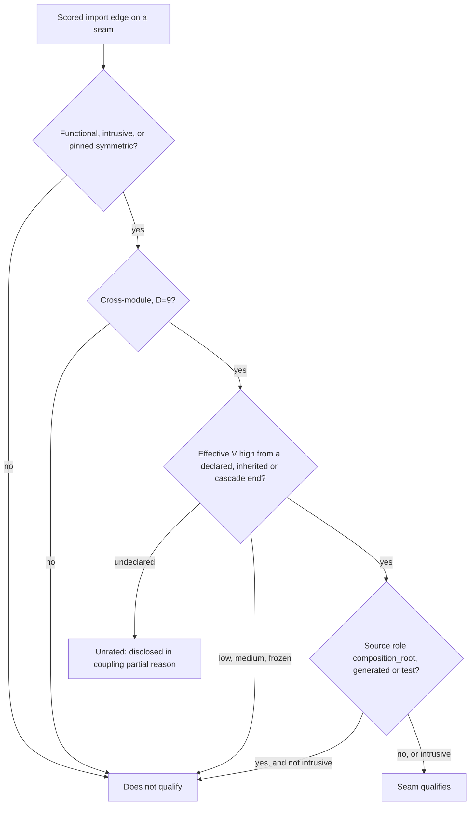

# Coupling score v7 (`bc_score.v7`)

## What this is

This plan describes the next version of archfit's Balanced Coupling score. The
scorer is `internal/relationship/scoring/scorer_book.go`, at version
`bc_score.v6` today. Version 7 keeps the book formula. It changes how archfit
gets the formula's inputs and which seams the seam gate counts. A **seam** is
one ordered module pair, however many imports express it. The **seam gate**
(`coupling.gate.distributed_monolith`) is the only coupling gate. Version 7
ships once, in the breaking v3.0.0 release, with the comparability work in
[erosion-tracking.md](erosion-tracking.md). The release plan is in
[erosion-roadmap.md](erosion-roadmap.md).

**Status:** not built. The current contract is in
[bc-measurement-v4.md](../../design/bc-measurement-v4.md) and
[20260705-bc-score-v6.md](../../design/20260705-bc-score-v6.md).
**Decisions:** distance is level-relative (D=9 at any module boundary), and a
call through a port or interface method is contract.

## The book formula

archfit uses the formula from Khononov, _Balancing Coupling in Software
Design_, Chapter 10, without change:

```text
balance = max(|S − D|, 10 − V) + 1        range 1..10, higher is better
```

- **S (integration strength):** contract 1, model 3, functional 8, symmetric 9,
  intrusive 10.
- **D (distance):** the cost to change both sides together.
- **V (volatility):** frozen 1, low 3, medium 6, high 10. Undeclared counts as 10.

The binary form is `(STRENGTH XOR DISTANCE) OR NOT VOLATILITY`. Strong coupling
must be close, and weak coupling can be far. Low volatility makes any
combination acceptable. The score maps to a **band**: 1–2 critical, 3–4 high,
5–6 medium, 7–8 low, 9–10 none (`ScoreBand`). The band is the only severity
source. Version 7 keeps the formula, the S and V numbers, and the bands.

## What v6 gets wrong

### The distance ladder is fixed at system scale

v6 uses fixed rungs: same module 2, cross-module same owner 4, different owner
7, different deploy unit 9, declared external 10. In a repository with one
owner and one deploy unit, every seam is D=4. That is the normal modular
monolith, and it is archfit itself. At D=4 and V=10 the strength order inverts:

| Strength   | S   | Balance at D=4, V=10 | Band         |
| ---------- | --- | -------------------- | ------------ |
| contract   | 1   | 4                    | high         |
| model      | 3   | 2                    | **critical** |
| functional | 8   | 5                    | medium       |
| symmetric  | 9   | 6                    | medium       |
| intrusive  | 10  | 7                    | **low**      |

Model coupling is critical. Intrusive coupling, the strongest kind, is low.
The book treats distance as relative to the level you observe (Ch10, Ch12,
Ch13). Inside one codebase, the module boundary is the far end.

### A published interface reads as functional

The Go extractor maps every `*types.Func` to functional, interface methods
included (`goObjectStrength`). In `classify`, a functional hint then raises a
`public:` contract floor. A `public:` entry declares a module's published
surface.

Example: `web` and `inventory` are separate deploy units. `web` calls
`Reserver.Reserve`, an interface in `inventory`'s `public:` package.

- v6: functional (S=8) at `cross_deploy_unit` (D=9), V=10 scores 2, critical.
  A critical edge at a high distance (`DistanceIsHigh`) qualifies the seam. It
  is a false distributed monolith, and in fail mode a new one blocks the merge.
- Book: a contract across services scores `|1 − 9| + 1 = 9`, the modular case.

### Other defects

- **Key spelling sets distance.** With no owner, module key names decide it.
- **Cross-team intrusive coupling never qualifies.** At D=7 it scores 4.
- **Volatility is the target's only.** Functional coupling ties both sides (Ch7).
- **Undeclared V counts as 10, but coupling still reads `measured`.**
- **One-rung moves** (`bookCheapestMove`) can land on a still-flagged state.
- **The Go fact-cache key has no semantics version.** Old hints can survive.

## What v7 changes

### Distance

| Seam                       | Token                                                   | D                                           |
| -------------------------- | ------------------------------------------------------- | ------------------------------------------- |
| Same module                | `same_module`                                           | 2 (report-only `local_coupling`, unchanged) |
| Module boundary            | `cross_module` (renamed from `cross_module_same_owner`) | 9                                           |
| Owner boundary             | `cross_module_different_owner`                          | 9                                           |
| Deploy-unit boundary       | `cross_deploy_unit`                                     | 9                                           |
| `external_systems:` target | `declared_external`                                     | 10 (unchanged)                              |
| Unresolved                 | `unknown`                                               | abstain                                     |

- 9 is the top internal rung. The Chapter 10 examples put in-house services at
  9 and vendors at 10, so a declared external system never shifts internal seams.
- Owner and deploy unit only name the boundary (token and `raw_distance.basis`).
  An owner change can relabel a seam but never make it qualify.
- **Containment tree from config only.** A module's roots are its `paths:` globs
  without a trailing `/**`. An exact glob, `/*` or `/*.ext` contains nothing.
  Python roots are dotted, Rust roots use `::`, Go workspace members use their
  directory. P is the parent of M when every root of M is strictly inside a
  root of P whose `paths:` glob ends in `/**`. Plain folders add no level.
- The tree gives each seam a **container**: the last node both sides share. It
  recomputes `shared_ancestor` and `boundary_crossings`, so a key rename changes
  nothing. The tree reads declared paths only, so `model_hash` covers it.
- Removed: `capDistanceForRole` and key-based structural distance.
  `DistanceIsHigh` means "any cross-module token or external". The distance
  compression disclosure reports rungs {2, 9, 10}.

### Strength

- **S1. Interface methods are contract.** A Go `*types.Func` with an interface
  receiver maps to contract, as SCIP already does. Ports are contracts (Ch13).
- **S2. A `public:` target is the integration contract.** A callable hint never
  raises the floor. Only data evidence refines it to model: a concrete non-DTO
  type, field, var, const, or method on a concrete receiver. The Go extractor
  adds `DataStrengthHint`, the strongest non-callable use per file and package.
  The SCIP reader emits the same split. A DTO stays contract. TypeScript
  without SCIP keeps public value imports at contract.
- **S3. Connascence never sets strength.** The connascence-to-strength step in
  `classify` is deleted. Connascence stays report-only.
- **Unchanged:** `internal:` maps to intrusive. A non-public cross-module call
  maps to functional. Approved labels pin strength. Unknown strength abstains.

### Volatility

Contract, model and intrusive edges use the target's effective V. Functional
edges, symmetric edges and clone facts use the worse V of the two sides.
Declared `high` ranks above undeclared, so an undeclared end cannot create
`high` alone. The cascade is unchanged, and undeclared V still ranks as 10.

### Duplicated knowledge

A clone pair no longer upgrades an import edge to symmetric. Each cross-module
clone pair becomes one symmetric **clone fact**. A clone pair A–B attaches to
seam A→B or B→A, whichever exists. If both exist, it attaches to the one whose
seam ID sorts first. A clone-only pair stays in the `duplicated_knowledge`
block. A clone fact scores like an edge (D=9, worse V of the pair) and can set
the seam's severity and hypothesis. It counts in `scored_edges`, not in
`edges`, and it never makes a seam qualify. The `advisory` setting of
`coupling.duplicated_knowledge` keeps clone facts out of seams.

### Severity across modules (D=9)

| S \ V      | frozen  | low    | medium   | high or undeclared |
| ---------- | ------- | ------ | -------- | ------------------ |
| contract   | 10 none | 9 none | 9 none   | 9 none             |
| model      | 10 none | 8 low  | 7 low    | 7 low              |
| functional | 10 none | 8 low  | 5 medium | 2 critical         |
| symmetric  | 10 none | 8 low  | 5 medium | 1 critical         |
| intrusive  | 10 none | 8 low  | 5 medium | 2 critical         |

The high band cannot occur across modules. A cross-module edge is critical
exactly when it is strong (functional, symmetric or intrusive) and V=10. The
cross-module quadrant is `tight` (strong) or `loose` (weak).

### Coupling dimension evidence

The coupling dimension gets a new required fact, `FactCouplingVolatility`
(rules in [evidence-contract.md](../../design/evidence-contract.md)). It is
observed when every volatility-bearing end of each scored candidate is
declared, inherited or cascade, or when one declared end is already `high`.
Functional, symmetric and clone facts have two such ends. Otherwise coupling is
`partial`, and the reason names the modules.

## Seam gate

A seam qualifies (`distributed_monolith: true`) when one active, scored
**import edge** passes all four checks:



- **Subset of severity.** A test asserts that a qualifying edge is critical.
- **Medium V and clone facts never qualify.** The book's volatility is binary.
  Medium is an archfit interpolation.
- **Driving edge.** A qualifying seam shows its lowest-balance qualifying edge,
  so strength, reason and qualification describe the same edge.
- **Reasons** name the boundary and container (`<boundary>@<container>` in
  `raw_distance.basis`). Only a deploy-unit boundary says "distributed
  monolith". Reasons stay empty when nothing qualifies. Example:

```text
orders -> pricing: functional coupling across the owner boundary into high-volatility pricing (container system)
```

Unchanged: `gate.go` stays score-blind (`TestSeamGateIsScoreBlind`). The seam
set comes from the full classified edge set. Fail mode blocks only on new seams
against a comparable reference, as defined in
[erosion tracking](erosion-tracking.md). The config key and its fields stay.

## Balancing guidance

The seam hypothesis comes from the driving fact. One function feeds the seam
ledger, advisories and agent-task constraints. The scorer stops computing moves.

| Hypothesis              | When                                                                    |
| ----------------------- | ----------------------------------------------------------------------- |
| `balanced`              | Band none or low, weak strength.                                        |
| `accept_low_volatility` | Strong, V low or frozen.                                                |
| `introduce_contract`    | Intrusive, or functional/model into a target with `public:`.            |
| `move_functionality`    | Symmetric or clone fact, or functional into a target without `public:`. |
| `declare_volatility`    | Flagged only because V is undeclared.                                   |
| `expected_by_role`      | Source has a cohesive role (`composition_root`, `generated` or `test`), not intrusive. |
| `follow_rule`           | An active gate finding covers a seam edge.                              |

A test requires each seam at band medium or worse to carry a move that
re-scores to low or better, or a non-move hypothesis. `leave_alone`,
`reduce_strength` and `reduce_distance` are retired. `follow_rule` is an
assessment-stage override, so relationship analysis never reads assessment output.

## Worked examples

All modules are core (V high) unless stated.

| Scenario                                                                                                                                      | v6                                                                       | v7                                                                                                                                  |
| --------------------------------------------------------------------------------------------------------------------------------------------- | ------------------------------------------------------------------------ | ----------------------------------------------------------------------------------------------------------------------------------- |
| 1. One owner, one deploy unit. `orders` calls the `Charger.Charge` interface in `billing`.                                                    | Functional, D=4: 5 medium. With nested keys, D=7: 2 critical, qualifies. | Contract, D=9: 9 none, `balanced`, for any key spelling.                                                                            |
| 2. Same service. An adapter reads `billing/store`, which `billing` declares `internal:`.                                                      | Intrusive, D=4: 7 low. The gate cannot fire.                             | Intrusive, D=9: 2 critical, qualifies, `introduce_contract`. With `billing` supporting: 8 low.                                      |
| 3. Two teams, one deploy unit. `orders` (core) calls non-public `pricing/engine` (supporting).                                                | Functional, D=7, V low (target only): 8 low.                             | Functional, D=9, V = worse(high, low) = high: 2 critical, qualifies. Through `pricing/api`: contract, 9 none.                       |
| 4. Two deploy units. `web` calls the `Reserver.Reserve` interface in `inventory`.                                                             | Functional, D=9: 2 critical, false distributed monolith.                 | Contract, D=9: 9 none. Never qualifies.                                                                                             |
| 5. Nested modules. `sales/cart` calls `sales/invoice` (a sibling) and `stock/lookup` (another branch). Both calls are functional, non-public. | 5 medium or 2 critical, by key spelling.                                 | Both 2 critical, both qualify. The containers (`sales`, system) are reported.                                                       |
| 6. No volatility declared. `app` calls the `Store.Save` interface in `adapters` and the concrete `rules.Discount`.                            | Interface call functional: 5 medium. Coupling reads `measured`.          | Interface call: contract, 9 none. Concrete call: 2 critical but unrated, `declare_volatility`. Coupling `partial`. `check` exits 2. |

## Migration impact

| Item                                          | v6                                       | v7                                                                         |
| --------------------------------------------- | ---------------------------------------- | -------------------------------------------------------------------------- |
| `ScoreVersion` and `relationshipScoreVersion` | `bc_score.v6`                            | `bc_score.v7`                                                              |
| Measurement contract                          | `go/packages.v1`, `scip.v1`              | `go/packages.v2`, `scip.v2`                                                |
| Fact-cache `schemaVersion`                    | `"3"`                                    | `"4"`; the Go member key adds the semantics version                        |
| Metric versions                               | `unbalanced_edge.v2`, `encapsulation.v1` | `unbalanced_edge.v3` (intrusive, cross-module, V high), `encapsulation.v2` |
| Model surface                                 | —                                        | `Edge.DataStrengthHint`; regenerate `model_surface.golden`                 |
| State and baseline shapes                     | state v1, baseline v2                    | unchanged, no new keys                                                     |

Seam values change (distance, basis, span, quadrant, hypothesis,
`distributed_monolith`). The App decoder keeps working: `distance` is a free
token, and the App drops `quadrant` and `hypothesis`.

**Effects:**

- Stored baselines become `non_comparable`, with reasons that name each drifted
  input (`rubric_version`, measurement profile version). The seam
  gate abstains, and `check` cannot exit 0 until the re-baseline.
- Ratchets report unmeasured against a non-comparable reference
  ([erosion-tracking.md](erosion-tracking.md)).
- `analyze --base` and `config compare` work at once: one binary runs both sides.
- A repository with undeclared volatility loses exit 0 until it declares it.

**Owner steps:**

1. Upgrade archfit and run `archfit analyze`.
2. Review qualifying and unrated seams. Declare volatility where coupling is `partial`.
3. Review `public:` surfaces. Each entry now claims a published contract.
4. Run `archfit baseline --reanchor` and land the owner-approved baseline PR
   ([erosion-tracking.md](erosion-tracking.md)).

**App and Action:** the App adds the engine version and profile to its manifest
and regenerates fixtures. It answers `action_required`
(`baseline_not_comparable`) until the baseline PR lands on the protected ref.
`archfit-action` bumps its pinned engine in the same release.

## Plan

All phases land on one release branch as one reviewed PR series. Tag once. Each
phase that moves seams regenerates and reviews `TestGolden` and the format
matrix, and runs `TestSelfModel`, `TestArchImports` and `TestErosion_`.

| Phase | Work                                                                                                                                                                                                                                      |
| ----- | ----------------------------------------------------------------------------------------------------------------------------------------------------------------------------------------------------------------------------------------- |
| P0    | Migrate the six corpus configs still on schema v1 (prometheus, ruff, storybook, tokio, yazi, herdr). Record v6 numbers with `scripts/eval/corpus_sweep.py`. Add fixtures for the six examples and a key-rename pair, with original names. |
| P1    | Strength S1–S3, `DataStrengthHint`, SCIP data split. Bump the score version, measurement contract and fact-cache schema.                                                                                                                  |
| P2    | Containment tree, D=9 at every module boundary, token rename. Delete the role cap and key-based distance.                                                                                                                                 |
| P3    | Both-sides volatility, clone facts, `FactCouplingVolatility`.                                                                                                                                                                             |
| P4    | Seam qualification, hypothesis vocabulary, gate reasons, metric versions.                                                                                                                                                                 |
| P5    | `config init` stops writing `public: [key]`; `config update` offers public-surface review. New `docs/design/bc-measurement-v7.md`. Update CLAUDE.md and the guides. Re-baseline archfit. Release notes.                                   |

## Validation and acceptance

- **Book checks.** The four Chapter 10 examples keep distances 10, 2, 9 and 9
  and their scores. Add the Chapter 13 layer case (functional between layers
  scores 2), the port case (9), and the Chapter 11 cases.
- **Fixtures.** The six examples and key-rename invariance. In fail mode, a new
  intrusive seam blocks. A new interface call never blocks. A new contract
  import between two duplicating modules never blocks.
- **Corpus acceptance.** No contract seam is flagged. Every flagged seam has a
  clearing move or a non-move hypothesis. The abstention rate does not change.
  Qualifiers on archfit, pumba and herdr are reviewed by hand. Counts are
  reported per language, with TypeScript without SCIP and single-crate Rust
  shown separately.

**Not verified on the current tree:** a prototype on an earlier commit found 3
qualifying seams on archfit (0 under v6). All three call the non-public
`internal/relationship/analysis` or `internal/assessment/evaluation`.

## Risks

1. **TypeScript without SCIP, and repos without `public:`.** Every value call
   reads functional, so core targets can flood the gate. Measure before
   recommending `mode: fail`.
2. **Wide `public:` globs hide model leaks.** Each `public:` change moves
   `config_hash` and goes to review.
3. **Ownership no longer grades severity.** It only labels the boundary.
4. **Composition-root seams can read critical**, but they are never gated.

## Open decisions

These items are not decided. The Default column gives the design's recommendation.

| Item                          | Default                                 | Alternative                                                                                                   |
| ----------------------------- | --------------------------------------- | ------------------------------------------------------------------------------------------------------------- |
| Gate scope                    | Every module boundary.                  | Owner and deploy-unit boundaries only. A single-owner monolith then gates nothing.                            |
| Medium volatility             | Not gate-eligible.                      | Gate it.                                                                                                      |
| Both-sides V                  | Also for call-derived functional edges. | Symmetric edges and clone facts only.                                                                         |
| Cohesive roles                | Exempt from the gate unless intrusive.  | Exempt everything.                                                                                            |
| Self-config entry points      | No default.                             | Keep the qualifiers visible under `mode: warn`, or declare the entry points `public:`.                        |
| Seams that qualify only in v7 | Not decided.                            | `--reanchor` adds no new identity, so they count as new. Fix them, or accept them in a reviewed full capture. |

## Rejected options

| Option                                                           | Why rejected                                                                                                                                                                                    |
| ---------------------------------------------------------------- | ----------------------------------------------------------------------------------------------------------------------------------------------------------------------------------------------- |
| Depth-graded distance (9 at the top container, 5 one level down) | The owner chose flat D=9. Ch13 treats functional coupling between parts of one service as global complexity.                                                                                    |
| Tree-rank distance with per-strength limits (fractal model)      | Flat configs need an invented fan-out floor to give any finding. It drops the Chapter 10 number across modules and needs state v2. Its source license (CC BY-NC-SA) blocks use in the paid App. |
| Strength fix only                                                | At D=4 a port call becomes contract and scores 4 (high), worse than 5 (medium) as functional.                                                                                                   |
| Distance fix only                                                | Floods the gate: 29 qualifying seams in the archfit prototype.                                                                                                                                  |
| A D=4 wiring rung for cohesive roles                             | 6 critical `low_cohesion` seams in the archfit prototype.                                                                                                                                       |
| The v6 clone edge upgrade                                        | With S1 and S2, it erases 6 of 9 symmetric seams in the archfit prototype.                                                                                                                      |
| Gate-eligible clone pairs with unordered-pair IDs                | Needs new IDs, and can block a pair that only gained a contract import.                                                                                                                         |

## Sources and licensing

Cite the book by chapter. Do not copy book text beyond the formula. This design
does not adopt fractal grading. A change that does must credit the source, get
legal review before it reaches the App, and never reuse its text or examples.
