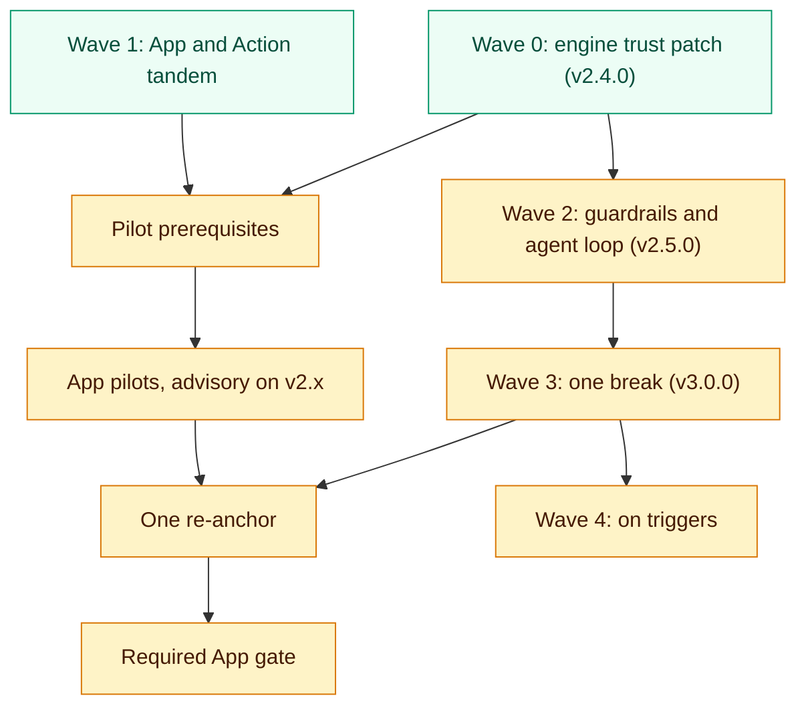

# Erosion-prevention roadmap

## What this is

This is the plan to make archfit stop architecture erosion in real projects.
It lists the problems, the waves of work and their order, what is built, and what is still open.
It also records the owner decisions and the open questions.
Seven design documents give the detail. The [index](#design-documents) is at the end.

## What archfit is for

archfit is an architecture-fitness CLI. An architect declares the intended architecture in `.archfit.yaml`.
archfit reads dependency facts from the code with external tools (`go list`, dependency-cruiser, grimp, `cargo metadata`, ast-grep, SCIP).
It checks the facts against the declared rules and gives a deterministic architecture state.
CI uses the state as a gate, and AI agents use its repair tasks to fix violations.
The coupling analysis uses Balanced Coupling (Khononov, Ch10): strength, distance, and volatility per module pair.
The archfit GitHub App and the archfit Action turn the engine into a team process.
They give approved policy, pull-request feedback, owner decisions, and baseline pull requests.

## Problems this plan fixes

| Problem                                                    | Effect                                                                                                             |
| ---------------------------------------------------------- | ------------------------------------------------------------------------------------------------------------------ |
| Guardrails that did not fire                               | Rules reported "evaluated" but could never find a violation. A gate that passes silently is worse than no gate.    |
| App and Action did not work together                       | Every upload was rejected, and CI could not make a comparable baseline.                                            |
| The policy language cannot state the intended architecture | No allowlists, no module-level selectors, and no rationale on rules.                                               |
| Agents get no guidance before an edit                      | No query answers "may I import this?". The full JSON report is too large for an agent.                             |
| Instrumentation does not match the book                    | Distance is not relative to the observed level, and a call to a published interface counts as functional coupling. |
| Comparisons break on changes that mean nothing             | A YAML comment or a new engine language makes stored baselines non-comparable.                                     |

## Terms

| Term                      | Meaning                                                                                                                                          |
| ------------------------- | ------------------------------------------------------------------------------------------------------------------------------------------------ |
| Verdict                   | The state result and the `check` exit code: `healthy` (0), `blocked` (1), `needs_attention` (2), error (3).                                      |
| `hard_gates`              | The part of the state that blocks: `pass`, `fail`, or `unmeasured` when a required rule or ratchet could not be evaluated.                       |
| Measurement profile       | The record of producer versions, producer status, and a settings hash. It is part of the comparison.                                             |
| Seam                      | One ordered module pair with at least one import edge. See [concepts](../../guide/concepts.md).                                                  |
| Baseline                  | The stored file of accepted findings and the state reference (`.archfit-baseline.json`).                                                         |
| Comparable reference      | A baseline whose four fingerprints (`config_hash`, `model_hash`, `labels_hash`, `rubric_version`) and measurement profile match the current run. |
| Ratchet                   | A metric gate that blocks when a metric gets worse than in the baseline.                                                                         |
| Re-anchor                 | Re-key the accepted debt of a baseline to a new engine epoch, without accepting new debt.                                                        |
| Guard rule                | A rule with `guard: true`. It must match nothing, and it blocks a removed package from coming back.                                              |
| Unevaluated required rule | A fail-gated rule that archfit could not evaluate. It is listed in `decision.unevaluated_required_rules`.                                        |
| `policy_defect`           | The App reason for a required rule whose selector matches nothing.                                                                               |
| `attention_only`          | The App reason for a `needs_attention` run with no blocker. The check conclusion is `success`, but the App does not call the run healthy.        |

## Wave order

Green boxes are built. Amber boxes are not built.
Pilots start on v2.x and stay advisory.
The required gate goes live after v3.0.0 and one re-anchor, so pilots re-anchor only once.

## Status

| Wave | Goal                                                         | Status                             | Where it lives                                                                                                                                   |
| ---- | ------------------------------------------------------------ | ---------------------------------- | ------------------------------------------------------------------------------------------------------------------------------------------------ |
| 0    | Stop false passes, false blocks, and agent misdirection      | Built, not released                | Engine branch `feat/wave0-trust-patch`. See the v2.4.0 section of the [release notes](../../guide/release-notes.md).                             |
| 1    | App and Action work together                                 | Built, except the persistent store | App branch `feat/wave1-tandem`, Action branch `feat/wave1-run-engine`                                                                            |
| 2    | Architecture-level guardrails and the agent loop             | Not built                          | This document, [guardrail language](guardrail-language.md), [agent guardrails](agent-guardrails.md), [architect workflow](architect-workflow.md) |
| 3    | One breaking release that batches every comparability change | Not built                          | This document, [coupling score v7](coupling-score-v7.md), [erosion tracking](erosion-tracking.md)                                                |
| 4    | Reach and depth, each item started by a trigger              | Not built                          | This document, [language extensibility](language-extensibility.md)                                                                               |

### What Wave 0 built

The [release notes](../../guide/release-notes.md) (v2.4.0) and the invariants in `CLAUDE.md` describe each change.
In short:

- `public_api_only` and `internal_api_access` decide from the declared `public:` and `internal:` globs in every language.
- New rule `module_cycle` finds cycles between declared modules in every language.
- New rule `forbidden_pattern` is the only consumer of `rules[].patterns`.
- A selector that matches nothing is never counted as evaluated. `guard: true` marks an intended guard rule.
- New command `archfit config lint` finds dead selectors, unknown values, and ownership ties.
- Rule scope follows extractor applicability and honors `exclude:` and languages switched off.
- Agent tasks no longer route a repair through the forbidden target's public surface.
- When a ratchet blocks, text and Markdown list the metrics that worsened. There is no agent channel for it yet.
- `model_hash` and Go deploy units no longer depend on how the shell spells the path.
- Go files excluded by build constraints are disclosed in coverage.
- Report free text is bounded, so one analyzer error cannot make the report undecodable.
- `config init` writes failable starter rules. `config update` no longer proposes catch-all modules.
- Releases attach `image-identity.json` with the per-platform image digests.

### What Wave 1 built

- The Action checks out the code, runs the pinned engine image, and uploads an envelope that the App decodes.
  Its modes are `report`, `discovery`, and `baseline`.
- The App reads reports from more than one engine release (N and N-1 manifest rows).
- The App gate has the reasons `attention_only` and `policy_defect`.
  PR feedback names blockers and annotates changed files only.
- `POST /v1/baselines` opens an owner-approved baseline pull request.
- A publication lease serializes writes per head SHA. A decision from changed trusted inputs is refused.
- CI compares the Action's vendored envelope schema with the App schema.

## Wave 2: architecture-level guardrails and the agent loop

Engine v2.5.0. Additive config keys and additive output. No schema break.
Until Wave 3.1 ships, every allowlist edit changes the raw `config_hash`, so the baseline becomes non-comparable.

| #   | Item                                                                                                                                                                                                                                                                | Done when                                                                                                     |
| --- | ------------------------------------------------------------------------------------------------------------------------------------------------------------------------------------------------------------------------------------------------------------------- | ------------------------------------------------------------------------------------------------------------- |
| 2.1 | Module allowlists: `modules.<m>.depends_on` (outbound) and `visible_to` (inbound). One `module_dependencies` rule enforces them. An importer that no module owns is denied. Findings are keyed by module pair, so a file move does not re-key them.                 | Allowlist fixtures fire. The engine self-config replaces 21 deny rules (19 that ban `internal/config`, `internal_no_llm`, `application_no_provider_adapters`) with `visible_to` on `policy-config-adapter` and `provider-adapters`. |
| 2.2 | Module selectors on `forbidden_dependency` (`from_module`, `to_module`, `layer:`, `role:`). Rule fields `rationale`, `alternatives`, and `docs` flow into findings, SARIF, and agent tasks.                                                                         | The rationale appears in the agent task and in SARIF.                                                         |
| 2.3 | `--format agent` emits `archfit.agent-result.v1`: the verdict, one `next_action` (`repair`, `ask_owner`, `restore_evidence`, `report_blocked`, `none`), and self-contained tasks.                                                                                   | Ten tasks fit in 8 KB. Format-matrix parity holds.                                                            |
| 2.4 | Agent hooks: a Claude Code Stop hook (exit 2 with stderr on blockers, fail open on archfit errors), a `.pre-commit-hooks.yaml`, `archfit agents-md [--write] [--check]`, and skill install from the binary.                                                         | Hook golden test passes. `agents-md --check` detects drift.                                                   |
| 2.5 | `archfit policy where` and `archfit policy can-import <from> <to>`. They read the config, waivers and the baseline. They run no extractor and do not read the fact cache. They use the same predicate as `check`.                                                                                                                                | `can-import` denies exactly the edges that `check` reports as gate findings, in both directions. A query takes less than 100 ms. |
| 2.6 | Text and Markdown brief: blockers first, with ID, `file:line`, goal, and validation command. Each NOT MEASURED line names the step that closes it. A glossary maps archfit terms to the book. Today warn-gated rule violations print after the coupling advisories. | Console and Markdown goldens pass.                                                                            |
| 2.7 | `archfit map --format mermaid\|text`, rendered from the report (no new wire document). After 2.1, an additive `seams[].policy` status feeds the App graph.                                                                                                          | Mermaid golden test on the hexagonal fixture passes.                                                          |
| 2.8 | Map completeness: production source that no declared module owns is reported, and `module_review.gate` can block on it. Today `module_review.gate` covers only staleness.                                                                                           | A new package outside every module fails `check` when `module_review.gate: fail`.                             |

The guardrail syntax is in [guardrail language](guardrail-language.md).
The agent surface is in [agent guardrails](agent-guardrails.md). The human brief and map are in [architect workflow](architect-workflow.md).

## Wave 3: one breaking release

Engine v3.0.0 and one new App manifest row. Users re-anchor once.
The App ships its decoders and the re-anchor flow before the engine release.

| #   | Item                                                                                                                                                                                                                                                                 | Today                                                             | Done when                                                                                            |
| --- | -------------------------------------------------------------------------------------------------------------------------------------------------------------------------------------------------------------------------------------------------------------------- | ----------------------------------------------------------------- | ---------------------------------------------------------------------------------------------------- |
| 3.1 | Comparability v2: a classification hash over policy leaves decides comparability. Comments, waivers, and `reviewed_at` are governance and never make a run non-comparable. The raw `config_hash` stays as identity, because the App integrity check needs raw bytes. | `config_hash` is the SHA-256 of the raw file.                     | A comment-only edit keeps the reference comparable.                                                  |
| 3.2 | Measurement profile v2: one slice per language, not-applicable languages omitted, normalized `tool_version`.                                                                                                                                                                 | `settings_hash` covers the options of every registered extractor. | An engine release that adds a language keeps baselines comparable on repos without that language.    |
| 3.3 | One origin classifier and one wire shape: `findings[].origin`, `comparison.introduced_finding_ids`, `comparison.resolved_finding_ids`. `--base` stays report-only and never replaces the accepted baseline.                                                          | Only agent tasks of a `--base` run carry `origin`.                | Findings and tasks get their origin from one classifier.                                             |
| 3.4 | `archfit baseline --reanchor`: re-key accepted debt across a profile or scoring epoch without accepting new debt.                                                                                                                                                    | Not present.                                                      | A re-anchored baseline is comparable and accepts no new finding.                                     |
| 3.5 | Balanced Coupling fidelity 2.0 (`bc_score.v7`). A Go extractor semantics version enters the fact-cache key.                                                                                                                                                          | `ScoreVersion` is `bc_score.v6`.                                  | The worked examples in [coupling score v7](coupling-score-v7.md) score as documented.                |
| 3.6 | Ratchets compare only against a comparable, version-matched reference. Against a non-comparable one they report `hard_gates: unmeasured`, never pass or block. Ships with 3.1, so a comment edit cannot switch ratchets off.                                         | The metric delta checks the metric version only.                  | Against a non-comparable reference, a worse metric gives `hard_gates: unmeasured` and exit 2, not 1. |

Comparability and re-anchor detail is in [erosion tracking](erosion-tracking.md).
The App side of the release is in [App and Action flow](app-action-flow.md).

## Wave 4: reach and depth

Each item starts only when its trigger is true.

| Item                                                                                                   | Trigger                                                                      | Done when                                                                                  |
| ------------------------------------------------------------------------------------------------------ | ---------------------------------------------------------------------------- | ------------------------------------------------------------------------------------------ |
| Strength ceilings and DDD context-map patterns (`max_strength`, OHS and ACL as checkable constraints)  | `bc_score.v7` ships, and the owner amends the "only coupling gate" invariant | A seam over its declared `max_strength` gives a rule finding, separate from the seam gate. |
| Language and analyzer descriptor, conformance kit, fail-closed tool tables, producer manifest          | Before the first new language                                                | A new language passes the conformance kit, and an unknown tool name fails closed.          |
| Generic SCIP primary extractor (scip-java first, then .NET), run in the pinned image                   | A scip-java spike on one real repo, and the image decision                   | One real Java repo gives an evaluated `forbidden_dependency` rule.                         |
| MCP server, a thin wrapper over `archfit policy` and `--format agent`                                  | Wave 2.5 ships, and a non-shell agent host needs it                          | MCP answers equal `policy can-import` answers on the agreement test.                       |
| `archfit history` (a series segmented by profile, no scalar) and an App trend view                     | Wave 3.1 makes the series comparable                                         | A series never mixes two measurement profiles.                                             |
| GitLab Code Quality and JUnit output                                                                   | The first user outside GitHub                                                | Format-matrix parity holds for both formats.                                               |
| Detection backtest: replay merged PRs of corpus repos with `--base` and count true and false positives | Before archfit claims effectiveness in public                                | True and false positive counts are published for each corpus repo.                         |

## Owner decisions

1. One breaking v3.0.0 release batches comparability v2, profile v2, origin, `--reanchor`, and `bc_score.v7`.
2. `bc_score.v7` uses level-relative distance: D=9 at any module boundary.
   A call to a port or interface counts as contract coupling.
   The full rule set is in [coupling score v7](coupling-score-v7.md).
3. App pilots run advisory on v2.x.
4. Rule scope follows extractor applicability.
5. An App storage outage keeps checks pending. It never makes a check green.
6. After an uncertain GitHub write, a 60 s publication lease stays in place.
7. Storybook files stay Production by default. Teams override this with `file_class:`.

## Open questions for the owner

Each question gives the recommendation first.

| Question                           | Recommendation                                                                                                                                                                                |
| ---------------------------------- | --------------------------------------------------------------------------------------------------------------------------------------------------------------------------------------------- |
| Ratchet as a finding               | In v3.0.0, a tripped ratchet emits one `metric/<name>` gate finding with before and after values and a repair task. This amends the `CLAUDE.md` invariant that a ratchet produces no finding. |
| The "only coupling gate" invariant | Allow declared `max_strength` constraints as rule findings, separate from the seam gate, after `bc_score.v7`.                                                                                 |
| Fractal-design model (a tree-rank coupling model under CC BY-NC-SA, rejected for v7 in [coupling score v7](coupling-score-v7.md#rejected-options)) | Use only the ideas grafted onto v7, in archfit's own words. Credit the source and copy no text. Ask the author before any fractal grading. Get counsel before the paid App relies on it.      |
| Command names | Use `archfit policy where`, `archfit policy can-import` and `archfit agents-md`. The roadmap names no hook command. The alternative is one `agent` group. See [agent guardrails](agent-guardrails.md#open-owner-decisions). |
| `--reanchor` matching key | Not decided. Matching on the finding ID drops debt whose ID changes in the new epoch. A coarser key keeps it but can accept new findings. See [erosion tracking](erosion-tracking.md#34-archfit-baseline---reanchor). |
| MCP                                | Ship the `archfit policy` CLI first. Add an MCP wrapper only when a non-shell agent host needs it.                                                                                            |
| Language reach                     | Spike scip-java on one real repo. Keep the JVM out of the default image. Choose between an image variant and customer-built indexes.                                                          |

## Open items before App pilots

### Before advisory pilots

1. Build the persistent App Store driver with cross-instance compare-and-swap.
   The App tech stack chose Firestore, accessed through its REST API.
   The Store interface has `CompareAndSwap`, but `ARCHFIT_STORE` supports only `memory`.
   `memory` loses entitlements, consent records, the LLM budget, and leases on restart.
2. Merge the Wave 0 and Wave 1 branches. Tag engine v2.4.0.
3. Add the v2.4.0 row to the App manifest, with digests from `image-identity.json`.
   The manifest still carries v2.3.1 digests, and `policy_defect` needs v2.4.0 behavior.
4. Publish the Action and replace the placeholder `action_ref` in the App manifest.
5. Register the GitHub App.
6. Pin grimp in the image. Today the image runs `uv run --with grimp` with no version.
   Profile tool versions must match exactly, so each grimp release breaks stored Python baselines.
7. Cap the `seams[]` list in the report and publish the total.
   The engine has no cap, and the App rejects uploads over 5 MiB.
   A synthetic fixture crossed the App cap at about 3,000 seams. Real seam counts are not measured.

The App also lists the unbuilt Monaco editor bundle as a release blocker. The policy editor uses a plain text area.

### Before the required gate

1. Ship Wave 3 and re-anchor the pilot baselines once.
2. Sign the release image and publish provenance. Today the image is pushed with `provenance: false` and no signature.
3. Re-capture archfit's own `.archfit-baseline.json`.
   Its `config_hash` does not match `.archfit.yaml`, and it has no measurement profile.
   So the dogfood seam and drift comparison always abstains.

## Rejected options

| Option                                                                                           | Reason                                                                              |
| ------------------------------------------------------------------------------------------------ | ----------------------------------------------------------------------------------- |
| A separate `archfit.architecture-map.v1` document chain (map JSON, App decoder, Action artifact) | The App graph reads report seams. An additive `seams[].policy` key covers the rest. |
| Seam budgets (`max_new`, `max_strengthened`, `max_edge_growth`)                                  | Allowlists cover new module pairs. Strength escalation waits for `bc_score.v7`.     |
| `public_surface_only` as a third API-surface rule type                                           | `public_api_only` was fixed in place.                                               |
| `independence`, tags, `except`, `closed_layers`, `deprecated`                                    | Allowlists cover most cases. Add them when a user asks.                             |
| A second agent payload schema for PRs                                                            | The App reuses `agent-result.v1` field names.                                       |
| A supplied-facts protocol (facts as JSON from the PR)                                            | It conflicts with the App trust model.                                              |

## Design documents

- [Coupling score v7](coupling-score-v7.md): the `bc_score.v7` design, with level-relative distance and contract coupling for port calls.
- [Guardrail language](guardrail-language.md): allowlists, module selectors, rationale fields, and the context map.
- [Agent guardrails](agent-guardrails.md): what an agent asks before an edit (`policy can-import`, `--format agent`, hooks, AGENTS.md block).
- [Architect workflow](architect-workflow.md): the human architect experience (brief, map, glossary, onboarding).
- [App and Action flow](app-action-flow.md): how the App and the Action work together, from upload to PR feedback and baseline PR.
- [Erosion tracking](erosion-tracking.md): erosion over time (ratchets, comparability, re-anchor).
- [Language extensibility](language-extensibility.md): how to add a tool or a language.
