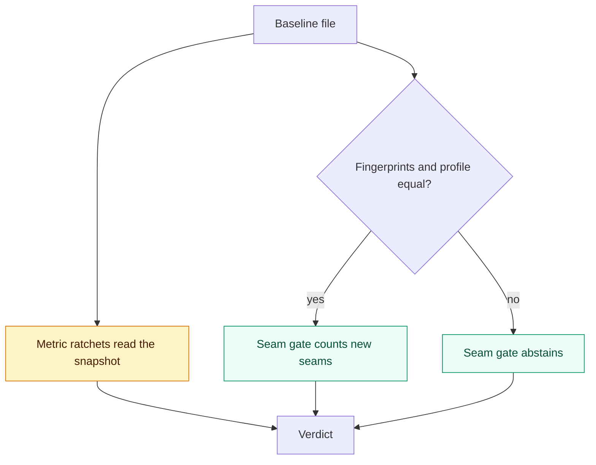

# Erosion tracking

## What this is

Architecture erodes one small change at a time. archfit stops erosion with a ratchet: each run compares the tree with a stored reference, and new violations block.
A ratchet works only when the reference stays comparable while code changes, and moves only by review.
This page describes what the engine does today, the problems that remain, and the changes planned for the v3.0.0 release.
The [roadmap](erosion-roadmap.md) owns the wave order. [Language extensibility](language-extensibility.md) shares the measurement profile v2 work.

## Terms

| Term                | Meaning                                                                                                                     |
| ------------------- | --------------------------------------------------------------------------------------------------------------------------- |
| Baseline            | `.archfit-baseline.json`. It stores accepted findings, a metric snapshot and a reference state.                             |
| Accepted finding    | A finding that the baseline lists. It shows as debt and does not block.                                                     |
| Reference           | The baseline's state snapshot. The report exposes the result of the comparison as `gate_reference`.                         |
| Fingerprints        | Four hashes that identify the inputs of a run: `config_hash`, `model_hash`, `labels_hash`, `rubric_version`.                |
| Measurement profile | The normalized analyzer settings hash plus the version, semantics and status of each producer (analyzer).                   |
| Comparable          | All four fingerprints and the measurement profile agree. Otherwise the comparison is `non_comparable`, with a named reason. |
| Seam                | One ordered pair of modules with at least one import between them. Its ID comes from the two module names.                  |
| Metric ratchet      | A `metrics.<name>.gate` setting that blocks when a metric gets worse than the baseline snapshot.                            |

## How it works today

### Baseline v2

`archfit baseline` writes schema `archfit.baseline.v2` (`internal/baseline/baseline.go`).

| Part         | Content                                                                                                                 |
| ------------ | ----------------------------------------------------------------------------------------------------------------------- |
| `accepted[]` | Fingerprint, rule ID, kind and severity of each accepted finding                                                        |
| `metrics`    | The metric snapshot that ratchets compare against                                                                       |
| `state`      | The four fingerprints, the measurement profile, hard-gate finding IDs, qualifying seam IDs and nine dimension snapshots |

The baseline has no repository score. The engine rejects older schemas.

Capture is a pure function of the tree and the config. It runs with an empty baseline, so it never reads the file that it overwrites. It skips findings that a waiver covers, and prints their count.
The only capture mode is a full capture: it accepts all current findings that no waiver covers. With `--no-advisories`, it leaves out advisory findings. See [`archfit baseline`](../../guide/commands.md) and the [CI baseline workflow](../../guide/ci.md).

### Comparability

`decision.CompareFingerprints` (`internal/assessment/decision/state_comparison.go`) compares the four fingerprints and the profile. Any difference makes the result `non_comparable`. The reason names the input that changed.

| Fingerprint         | What it hashes today                                                                                                                                                                                                                                 |
| ------------------- | ---------------------------------------------------------------------------------------------------------------------------------------------------------------------------------------------------------------------------------------------------- |
| `config_hash`       | The raw bytes of `.archfit.yaml`. Identity only since v3.0.0: `classification_hash` is the comparison input.                                                                                                                            |
| `model_hash`        | The resolved module map, after CODEOWNERS owners and detected deploy units are filled in                                                                                                                                                             |
| `labels_hash`       | The approved entries of `.archfit-labels.yaml`. Empty when none is approved.                                                                                                                                                                         |
| `rubric_version`    | The coupling score version, today `bc_score.v6`                                                                                                                                                                                                      |
| Measurement profile | `archfit.measurement.v2` (shipped in v3.0.0). The settings hash covers the global settings plus one slice per applicable language (extractor config, syntax flag, Go environment or TypeScript config). Not-applicable rows leave the producer list. |

`CompareMeasurementProfiles` (`internal/assessment/decision/measurement.go`) also refuses a profile with an unknown producer, an unknown tool version, or a partial row that has no accepted partial basis.

### Seam gate

The distributed-monolith seam gate (`coupling.gate.distributed_monolith`) blocks only on seams that are new against a comparable reference.
`seamAnchor` (`internal/application/analysis.go`) uses the same comparison as `gate_reference`. Against a non-comparable reference, the gate reports the seam total, claims no new-seam count, and never blocks.
A blocked run emits one `bc/coupling_gate` finding for each new seam.

### Metric ratchets

- A ratchet with `gate: fail`, or no gate, blocks when the metric delta passes `min_delta` or `max_new`. A `warn` gate never blocks.
- A tripped ratchet is a `metric/<name>` finding (shipped in v3.0.0). It has before and after values and a repair task.
- When a ratchet blocks, text and Markdown list each worsened metric with its baseline and current values (v2.4.0). Thresholds are not in the report, so a metric inside its threshold is listed too.
- A ratchet decides only against a comparable reference (shipped in v3.0.0). Against any other it is unmeasured: one `metric_ratchets` entry in `unevaluated_required_rules`, `hard_gates: unmeasured`, exit 2.

### Comparison with `--base`

`archfit analyze --base <ref>` and `check --base <ref>` score a second worktree and print a delta. This comparison is report-only. It never replaces the baseline as the gate reference.
Today it gives an origin (`introduced`, `pre_existing` or `unknown`) to agent tasks only, not to findings. Any measurement profile difference sets every task that is not `pre_existing` to `unknown` (`internal/application/base_compare.go`).

### In the App

The App adds `baseline_not_comparable` (`action_required`) when the baseline is trusted and `gate_reference` is not comparable. See [App and Action flow](app-action-flow.md).

The ratchet path (amber) skips the comparability check. That is a defect.

## Problems that remain

| Problem                              | Effect                                                                                                                                                                               | Cause in code                                                                                                  |
| ------------------------------------ | ------------------------------------------------------------------------------------------------------------------------------------------------------------------------------------ | -------------------------------------------------------------------------------------------------------------- |
| A comment edit breaks comparability  | One YAML comment, waiver or `reviewed_at` edit makes the reference `non_comparable`. A blocked new seam then becomes exit 2.                                                         | `config_hash` hashes raw bytes and decides comparability                                                       |
| A new producer breaks every baseline | An engine release that registers a language changes the settings hash on every tree, also where that language is absent.                                                             | The settings hash covers every registered `ExtractConfig`. Absent rows enter the producer list.                |
| Ratchets ignore comparability        | A policy-only edit can give exit 1 with zero findings.                                                                                                                               | `assess` passes the stored metrics unconditionally                                                             |
| A ratchet has no finding (fixed in v3.0.0) | Agents got no repair task. The App named no blocker.                                                                                                                                 | Fixed: ratchets are `metric/<name>` findings now |
| `unbalanced_edge` cannot trip        | Capture counts every far intrusive high-volatility edge as new. Check counts only edges whose finding is not accepted. The delta is then never positive once the count is 1 or more. | `internal/assessment/metrics/boundary/unbalanced_edge.go`. Unverified: code read only.                         |
| Only full capture                    | Every re-capture accepts all current findings, also findings that an engine upgrade exposed.                                                                                         | `archfit baseline` has no other mode                                                                           |
| Origin collapses                     | Any unrelated profile difference sets every task origin to `unknown`. Exit 2 cannot say "this change added it".                                                                      | Blanket downgrade in `base_compare.go`                                                                         |

## Plan for v3.0.0

One breaking release, v3.0.0, batches comparability v2, measurement profile v2, origin, `archfit baseline --reanchor`, and [coupling score v7](coupling-score-v7.md). Users re-anchor once. The App ships its decoders and the re-anchor flow before the engine release. It adds the manifest row from that release's `image-identity.json`.
Item 3.5 (`bc_score.v7`) is in [coupling score v7](coupling-score-v7.md).

### 3.1 Comparability v2

- Comparability no longer uses `config_hash`. It uses a hash over the policy leaves that change compared facts: coupling classification, external systems and measurement thresholds.
- `config_hash` keeps its raw-byte meaning. It stays in the `comparison` block as the identity that the App binds to the protected policy digest.
- Comments, waivers and `reviewed_at` are governance. They change findings, but they never make a run non-comparable.
- Proposed: rules and gate settings are governance too.
- Each config leaf gets exactly one class: model, classification, profile or governance. A reflection test fails on a leaf with no class, so each new key needs a decision.

### 3.2 Measurement profile v2

The profile becomes `archfit.measurement.v2`. This is its one definition:

- The producer list drops only not-applicable rows. [Language extensibility](language-extensibility.md) owns that predicate. `disabled` rows and `absent` rows with a coverage gap stay in the list.
- The settings hash covers the global settings plus one slice for each contributing language: its extractor config and its environment. Not-applicable languages contribute nothing.
- `tool_version` is normalized, so it fits the App's token class.

| Head and reference                                                 | Result                                                   |
| ------------------------------------------------------------------ | -------------------------------------------------------- |
| Producer missing on both sides                                     | Comparable                                               |
| Missing on one side, `ok` or `partial` on the other                | `non_comparable`: "producer X is missing from one run"   |
| `ok` on both, with a different version, semantics or partial basis | `non_comparable`                                         |
| `timed out` on either side                                         | `non_comparable`                                         |
| Reference profile is v1                                            | `non_comparable`, with one reason that names the version |

Constraint: `pairFamily` reads the marked coverage copy, the copy that acquisition rewrites. If not-applicable rows leave that copy, every `--base` origin becomes `unknown` on a repo without one of the four languages. Pairing must map a named not-applicable producer to "not applicable" on that side. A Go-only `--base` regression test must keep `introduced` and `pre_existing`.

### 3.3 Origin

- One classifier: the per-family pairing, without the blanket profile downgrade.
- One wire shape, only with `--base`: `findings[].origin`, plus `comparison.introduced_finding_ids` and `comparison.resolved_finding_ids`.
- Origin is presentation only. `--base` never replaces the persisted baseline, and the App never derives a conclusion from origin.
- In CI, origin also needs an Action change, because `--base` needs a git worktree and the Action mounts `.git` read-only.

### 3.4 `archfit baseline --reanchor`

`--reanchor` re-keys accepted debt across a profile or scoring epoch without accepting new debt. Full capture stays for first adoption.

**Open decision: the matching key.** `--reanchor` keeps a current finding only when it matches a stored accepted finding. The key for that match is not decided. Matching on the finding ID drops debt whose ID changes in the new epoch. A coarser key, such as rule and module pair, keeps that debt but can accept a new finding on the same pair.

### 3.6 Ratchets compare only with a comparable reference

- A ratchet uses the stored metric only when the reference is comparable and the metric version matches.
- Against a non-comparable reference, the ratchet reports unmeasured (`hard_gates: unmeasured`). It never passes or blocks.
- With no baseline file, there is no delta and no trip.
- This ships with comparability v2, so a comment edit can never turn ratchets off.

### Migration

1. Upgrade the pinned engine. The stored reference becomes `non_comparable` once, with reasons that name each drifted input (`rubric_version`, measurement profile version).
2. Run `archfit baseline --reanchor` in the pinned image. The App flow cannot do this yet. The Action baseline mode does not mount the stored baseline. The App contract requires an empty `baseline_digest` for a baseline upload. Both must change.
3. Review the baseline PR. It must add no accepted finding.
4. Get owner approval on the exact head, and merge.

## Later

`archfit history` gives a profile-segmented series of dimension statuses and counts, with no scalar. A segment ends at any non-comparable boundary. It waits until comparability v2 makes the series comparable (roadmap Wave 4).

## Open decisions

- **Ratchet findings.** Decided and shipped in v3.0.0: a tripped ratchet emits one `metric/<name>` gate finding with before and after values and a repair task. The separate ratchet path is gone.
- **Classification hash or `model_hash`.** A new `classification_hash` gives clear reasons, but adds a fifth fingerprint, a wire key and an App decoder change. Folding the leaves into `model_hash` keeps four fingerprints, with coarser reasons.
- **Class of `layers`, `min_severity`, `depends_on` and `visible_to`.** Governance or classification is open.
- **`unbalanced_edge`.** A fact count of all far intrusive edges into high-volatility modules fixes the inert delta. Fold the fact-count fix into the single `unbalanced_edge.v3` bump in [coupling score v7](coupling-score-v7.md).

## Invariants to keep

- Over-hash, never under-hash. Unknown producers and semantics stay non-comparable.
- No repository scalar in any gate, ratchet, origin or history.
- Capture stays pure: output depends on the tree, the config and, for `--reanchor`, the stored file. This amends the CLAUDE.md baseline-capture invariant.
- The exit code is the verdict.
- Seam IDs do not change (`seam.v1`).
- A missing snapshot abstains. It is never read as zero.

## Rejected options

| Option                                                          | Reason                                                                                           |
| --------------------------------------------------------------- | ------------------------------------------------------------------------------------------------ |
| Normalize `config_hash`                                         | The App binds the raw digest to the protected policy. A second meaning would break that binding. |
| `--base` as the seam reference                                  | Only an owner-approved baseline moves the reference.                                             |
| Gate on `origin`                                                | Pre-existing blockers still block. Origin only explains.                                         |
| Seam budgets (`max_new`, `max_strengthened`, `max_edge_growth`) | Module allowlists and the seam gate cover new pairs. Strength gates wait for coupling score v7.  |
| A trend scalar or App-side history storage                      | archfit reports states and counts, never a composite score.                                      |
