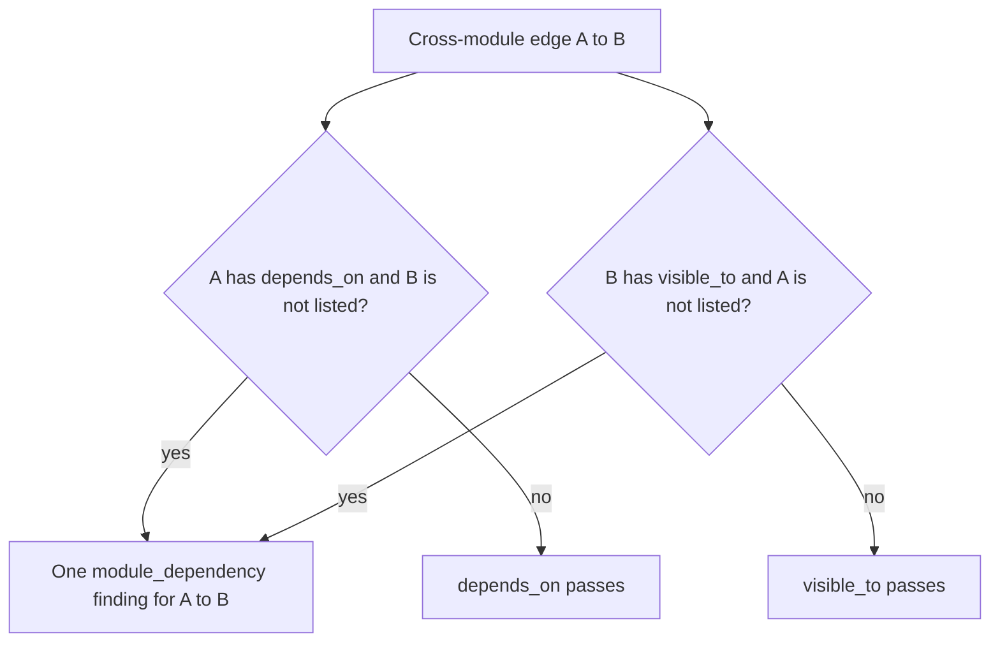

# Guardrail language

## What this is

This plan covers the remaining work on the archfit policy language: the
`modules:` and `rules:` sections of `.archfit.yaml`. It adds module allowlists,
module selectors, rule rationale, and map completeness (Wave 2, items 2.1, 2.2
and 2.8 in the [roadmap](erosion-roadmap.md)). It also records the later strength
ceilings (Wave 4). Every YAML block marked **Proposed** fails to load on the
current engine, because config schema v2 rejects unknown keys. Do not copy
these blocks into a configuration.

**Already built in v2.4.0:** `module_cycle`, `forbidden_pattern`,
`guard: true`, `config lint`, dead-selector reporting, declared
`public:`/`internal:` enforcement in all four languages, and rule scope that
follows extractor applicability. See the
[v2.4.0 release notes](../../guide/release-notes.md#v240--guardrails-that-fire)
and the [rules reference](../../guide/configuration-reference.md#rules).

## Terms

| Term           | Meaning                                                                                     |
| -------------- | ------------------------------------------------------------------------------------------- |
| Module         | A named entry under `modules:`. Its `paths:` globs decide which source it owns.             |
| Rule           | An entry under `rules:` with an `id`, a `type`, and a `gate` (`fail`, `warn`, or `off`).    |
| Gate finding   | A finding from a rule. With `gate: fail` and an active status, it blocks `check` (exit 1).      |
| Selector       | A `from:` or `to:` glob. Today it matches graph node paths in each language's own spelling. |
| Allowlist      | A list of the only modules that a module can import, or that can import it.                 |
| Unowned source | Production source that no module's `paths:` owns.                                           |

## Problems that remain

- **No allowlists.** All rules are denylists. The engine's own config uses
  19 of its 60 rules (18 `*_no_config` plus `application_no_config_adapter`)
  to approximate one inbound allowlist:
  "only composition roots import `internal/config`". A new top-level package
  that imports `internal/config` passes, because no rule names it.
- **No module selectors.** Selectors are node paths. A rule such as "the domain
  layer does not import `net/http`" needs one glob for each domain directory.
- **No rationale.** A finding says what broke. It does not say why the rule
  exists, or what to do instead.
- **Unowned source is not gated.** `module_cycle` and
  `forbidden_layer_direction` skip endpoints that no module owns.
  `module_review.gate` reads only staleness (`Config.ForStaleness` in
  `internal/config/views.go`). It never blocks.
- **No strength ceilings or context map.** A rule cannot say "billing calls
  shipping only through its published contract". This waits for
  [coupling score v7](coupling-score-v7.md), which makes port calls count as
  contract coupling.

## 2.1 Module allowlists

Two new optional module keys state the allowed module graph. One new rule type,
`module_dependencies`, enforces them.

**Proposed:**

```yaml
modules:
  billing:
    paths: [billing/**]
    public: [billing/api/**]
    visible_to: [shipping, api-gateway] # inbound allowlist
  shipping:
    paths: [shipping/**]
    depends_on: [billing, shared-kernel] # outbound allowlist
  shared-kernel:
    paths: [shared/**]
    depends_on: [] # no first-party module
rules:
  - id: boundaries
    type: module_dependencies
    gate: fail
```

Rules for `depends_on` (outbound):

1. An absent key means unconstrained. An empty list allows no first-party module.
2. Each cross-module edge from the declaring module must match an entry.
3. Each entry is an exact module name or a module selector (see 2.2).
4. External targets (stdlib, third-party) are out of scope. Use
   `forbidden_dependency` for them.

Rules for `visible_to` (inbound):

1. An absent key means visible to all modules.
2. Each importer from another module must match an entry.
3. An importer that no module owns is denied. Allowlists fail closed.

A module pair gives one finding, even when both keys fail.
`matched_by.violates` names the keys that failed.



**Finding shape.** The finding uses the same shape as a `module_cycle` finding:

- `edge.kind: module_dependency`.
- Endpoint paths are empty, and the endpoint module names are set.
- The ID is `finding.NewKeyed(rule, kind, from, to)`. A file move does not
  re-key it.
- It carries a bounded list of import locations. `matched_by.locations_total`
  gives the full count.

Waivers already match these findings. When an endpoint path is empty,
`status.matchEndpoint` matches the waiver glob against the module name. So
`waivers: [{rule: boundaries, from: shipping, to: catalog, ...}]` works.

**Producer scope.** Evaluability is decided for each declaring module, not for
the rule. A module that owns only Go source stays evaluated when grimp is
missing. This extends the narrowing that `restrictToTargetVocabulary` applies
today.

**Cost.** Until comparability v2 ships (Wave 3.1), every allowlist edit
changes `config_hash`. The stored baseline then becomes non-comparable. See
[erosion tracking](erosion-tracking.md).

## 2.2 Module selectors and rationale

### Module selectors

`forbidden_dependency` gets two new keys, `from_module` and `to_module`. One
parser reads them:

| Selector       | Matches                                                     |
| -------------- | ----------------------------------------------------------- |
| `layer:<name>` | Every module with that `layer:`                             |
| `role:<role>`  | Every module with that `role:`                              |
| Any other text | A doublestar glob over module names, declared and synthetic |

An unknown module name, layer, or role loads, as an undeclared `layer:` does
today. `config lint` reports it as an error, and `check` reports a config
warning. A selector that matches no module makes the rule vacuous. A
fail-gated vacuous rule goes to `decision.unevaluated_required_rules` with the
reason prefix `selector matches nothing:`, the same as a dead path selector.
The App reads that prefix as a `policy_defect`. A
module selector matches cross-module edges only, never edges inside one module.
Findings are keyed by module pair.

**Proposed:**

```yaml
rules:
  - id: domain_no_http
    type: forbidden_dependency
    from_module: "layer:domain"
    to: net/http
    rationale: "Domain code stays free of I/O"
    alternatives: ["Depend on a port in the application layer"]
    docs: docs/adr/003.md
  - id: billing_separate_from_catalog
    type: forbidden_dependency
    from_module: billing
    to_module: catalog
```

Two independent contexts ("separate ways" in DDD) need two rules, one for each
direction. No `independence` rule type is added.

### Rationale fields

Three optional fields apply to every rule type:

| Field          | Effect                                                         |
| -------------- | -------------------------------------------------------------- |
| `rationale`    | Appended to the finding `why` as ` — <rationale>`.             |
| `alternatives` | Sets `allowed_alternatives` on the finding. The agent task repeats them in `constraints`. |
| `docs`         | Appends ` (see <docs>)` to the finding `constraint`.           |

Agent tasks and SARIF carry the same text. Finding IDs never include this
text, so a rationale edit does not re-key findings. Report text is already
bounded once, at projection (`boundReportText`), so the new text needs no
second cap. Make one change in `agenttask` that composes the rationale with
the rule-aware constraints from v2.4.0.

## 2.8 Map completeness

Unowned source gets one mechanism: `module_review.gate`.

1. Report production source that no module owns. Group it per package, so one
   new package gives one finding.
2. With `module_review.gate: fail`, a new uncovered package blocks `check`.
3. Module-level rules keep skipping unowned endpoints. They disclose the
   skipped count in `matched_by`.
4. `config init` writes `module_review.gate: fail` for new adopters.

**Proposed:**

```yaml
module_review:
  gate: fail # proposed: blocks on new unowned packages
  stale_after: 2160h # exists today
```

## Lint additions

`archfit config lint` gets these checks. Codes stay additive strings, with no
closed, versioned set.

| Code               | Severity | Condition                                                                          |
| ------------------ | -------- | ---------------------------------------------------------------------------------- |
| `unknown_module`   | error    | A `depends_on`, `visible_to`, `from_module`, or `to_module` entry names no module, layer, or role. |
| `unowned_source`   | warning  | The 2.8 predicate finds unowned production source.                                 |
| `node_cycle_on_go` | warning  | A Go-only config uses `type: cycle`, which is always zero on Go.                   |

The existing codes stay as they are. See
[config lint](../../guide/commands.md#archfit-config-lint).

## Self-config rewrite

Apply the new keys to `.archfit.yaml` in the same release:

1. Remove 21 rules: the 18 `*_no_config` rules, `application_no_config_adapter`,
   `internal_no_llm`, and `application_no_provider_adapters`.
2. Set `visible_to` on two modules:
   - `policy-config-adapter`: `[cli-composition, config-lifecycle, development-tools]`
   - `provider-adapters`: `[cli-composition]`
3. Add one `module_dependencies` rule.
4. Set `depends_on: []` on `evidence-contracts`, `report-contract`, and
   `analysis-scope`.
5. Add a `module_cycle` rule at `gate: warn`. The `evidence-adapters` and
   `persistence-adapters` cycle in the
   [architecture baseline](../../design/architecture-baseline.md) is not gated today.

The rule count goes from 60 to 41. Run `go test ./internal/ -run TestSelfModel`
after each step.

## Wave 4: strength ceilings and context map

A `depends_on` entry can later carry `max_strength` and a DDD relationship
`pattern` (for example `open_host_service`). These ship together, and only after
two conditions are true:

- [Coupling score v7](coupling-score-v7.md) makes a call through a published
  interface count as contract coupling. Today Go maps every call to
  `functional`, so a `contract` ceiling flags every consumer of an open host
  service.
- The owner amends the invariant that the distributed-monolith gate is the only
  coupling gate.

A pattern name never sets or raises measured strength.

## Invariants kept

- The scorer, `bc_score.v6`, and `rubric_version` do not change. No rule reads
  `Score` or `Band`.
- The distributed-monolith gate stays the only coupling gate until the Wave 4
  amendment.
- `ModelHash` ignores the new keys, because they move neither distance nor seam
  identity. A test pins this.
- Existing finding IDs do not change.
- The `check` exit code stays the verdict. Baseline capture stays idempotent.

## Contract impact

| Contract                        | Change                                                                      |
| ------------------------------- | --------------------------------------------------------------------------- |
| Config schema v2                | Additive keys only. No schema v3. `archfit.schema.json` gains the new keys. |
| `archfit.architecture-state.v1` | No field change. New rule IDs and module-pair findings.                     |
| Baseline v2                     | Unchanged. A module rename re-fires its module-keyed findings.              |
| Engines up to v2.4              | Reject the new keys. Pin the engine before adopting them.                   |
| App                             | Re-pin the schema. The report decoder already accepts module-only findings. |

## Tests

- A paired fixture for each new behavior, seen to fail first:
  - A new module pair blocks. A new file on an allowed pair stays green.
  - An unowned importer of a `visible_to` module blocks.
  - A `layer:` selector that matches no module is listed as unevaluated.
  - A new uncovered package blocks with `module_review.gate: fail`.
- Finding IDs stay stable when a file is added or moved.
- The rationale appears in the finding, the agent task, and SARIF.
- `TestSelfModel` passes on the rewritten self-config.

## Open owner decisions

1. The default severity of `unowned_source` in lint.
2. Whether `config init` writes `module_review.gate: fail` or `warn`.

## Rejected options

| Option                                    | Reason                                                                  |
| ----------------------------------------- | ----------------------------------------------------------------------- |
| `public_surface_only` rule type           | `public_api_only` now enforces declared surfaces in place.              |
| `independence` rule type                  | Two `forbidden_dependency` rules with module selectors do the same job. |
| `pattern` on `depends_on` before ceilings | Five of seven patterns would only be recorded, not checked.             |
| `deprecated: {replacement, reason}`       | `visible_to: []` plus a rationale does the same job.                    |
| Per-language `unowned:<key>` identities   | Map completeness (2.8) covers unowned source for all rules at once.     |
| Tags, `except:`, `closed_layers`          | No current config needs them. Add them when a user asks.                |
| A closed, versioned set of lint codes     | Additive string codes are enough.                                       |
| Schema v3 or a top-level `context_map:`   | No existing key changes meaning.                                        |
