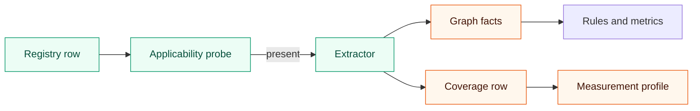

# Language extensibility

## What this is

This page explains how archfit adds a language or an analyzer today, what goes wrong, and what the plan changes.
archfit supports Go, TypeScript, Python and Rust. The next planned language is the JVM (Java, Kotlin, Scala) through a SCIP indexer.
The measurement-profile half of language-addition invariance shipped in v3.0.0. The published coverage rows and the other items on this page are not built.
The [roadmap](erosion-roadmap.md) owns the wave order. [Erosion tracking](erosion-tracking.md) owns the measurement profile v2 rules for comparability.

## Terms

| Term                | Meaning                                                                                                                              |
| ------------------- | ------------------------------------------------------------------------------------------------------------------------------------ |
| Extractor           | A package under `internal/extract/<lang>` that runs an external tool through `toolrun.Runner` and returns graph facts.               |
| Producer            | Any analyzer that writes a coverage row, for example `go/packages` or `ast-grep/syntax`.                                             |
| Coverage name       | The tool name on a coverage row. Each analyzer has exactly one.                                                                      |
| Primary producer    | The dependency-graph producer of a language, for example `grimp` for Python.                                                         |
| Applicability probe | The function that answers "is this language present under the root?". The extractor uses the same function to decide whether to run. |
| Node vocabulary     | How a language spells graph node IDs: slash paths for Go and TypeScript, dotted names for Python, `crate::mod` for Rust.             |
| Measurement profile | The settings hash and producer list that decide whether two runs are comparable.                                                     |
| SCIP                | A source-code index format. A SCIP indexer writes a file of symbols and references.                                                  |

## Languages today

| ID           | Aliases | Primary producer                      | Separator | Extensions                        | SCIP indexer (strength overlay) |
| ------------ | ------- | ------------------------------------- | --------- | --------------------------------- | ------------------------------- |
| `go`         | none    | `go/packages`                         | `/`       | `.go`                             | `scip-go`                       |
| `typescript` | `ts`    | `dependency-cruiser`                  | `/`       | TypeScript and JavaScript sources | `scip-typescript`               |
| `python`     | `py`    | `grimp`                               | `.`       | `.py`, `.pyi`                     | `scip-python`                   |
| `rust`       | `rs`    | `cargo` (plus opt-in `cargo-modules`) | `::`      | `.rs`                             | `rust-analyzer`                 |

SCIP is only an overlay today. It refines edge strength on graphs that the primary producers built. The engine decodes each index with `uv`, which runs the embedded `scip_reader.py`. For Go, compiler type information wins, and SCIP never overrides it. See [language support](../../guide/languages.md).



## Add a language today

The registry comment says "one row here plus an extract package". In practice, a new language touches many more places. Most of them fail silently when you forget them.

1. Write the extractor in `internal/extract/<lang>`. Implement `ports.Extractor` (`internal/evidence/ports/ports.go`), with `Name()` and a separate `CoverageTool()`. Run every tool through `toolrun.Runner`.
2. Export an applicability function from the extractor. Call it from `Extract`.
3. Append a `Descriptor` to `languages` in `internal/extract/registry/registry.go`. Set `ProjectPresent` to the exported function. Never reorder the rows, because the graph merge uses the row order.
4. Add the language constant to `internal/model/graph/graph.go` and an entry to `BuiltinConventions` in `internal/model/graph/convention.go`: separator, extensions, priority and the file-to-module mapping.
5. Add the coverage name to `MeasurementContract` in `internal/model/evidence/measurement.go`. Without it, every run is `non_comparable`.
6. If the tool can finish with unresolved specifiers, add it to `PartialFromUnresolvedSpecifiers` (same file) and to `comparablePartialProducer` (`internal/assessment/decision/measurement.go`).
7. Add the config section to `internal/config`: the `Lang<X>` constant and the cases in `ToolMode`, `ToolGate` and `SetToolMode` (`internal/config/tools.go`).
8. Extend `primaryToolForLanguage` in `internal/assessment/evaluation/dimensions.go`. It maps a language to a position in the registry order.
9. Add a field to `initcfg.Presence` and set it in `languagePresence` (`cmd/archfit/init.go`).
10. Add the extensions to the other per-language switches: the LOC walk (`internal/extract/loc/loc.go`), test-file rules (`internal/syntax/testfile.go`), `cloneLanguage` (`internal/relationship/analysis/analysis.go`) and the agent-task file resolver (`internal/assessment/agenttask`).
11. For syntax facts, add an ast-grep rule file under `internal/extract/astgrep/rules`. For a SCIP overlay, add the indexer to `internal/extract/scip`.
12. If the extractor uses the fact cache, make the key hash the tool's real input set. See [fact cache](../../design/fact-cache.md).
13. Add the tool to `DoctorTools` and to the image, or document why it is not in the image.
14. Add fixtures and regenerate the goldens on purpose. A new constant in `internal/model` changes `model_surface.golden`.

Onboarding presence already comes from the registry probes (v2.4.0). See the [release notes](../../guide/release-notes.md).

An analyzer that is not a language follows steps 5, 7, 12 and 13, and needs its own coverage name. For `--base` pairing, it also needs a field in `FamilyOptions` and a family in `AnalyzerFamilies` (`internal/assessment/decision/origin.go`).

## Problems

| Problem                                | Effect                                                                                                                                                                                                             | Where                                                                                                         |
| -------------------------------------- | ------------------------------------------------------------------------------------------------------------------------------------------------------------------------------------------------------------------ | ------------------------------------------------------------------------------------------------------------- |
| Producer rules are lists of tool names | Each new tool needs edits in many switches. A missed switch makes runs non-comparable or hides partial evidence.                                                                                                   | `MeasurementContract`, `PartialFromUnresolvedSpecifiers`, `comparablePartialProducer`, `knownProducerVersion` |
| Config switches fail open              | `ToolMode` returns `auto` for an unknown ID, and `SetToolMode` does nothing. This is latent: `ApplyFlagOverrides` rejects unknown aliases first. It bites only when a registry row has no config case.             | `internal/config/tools.go`                                                                                    |
| Core cannot import the vocabulary      | Assessment works around it with a positional lookup and copied extension lists.                                                                                                                                    | `primaryToolForLanguage`, `cloneLanguage`, `loc.go`                                                           |
| A new producer changes every baseline  | The settings hash covers the extractor config of every registered language. Absent rows enter the producer list. One new language makes every stored baseline non-comparable, also on trees without that language. | `internal/evidence/acquisition/measurement.go`                                                                |
| Reach stops at four languages          | SCIP can only refine strength. It cannot build a graph.                                                                                                                                                            | `internal/extract/scip`                                                                                       |

## Plan

### In v3.0.0: language-addition invariance

Registering a producer must change no report byte, profile or fingerprint for a tree that has no file of that language.
A producer row is **not applicable** when all three conditions hold:

- Its status is `absent`.
- The run emitted no coverage gap for it.
- The source inventory has no file with that language's extensions.

Not-applicable rows leave the published coverage and the measurement profile. Every other missing row stays applicable and incomplete, so it fails closed.
This predicate is part of measurement profile v2. [Erosion tracking](erosion-tracking.md) defines the profile and the comparison table.

Two constraints apply:

- Task-origin pairing reads the marked coverage copy. It must treat a named not-applicable producer as "not applicable", or every `--base` origin becomes `unknown`.
- Stray files with no build marker give a gapless `absent` row. When the inventory has files of that language, the run must disclose them, so that pairing cannot treat the row as not applicable.

### Before the first new language

1. **Conformance kit.** A test (`internal/language_conformance_test.go`) runs over each registry row with `present` and `absent` fixtures. It checks that the probe and the extractor agree and that config round-trips for each alias. It also checks the LOC extensions, the primary producer, the agent-task file resolver, and the cache key.
2. **Fail-closed config.** One ordered tool table drives `ToolMode`, `ToolGate`, `SetToolMode` and the defaults. `SetToolMode` returns an error for an unknown ID.
3. **Producer manifest.** Each producer declares its tool, language, semantics version, role, and the one partial basis it can claim. Core code reads roles and capabilities, not tool names.
4. **Vocabulary in the kernel.** The node convention, extensions and test-path rules move into one stdlib-only kernel package, so that assessment can read them. The per-language switches iterate it.

### After the scip-java spike: a generic SCIP primary extractor

One extractor builds the dependency graph from a SCIP index, driven by data rows.

| Row (aliases)                     | Indexer       | Build markers                                                                 | Extensions               | Builds target code |
| --------------------------------- | ------------- | ----------------------------------------------------------------------------- | ------------------------ | ------------------ |
| `jvm` (`java`, `kotlin`, `scala`) | `scip-java`   | `pom.xml`, `build.gradle`, `build.gradle.kts`, `settings.gradle`, `build.sbt` | `.java`, `.kt`, `.scala` | yes                |
| `dotnet` (`csharp`)               | `scip-dotnet` | `*.sln`, `*.csproj`                                                           | `.cs`                    | yes                |

Each row ships only with a checked-in fixture index from its pinned indexer. The main rules:

- **Nodes and edges.** Nodes are files inside the scan root. A reference to a symbol in another directory gives a file-to-file edge. References in the same directory are dropped, as Go drops references inside one package.
- **External symbols.** A symbol that the index does not define becomes `external:<manager>/<package>`, without the version.
- **Strength.** Strength comes from the SCIP symbol kind. An unknown kind abstains. No name heuristics.
- **Coverage.** `ok` needs every build root indexed and every production file present in the index. Otherwise the row is `partial`, with a count and the first missing directory. A missing indexer is `absent`. A timeout is `timed out`.
- **Fact cache.** A row that builds target code is not cached, because its inputs live outside the tree. Today `rust-analyzer` SCIP and `cargo-modules` also run target build code, and both are cached through `factcache.Runner`. Their cache must go, or their keys must provably cover the real input set.
- **Vocabulary.** JVM node IDs use `/`, so they never collide with Python's dotted names.

Not verified:

- That `scip-java` and `scip-dotnet` fill in the symbol kind.
- That a Go streaming reader can replace `scip_reader.py` without a new Go module dependency.

The extractor follows this config shape, additive in schema v2:

```yaml
languages:
  jvm:
    enabled: auto # true | false | auto
    gate: warn # off | warn | fail
    timeout: 30m
```

### Trust model

- The engine owns the indexer arguments, the output path and the read. No config key, flag or environment variable names an index file.
- `doctor` lists the producers that run target build code: `scip-java`, `scip-dotnet`, and today `rust-analyzer` and `cargo-modules`. Their facts are customer-attested.
- The App approves an engine identity: version, image digest and platform. A host run with a locally installed JDK matches no approved row. Until an image decision exists, JVM analysis is CLI-only.

## Open decisions

- **JVM image.** The JVM toolchain does not belong in the default image. The choice is a separate image variant, or indexes that the engine builds in customer CI. Spike `scip-java` on one real repo first.
- **Gate eligibility.** The App must decide whether facts from producers that run target build code can clear a required gate, and how the gate summary discloses them.
- **Row IDs and defaults.** The JVM row ID, the default mode, and the row order are open.
- **Kind-less strength.** If an indexer does not fill in the symbol kind, every edge abstains on strength.

## Rejected options

| Option                                             | Reason                                                                                                                        |
| -------------------------------------------------- | ----------------------------------------------------------------------------------------------------------------------------- |
| A supplied-facts protocol (PR-supplied graph JSON) | The App treats supplied files as untrusted. A forged graph would bypass the hard gates. Engine-run SCIP gives the same reach. |
| A supplied SCIP index                              | Same reason. The engine runs the indexer itself.                                                                              |
| Runtime plugins or runtime vocabularies            | The registry is a compiled, ordered slice. Order is load-bearing for the graph merge.                                         |
| A settings hash for each producer on the wire      | The App decoder fixes the producer keys. A digest for each producer would need a wire change only for clearer reasons.                            |
| Marker-file lists for presence                     | A list that disagrees with the extractor turns "not measured" into "nothing here".                                            |
